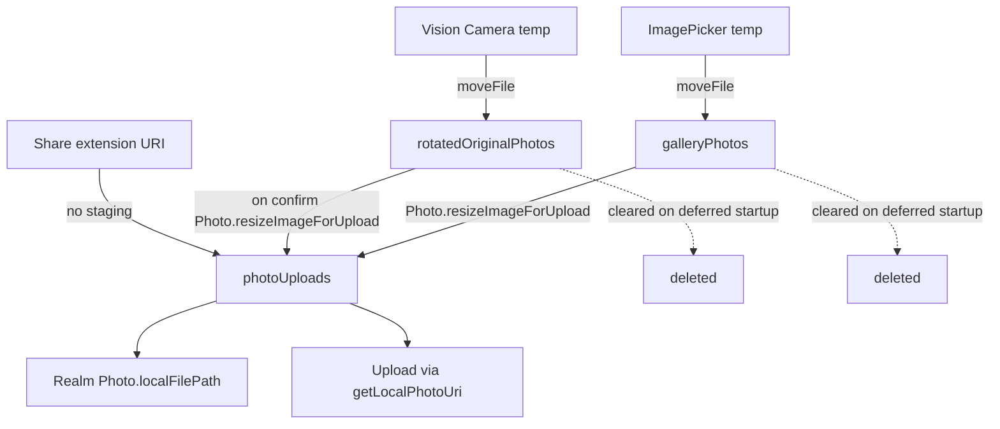

# Media Filesystem Lifecycle

## Overview

Photos and sounds are stored on disk under `DocumentDirectoryPath` (from `@dr.pogodin/react-native-fs`). The app uses **staging directories** for short-lived originals during the observation-create flow, and **canonical upload directories** for resized photos and sounds that persist until upload succeeds and cleanup runs.

Key design points:

- **Photos:** `Photo.resizeImageForUpload()` creates a max-2048px JPEG copy in `photoUploadPath`. Realm `Photo.localFilePath` points at that copy for display and upload.
- **Sounds:** `Sound.moveFromCacheToDocumentDirectory()` moves the recorder cache file into `soundUploadPath` (no copy).
- **Cleanup:** Deferred startup tasks wipe staging dirs and orphan synced media; see [Cache Cleanup](#cache-cleanup-deferred-startup).

For the upload pipeline after media is on disk, see `upload-system.md`.

## Key Files

| File | Purpose |
|------|---------|
| `src/appConstants/paths.ts` | Path constants under `DocumentDirectoryPath` |
| `src/realmModels/Photo.ts` | Resize for upload, local URI normalization, delete |
| `src/realmModels/ObservationPhoto.ts` | Create obs photos, upload mapping, delete |
| `src/realmModels/Sound.ts` | Move from cache, local URI normalization, delete |
| `src/realmModels/ObservationSound.ts` | Create obs sounds, upload mapping, delete |
| `src/sharedHelpers/resizeImage.ts` | Shared `@bam.tech/react-native-image-resizer` wrapper |
| `src/sharedHelpers/clearCaches.ts` | Per-directory cleanup helpers |
| `src/sharedHelpers/removeSyncedFilesFromDirectory.ts` | Selective delete with keep-list and size cap |
| `src/sharedHelpers/rollbackPhotos.ts` | Backup/restore of `photoUploads` during edit cancel |
| `src/sharedHelpers/shouldFetchObservationLocation.ts` | Uses source URI to decide GPS fetch |
| `src/components/hooks/useDeferredStartup.ts` | Schedules cache cleanup on app launch |
| `src/components/Camera/helpers/savePhotoToDocumentsDirectory.ts` | Camera temp → staging move |
| `src/components/Camera/helpers/savePhotosToPhotoLibrary.ts` | Optional copy to device photo library |
| `src/components/PhotoImporter/PhotoLibrary.tsx` | Gallery import and staging move |
| `src/components/PhotoSharing.tsx` | Share-extension entry point |
| `src/components/SoundRecorder/SoundRecorder.js` | Sound recording entry point |
| `src/components/Suggestions/helpers/flattenUploadParams.ts` | 640px CV resize for `score_image` |
| `src/uploaders/dataTransformation/prepareMediaForUpload.ts` | Photo/Sound → upload payload |
| `src/components/Developer/hooks/useAppSize.ts` | Developer screen directory size breakdown |

## Filesystem Paths

All paths are defined in `src/appConstants/paths.ts` and rooted at `DocumentDirectoryPath`.

| Constant | Directory name | Purpose |
|----------|----------------|---------|
| `photoUploadPath` | `photoUploads` | Resized photos for upload; canonical storage for observation photos |
| `rotatedOriginalPhotosPath` | `rotatedOriginalPhotos` | Staging for camera-captured photos before resize |
| `photoLibraryPhotosPath` | `galleryPhotos` | Staging for photos imported from device gallery |
| `computerVisionPath` | `computerVisionSuggestions` | Resized images for `score_image` / suggestions API |
| `soundUploadPath` | `soundUploads` | Sound recordings for upload |
| `rollbackPhotosPath` | `rollbackPhotos` | Temporary backup copies during observation edit cancel |
| `sentinelFilePath` | `sentinelFiles` | Debug/sentinel files (not media) |

**Note:** `photoLibraryPhotosPath` still uses the `galleryPhotos` folder name on disk (intentionally unchanged in MOB-431 to avoid cache-cleanup regressions).

## Photo Lifecycle

### Entry points

**Camera flow** (`CameraContainer.tsx`, `savePhotoToDocumentsDirectory.ts`):

1. Vision Camera writes to a temp path via `takePhoto()`.
2. `savePhotoToDocumentsDirectory` **moves** (not resizes) the file into `rotatedOriginalPhotosPath` via `moveFile` and returns the new `file://` URI.
3. The URI is stored in Zustand `cameraUris` (`createObservationFlowSlice`) until the user confirms.
4. On confirm, `usePrepareStoreAndNavigate` → `createObsWithCameraPhotos` → `ObservationPhoto.createObsPhotosWithPosition(uris, { local: true })`.
5. `Photo.new(uri)` → `Photo.resizeImageForUpload(uri)` creates a max-2048px JPEG copy in `photoUploadPath`.
6. Optionally, `savePhotosToPhotoLibrary` copies camera photos to the **device photo library** (outside app document dirs).

**Gallery flow** (`PhotoLibrary.tsx`):

1. `launchImageLibrary` returns assets (iOS: temp dir; Android: picker URI).
2. `moveImagesToDocumentsDirectory` moves files into `galleryPhotos`:
   - **iOS:** `TemporaryDirectoryPath/${fileName}` → `galleryPhotos/${fileName}`
   - **Android:** picker `uri` → `galleryPhotos/${fileName}`
3. `Observation.createObservationWithPhotos` or `ObservationPhoto.createObsPhotosWithPosition(photos, { local: false })` reads `photo.image.uri`.
4. Same resize path as camera: `Photo.new` → `photoUploadPath`.

**Share extension flow** (`PhotoSharing.tsx`):

1. Share menu provides URIs (often App Group paths outside `DocumentDirectoryPath`).
2. `Observation.createObservationWithPhotos` → `ObservationPhoto.createObsPhotosWithPosition` with no intermediate staging.
3. `Photo.resizeImageForUpload` copies directly into `photoUploadPath`.

### Redundant copies (potential bloat)

Between capture/import and the next app launch:

| Source | Copies on disk |
|--------|----------------|
| Camera | `rotatedOriginalPhotos` + `photoUploads` (original + resized) |
| Gallery | `galleryPhotos` + `photoUploads` (original + resized) |
| Share | `photoUploads` only (1 copy) |

Staging dirs are cleared on every deferred startup (see below).

### Display and upload

- **Display:** `Photo.getLocalPhotoUri(localFilePath)` normalizes stored paths to `file://${photoUploadPath}/${filename}` so photos remain accessible after app updates.
- **Upload:** `prepareMediaForUpload` → `ObservationPhoto.mapPhotoForUpload` → `Photo.getLocalPhotoUri` → `FileUpload`.
- **Resize:** `Photo.resizeImageForUpload` uses `resizeImage` with max width 2048, JPEG, quality 100, `onlyScaleDown: true`. On iOS, `ph://` asset URIs use `copyAssetsFileIOS` instead of the resizer.

### Transient `originalPhotoUri`

`ObservationPhoto.new(uri)` sets `originalPhotoUri: uri` on the in-memory observation-create object. It records **where the photo came from**:

| Source | Typical `originalPhotoUri` path |
|--------|--------------------------------|
| Camera | `rotatedOriginalPhotosPath` |
| Gallery | `photoLibraryPhotosPath` (`galleryPhotos`) |
| Share | App Group / shared URI (outside `DocumentDirectoryPath`) |

`shouldFetchObservationLocation` uses this to decide whether to fetch GPS (camera photos without good accuracy may need location; gallery/share photos may already have EXIF location).

**Important:** `originalPhotoUri` is **not** in `ObservationPhoto.schema`. It exists only on the Zustand observation-create flow object (`RealmObservationPhotoPojo` in `types.d.ts`). It is not persisted to Realm.

## Sound Lifecycle

### Recording and storage

1. `SoundRecorder.js`: `react-native-audio-recorder-player` writes to a cache path via `startRecorder`.
2. On confirm, `Observation.createObsWithSoundPath(uri)` → `ObservationSound.new(uri)` → `Sound.new(uri)`.
3. If `uri` matches `file://`, `Sound.moveFromCacheToDocumentDirectory` **moves** the file into `soundUploadPath` with a UUID basename.
4. Realm `Sound.file_url` is stored as `file://${soundUploadPath}/${filename}`.

### Upload and deletion

- **Upload:** `prepareMediaForUpload` → `ObservationSound.mapSoundForUpload` → `Sound.getLocalSoundUri`.
- **Manual delete:** `ObservationSound.deleteLocalObservationSound` → `Sound.deleteSoundFromDeviceStorage` (`unlink`).
- **Photo delete:** `ObservationPhoto.deletePhoto` → `deleteLocalPhoto` → `Photo.deletePhotoFromDeviceStorage`.

## Computer Vision / Suggestions

- `flattenUploadParams` resizes images to 640px into `computerVisionPath` for the `score_image` API.
- `clearComputerVisionPhotos` (deferred startup) removes all files in `computerVisionPath`.
- CV images created during a session may linger until the next app launch.

## Rollback Photos

When editing an existing observation, `backupObservationPhotos` copies files from `photoUploads` into `rollbackPhotos` so edits can be reverted.

- **Restore:** `restoreObservationPhotos` copies backups back and calls `clearRollbackPhotos`.
- **Cleanup:** `clearRollbackPhotos` runs on observation flow exit (`useExitObservationFlow`) and on deferred startup.

## Cache Cleanup (Deferred Startup)

Media cache cleanup is **not** in `StartupService`. It runs from `useDeferredStartup`, which schedules each task in its own `requestIdleCallback` so filesystem work does not block initial render.

| Task | Action |
|------|--------|
| `clearRotatedOriginalPhotosDirectory` | Remove all files in `rotatedOriginalPhotosPath` |
| `clearGalleryPhotos` | Remove all files in `photoLibraryPhotosPath` |
| `clearComputerVisionPhotos` | Remove all files in `computerVisionPath` |
| `clearSyncedMediaForUpload` | Keep only files referenced by unsynced observations; delete rest in `photoUploadPath` and `soundUploadPath` |
| `clearRollbackPhotos` | Remove all files in `rollbackPhotosPath` |

### `removeSyncedFilesFromDirectory` logic

Used by `clearSyncedMediaForUpload` for `photoUploads` and `soundUploads`:

1. **Keep list:** Filenames from unsynced observations (`observationPhotos._synced_at == nil` / `observationSounds._synced_at == nil`).
2. **30-day skip:** Files modified in the last 30 days (`TRASHABLE_VINTAGE_MS`) are never deleted — avoids race where the file was written just before the observation was saved to Realm.
**5GB overflow (currently unreachable):** Intended to delete largest-then-oldest files — excluding keep-list entries and files modified in the last 24h — when kept + skipped files exceed 5GB. As written the branch never runs: `deletionPromises` is not awaited, so `totalSize` is still `0` when compared against the limit and the function returns early. Don't plan around this rule until it's fixed.

## Manual Deletion

### Photo/sound removal from observation

- **Photo:** `ObservationPhoto.deletePhoto` → `deleteLocalPhoto` → `Photo.deletePhotoFromDeviceStorage`.
- **Sound:** `ObservationSound.deleteLocalObservationSound` → `Sound.deleteSoundFromDeviceStorage`.

### Observation deletion

- `Observation.deleteLocalObservation` deletes the Realm object only; it does **not** unlink associated media files.
- Orphaned files in `photoUploads` and `soundUploads` are removed on the next deferred startup by `clearSyncedMediaForUpload` (the observation no longer exists, so its filenames are not in the keep list).

## Call Chains

### Camera

`CameraContainer.takePhotoAndStoreUri` → `savePhotoToDocumentsDirectory` (move to `rotatedOriginalPhotos`) → Zustand `cameraUris` → `usePrepareStoreAndNavigate.prepareStoreAndNavigate` → `createObsWithCameraPhotos` → `ObservationPhoto.createObsPhotosWithPosition({ local: true })` → `ObservationPhoto.new(uri)` → `Photo.new(uri)` → `Photo.resizeImageForUpload` → `photoUploadPath`

### Gallery

`PhotoLibrary.showPhotoLibrary` → `launchImageLibrary` → `moveImagesToDocumentsDirectory` (move to `galleryPhotos`) → `Observation.createObservationWithPhotos` → `ObservationPhoto.createObsPhotosWithPosition({ local: false })` → `Photo.new(uri)` → `photoUploadPath`

### Share

`PhotoSharing` → `Observation.createObservationWithPhotos` → `ObservationPhoto.createObsPhotosWithPosition` → `Photo.new(uri)` → `photoUploadPath`

### Sound

`SoundRecorder.startRecording` → cache path → `Observation.createObsWithSoundPath(uri)` → `ObservationSound.new(uri)` → `Sound.new(uri)` → `Sound.moveFromCacheToDocumentDirectory` → `soundUploadPath`

### Upload (photo)

`prepareMediaForUpload` → `ObservationPhoto.mapPhotoForUpload` → `Photo.getLocalPhotoUri` → `FileUpload`

### Computer vision

`flattenUploadParams` → `resizeImage({ width: 640, outputPath: computerVisionPath })` → `FileUpload` for `score_image`
