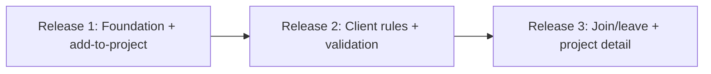
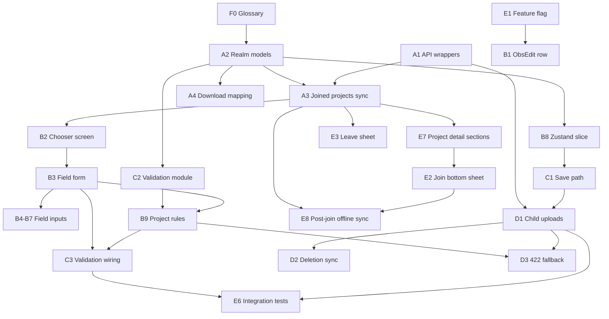

# Traditional Projects — Engineering Build Plan

Phase 2 deliverable for the **Traditional Project Support POD**: exhaustive ticket breakdown for Linear, with implementation notes, Figma references, dependencies, and point estimates.

**Linear project:** [Traditional Projects in App](https://linear.app/inaturalist/project/traditional-projects-in-app-85969e27f9f8) — all implementation tickets for this feature belong in this project (team: **Mobile**).

**Abbreviations:** PO = project observation, OFV = observation field value, POF = project observation field. See [traditional-projects-glossary.md](traditional-projects-glossary.md).

**Audits:** [iOS porting reference](traditional-projects-porting-reference_iOS.md) · [Android porting analysis](traditional-projects-porting-analysis_Android.md)

**Designs:** [Figma — Add to Projects section](https://www.figma.com/design/MChpvx4ZrKEVVwsWKt4lkI/iNaturalist-Mobile-UI-Design?node-id=29821-78787&m=dev)

---

## Summary

| Phase | Points | ~Ideal days (4 pts/day) | Tickets |
|-------|--------|-------------------------|---------|
| Phase 1 | 214 | 54 | F0, A1–A4, B1–B9, C1–C4, D1–D2, D4, E1–E8 |
| Phase 2 | 30 | 8 | P2-2–P2-4, D3 |
| **Total** | **244** | **62** | |

**Estimation:** 1 ideal engineer-day = **4 story points**. Use points for Linear sizing.

**Cancelled (traceability only, 0 pts):** P2-1 (merged into E2), P2-5 (out of scope per 2026-06-10 meeting), E4 (folded into E7 — detail subtitle only; list type already in `ProjectListItem`).

---

## Product meeting outcomes (2026-06-10)

**Attendees:** Tony Iwane, Abhas Misraraj, Johannes Klein

| Topic | Decision |
|-------|----------|
| **Join flow** | Bottom sheet with **3 radio options** (pattern: geo-privacy sheet). About, curators, and rules live on the **public traditional project detail page** — not a separate join screen. |
| **Leave flow** | **3-option full sheet only** — drop simple variant (`29821-81792`). |
| **Incremental release** | Ship **add-to-project first** (feature flag) for already-joined projects; join/leave + project detail enhancements can follow. Foundation/data before UI polish. |
| **Incomplete chooser data** | Back/save with incomplete projects → **Missing info sheet**; LEAVE keeps **only completed** projects; **clear incomplete project state** (no partial data on ObsEdit). |
| **Project rules validation** | Show **project rules at top of chooser** with required/checkmark UI (same pattern as observation fields). Validate **client-checkable rules** (photo, sound, location, captive/cultivated, etc.) before save — **primary strategy** to avoid post-upload 422 complexity. |
| **ObsEdit re-edit** | When editing an obs **already in a traditional project**, ObsEdit must show project requirements/fields (not only via chooser from scratch). |
| **Hidden coords at join** | **In scope** — part of join bottom sheet (absorbs former P2-1). |
| **422 / D3** | Deprioritize — only needed as **fallback** for server-only rules if client validation is insufficient. |
| **P2-5 ObsDetails OFV** | **Out of scope** — not POD scope or classic parity (Tony/Abhas confirmed). |
| **Default select seeding** | **Do not seed** — explicit user input required (reinforces existing plan). |
| **Upload model** | Observation uploads first; **project_observation link is created last** and can 422 — cannot block obs upload server-side for project rules. |

**Action items (not blocking implementation):**

- ~~**Johannes:** Spike which project rules are client-checkable vs server-only~~ — **Done** (2026-06-10); findings in [B9 spike appendix](#b9-spike-appendix--project-rules-validation) below.
- **Tony:** Curator/admin count data for layout.
- ~~**Abhas:** Finalize join/leave bottom sheets, project detail sections, cursor states; annotate Figma~~ — **Done** (2026-06).

---

## Phasing rationale

**Phase 1** = POD launch scope: classic-app parity for add-to-project + field form + join/leave + offline persistence, **plus** POD-mandated items the classic apps lack:

- Client-side required-field validation before upload (iOS validator is dead code; Android only validates in picker confirm)
- **Client-side project rules validation in chooser** (B9) — primary defense against post-upload 422 failures
- Leave flow with keep/remove observations and hidden-coordinate revoke option (3-option sheet)
- Join flow with hidden-coordinate grant via bottom sheet (E2, formerly P2-1)
- Traditional-project indicator in project lists; project detail About/Curators/Rules sections (E7)
- Feature flag for beta rollout

**Phase 2** = resilience upgrades: server 422 fallback surfacing (D3), upload-time schema reconciliation, offline join/leave queue, OFV delete propagation.

### Incremental release strategy (Phase 1)



- **Release 1:** A*, B*, C1, E1 — add-to-project for **already-joined** projects only; feature flag off by default.
- **Release 2:** B9, C2/C3 expanded, D1–D2, D4 — client-side project rules in chooser; blocks upload for checkable rule failures; upload path live.
- **Release 3:** E2, E8, E3, E7 — join/leave bottom sheets; post-join offline cache; traditional project detail sections.

---

## Key engineering decisions

| Area | Decision |
|------|----------|
| **Joined projects cache** | Standalone Realm `Project` model with embedded `ProjectObservationField` → `ObservationField` (mirrors iOS `ExploreProjectRealm`). |
| **Per-observation data** | Embedded `ProjectObservation` + `ObservationFieldValue` on `Observation` (same pattern as `ObservationPhoto`). |
| **In-flight edits** | Zustand observation POJO in `createObservationFlowSlice.ts`; persist on save via `saveLocalObservationForUpload`. |
| **Upload** | Extend `observationUploader.ts`: after obs + media → OFVs → POs (PO link last; can 422 independently). Deletes: PO before OFV. |
| **Membership rules vs preferences** | Only `project_observation_rules` cause rule 422s on traditional `POST /v1/project_observations`. `rule_preferences` / `search_parameters` are ES/display for traditional — show in UI, **do not SAVE-gate on prefs alone**. |
| **Project rules** | Validate `project_observation_rules` in chooser (B9) before save/upload; OR within operator, AND across operators; server-only rules may still 422 (D3 fallback). |
| **Join/leave UI** | Bottom sheet with 3 radio options (geo-privacy pattern); project About/Curators/Rules on detail page, not join screen. |
| **Incremental release** | Add-to-project ships first under feature flag; join/leave follows in Release 3. |
| **Field semantics** | Traditional = `project_type` not collection/umbrella; select = text/dna + >1 `allowed_values`; all values strings; **do not** seed required fields with first allowed value (iOS bug). |
| **UI** | Chooser = full stack screen; reuse `DropdownItem`, `RadioButtonSheet`, `DateTimePicker`, `TaxonSearch`. |

---

## Figma design reference map

**Status: Final (2026-06).** Section: [Add to Projects](https://www.figma.com/design/MChpvx4ZrKEVVwsWKt4lkI/iNaturalist-Mobile-UI-Design?node-id=29821-78787&m=dev) (`29821:78787`).

| Frame | Node | Tickets |
|-------|------|---------|
| [Obs Edit — No Projects Added](https://www.figma.com/design/MChpvx4ZrKEVVwsWKt4lkI/iNaturalist-Mobile-UI-Design?node-id=29821-80570&m=dev) | `29821:80570` | B1 |
| [Obs Edit — Projects Added](https://www.figma.com/design/MChpvx4ZrKEVVwsWKt4lkI/iNaturalist-Mobile-UI-Design?node-id=29821-80653&m=dev) | `29821:80653` | B1 |
| [Logged out state](https://www.figma.com/design/MChpvx4ZrKEVVwsWKt4lkI/iNaturalist-Mobile-UI-Design?node-id=29967-46496&m=dev) | `29967:46496` | B1 |
| [No Projects Selected](https://www.figma.com/design/MChpvx4ZrKEVVwsWKt4lkI/iNaturalist-Mobile-UI-Design?node-id=29821-80612&m=dev) | `29821:80612` | B2 |
| [Add to Projects — No Projects](https://www.figma.com/design/MChpvx4ZrKEVVwsWKt4lkI/iNaturalist-Mobile-UI-Design?node-id=29821-80722&m=dev) | `29821:80722` | B2 |
| [Project Selected — No Requirements Met](https://www.figma.com/design/MChpvx4ZrKEVVwsWKt4lkI/iNaturalist-Mobile-UI-Design?node-id=29876-27135&m=dev) | `29876:27135` | B3, B9, C3 |
| [Project Selected — Some Requirements Met](https://www.figma.com/design/MChpvx4ZrKEVVwsWKt4lkI/iNaturalist-Mobile-UI-Design?node-id=29876-27108&m=dev) | `29876:27108` | B3, B9, C3 |
| [Project Selected — All Requirements Met](https://www.figma.com/design/MChpvx4ZrKEVVwsWKt4lkI/iNaturalist-Mobile-UI-Design?node-id=29876-27162&m=dev) | `29876:27162` | B3 |
| [Cursor State](https://www.figma.com/design/MChpvx4ZrKEVVwsWKt4lkI/iNaturalist-Mobile-UI-Design?node-id=30019-20243&m=dev) | `30019:20243` | B3, B4 |
| [Cursor in Progress](https://www.figma.com/design/MChpvx4ZrKEVVwsWKt4lkI/iNaturalist-Mobile-UI-Design?node-id=30019-20915&m=dev) | `30019:20915` | B3, B4 |
| [Project Rules & Obs Fields — None Met](https://www.figma.com/design/MChpvx4ZrKEVVwsWKt4lkI/iNaturalist-Mobile-UI-Design?node-id=30002-15858&m=dev) | `30002:15858` | B4–B7, B9 (catalog) |
| [Project Rules and Obs Fields — All Met](https://www.figma.com/design/MChpvx4ZrKEVVwsWKt4lkI/iNaturalist-Mobile-UI-Design?node-id=30021-58210&m=dev) | `30021:58210` | B4–B7, B9 (catalog) |
| [Text String Input](https://www.figma.com/design/MChpvx4ZrKEVVwsWKt4lkI/iNaturalist-Mobile-UI-Design?node-id=30026-58576&m=dev) | `30026:58576` | B4 |
| [Number Input](https://www.figma.com/design/MChpvx4ZrKEVVwsWKt4lkI/iNaturalist-Mobile-UI-Design?node-id=30026-59552&m=dev) | `30026:59552` | B4 |
| [Date Input](https://www.figma.com/design/MChpvx4ZrKEVVwsWKt4lkI/iNaturalist-Mobile-UI-Design?node-id=30028-13392&m=dev) | `30028:13392` | B6 |
| [Time Input](https://www.figma.com/design/MChpvx4ZrKEVVwsWKt4lkI/iNaturalist-Mobile-UI-Design?node-id=30028-13467&m=dev) | `30028:13467` | B6 |
| [Date & Time Input](https://www.figma.com/design/MChpvx4ZrKEVVwsWKt4lkI/iNaturalist-Mobile-UI-Design?node-id=30028-13542&m=dev) | `30028:13542` | B6 |
| [Value Input (select)](https://www.figma.com/design/MChpvx4ZrKEVVwsWKt4lkI/iNaturalist-Mobile-UI-Design?node-id=30060-87134&m=dev) | `30060:87134` | B5 |
| [Species Search](https://www.figma.com/design/MChpvx4ZrKEVVwsWKt4lkI/iNaturalist-Mobile-UI-Design?node-id=29821-80733&m=dev) | `29821:80733` | B7 |
| [Missing Info Bottom Sheet](https://www.figma.com/design/MChpvx4ZrKEVVwsWKt4lkI/iNaturalist-Mobile-UI-Design?node-id=29821-80736&m=dev) | `29821:80736` | C3 |
| [Join + Location Permissions](https://www.figma.com/design/MChpvx4ZrKEVVwsWKt4lkI/iNaturalist-Mobile-UI-Design?node-id=30019-21511&m=dev) | `30019:21511` | E2 |
| [Edit Location Permissions](https://www.figma.com/design/MChpvx4ZrKEVVwsWKt4lkI/iNaturalist-Mobile-UI-Design?node-id=30019-58169&m=dev) | `30019:58169` | E2, E7 |
| [Leave Project](https://www.figma.com/design/MChpvx4ZrKEVVwsWKt4lkI/iNaturalist-Mobile-UI-Design?node-id=29821-81668&m=dev) | `29821:81668` | E3 |
| [Traditional Project — Not Joined](https://www.figma.com/design/MChpvx4ZrKEVVwsWKt4lkI/iNaturalist-Mobile-UI-Design?node-id=30019-21238&m=dev) | `30019:21238` | E7 (incl. former E4 subtitle) |
| [Traditional Project — Joined](https://www.figma.com/design/MChpvx4ZrKEVVwsWKt4lkI/iNaturalist-Mobile-UI-Design?node-id=30019-21546&m=dev) | `30019:21546` | E7 |

**Partial coverage:** E4 Projects tab browse list — no dedicated list-row frame; infer type label from project detail subtitle (`Traditional Project` on `30019:21238`) and existing `ProjectListItem` + `displayProjectType.ts`.

---

## Open product questions

1. **Remove all observations on leave** — What API removes a user's existing project observations? Web spike required (part of E3).

---

# Phase 1 tickets

## Workstream F — Documentation (2 pts)

### F0 — Engineering glossary

| | |
|---|---|
| **Points** | 2 |
| **Dependencies** | None |
| **Linear labels** | `docs`, `traditional-projects` |

**Description:** Create and maintain [traditional-projects-glossary.md](traditional-projects-glossary.md) for shared vocabulary across implementers.

**Acceptance criteria:**

- All required terms documented with API key, RN/Realm name, classic-app equivalent, common confusion
- "How the pieces fit together" flow diagram included
- Cross-links to audit docs and build-plan tickets

**Status:** Delivered in this PR.

---

## Workstream A — Data foundation (32 pts)

### A1 — API wrappers and TypeScript types

| | |
|---|---|
| **Points** | 4 |
| **Dependencies** | None |
| **Linear labels** | `api`, `traditional-projects`, `phase-1` |

**Description:** Add write-path API wrappers and types for project observations and observation field values. Extend project fetch to include field definitions.

**Acceptance criteria:**

- `src/api/projectObservations.ts` (or extend `projects.js`): `createProjectObservation`, `updateProjectObservation`, `deleteProjectObservation` via `inatjs.project_observations`
- `src/api/observationFieldValues.ts`: `createObservationFieldValue`, `updateObservationFieldValue`, `deleteObservationFieldValue` via `inatjs.observation_field_values`
- Types in `src/api/types.d.ts`: `ApiObservationField`, `ApiProjectObservationField`, `ApiObservationFieldValue`, `ApiProjectObservation` (with server `id`, `uuid`)
- `fetchProjects` / `fetchUserProjects` accept `fields` including `project_observation_fields` nested `observation_field`
- Unit tests for payload shape helpers if any

**Implementation notes:**

- PO POST body is **flat**: `{ observation_id, project_id, uuid }` (iOS). OFV POST is **nested**: `{ observation_field_value: { ... } }` (iOS/Android).
- `inatjs` endpoints already exist under `node_modules/inaturalistjs/lib/endpoints/`.
- Reference: iOS audit §4–5.1; Android audit §6.

---

### A2 — Realm models and schema migration

| | |
|---|---|
| **Points** | 12 |
| **Dependencies** | None (naming per [glossary](traditional-projects-glossary.md)) |
| **Linear labels** | `realm`, `traditional-projects`, `phase-1` |

**Description:** Add Realm models for joined projects cache and per-observation PO/OFV records. Bump schema version with migration.

**Acceptance criteria:**

- `Project` model: `id`, `title`, `icon`, `project_type`, embedded `projectObservationFields[]`
- `ProjectObservationField`: `projectObsFieldId`, `required`, `position`, `obsField` (→ `ObservationField`)
- `ObservationField`: `obsFieldId`, `name`, `datatype`, `allowedValues[]`, `description`
- Embedded on `Observation`: `projectObservations[]`, `observationFieldValues[]`
- `ProjectObservation`: `uuid` (PK), `projectObsId`, `projectId`, `_synced_at`, `_updated_at`, `needsSync()` / `wasSynced()`
- `ObservationFieldValue`: `uuid` (PK), `obsFieldValueId`, `obsFieldId`, `value` (string), sync timestamps, `needsSync()` / `wasSynced()`
- Schema version bump + migration in `src/realmModels/index.ts`
- `Observation.filterUnsyncedObservations` extended for unsynced PO/OFV children
- `Observation.needsSync()` includes child PO/OFV checks
- Register models in `src/realmModels/index.ts`

**Implementation notes:**

- Follow `ObservationPhoto.ts` / `ObservationSound.ts` patterns for embedded children and upload dirty tracking.
- Client-generated lowercase UUIDs for new PO/OFV (iOS audit §2.4, gotcha #13).
- **Do not** key OFVs by `field_id` alone across projects — scope values per project toggle or use composite identity (Android collision gotcha, Android audit §8).
- Reference: iOS audit §2.4; Android audit §2.

---

### A3 — Joined-projects sync to Realm

| | |
|---|---|
| **Points** | 8 |
| **Dependencies** | A1, A2 |
| **Linear labels** | `sync`, `offline`, `traditional-projects`, `phase-1` |

**Description:** Paginated fetch of user's joined projects with `project_observation_fields` and membership rules metadata, upserted into Realm for offline chooser and B9 validation.

**Acceptance criteria:**

- Hook/service: paginate `fetchUserProjects({ id, per_page: 100, page, fields })` with `rule_details: true` until all pages fetched (match `ProjectRequirements.tsx` pattern)
- Upsert `Project` + embedded POF/ObservationField by `projectId` / `projectObsFieldId` / `obsFieldId`
- Persist on Realm `Project`: `project_observation_rules[]`, `rule_preferences[]`, `search_parameters[]` for offline B9/E7
- For `in_taxon?` / `on_list?` operands: cache `taxon.ancestor_ids` and list taxon IDs when present in `rule_details` response; if API omits, defer those rules to D3 fallback
- Bioblitz projects: cache `start_time` / `end_time` when present
- Trigger on: manual sync tail, chooser screen mount (if online), post join success (E8)
- Offline: chooser reads from Realm only; no wipe-all-projects on refresh (avoid iOS Projects tab aggressive delete — audit gotcha #12)
- `useJoinedProjects` or equivalent Realm query hook

**Implementation notes:**

- Use Node API shape via `fetchUserProjects` / `fetchProjects` with `rule_details: true` — not thin Rails `GET /projects/:id.json`.
- Existing read path: `fetchUserProjects` in `src/api/users.js`, used by `ProjectListContainer`.
- iOS chooser clears `joinedProjects` then re-fetches when online; RN should upsert without breaking PO references.
- Reference: iOS audit §3.2, §6.4; Android audit §6 `saveJoinedProjects`.

---

### A4 — Download mapping for remote observations

| | |
|---|---|
| **Points** | 8 |
| **Dependencies** | A2 |
| **Linear labels** | `realm`, `sync`, `traditional-projects`, `phase-1` |

**Description:** When downloading observations, persist `project_observations` and `ofvs` into Realm so synced obs are editable offline.

**Acceptance criteria:**

- Add to `Observation.FIELDS` and `ADVANCED_MODE_LIST_FIELDS` as needed: `ofvs`, expanded `project_observations`
- `Observation.mapApiToRealm` maps PO/OFV arrays into embedded Realm objects
- Downloaded PO/OFV get `_synced_at` set; server ids on `projectObsId` / `obsFieldValueId`
- Editing a downloaded obs in ObsEdit loads existing project selections and field values

**Implementation notes:**

- Today `Observation.FIELDS` includes `project_observations` but Realm schema drops them on upsert.
- Reference: iOS audit §2.3; Android audit §6 `extra=projects,fields`.

---

## Workstream B — ObsEdit add-to-project UI (70 pts)

### B1 — Projects row in ObsEdit

| | |
|---|---|
| **Points** | 4 |
| **Dependencies** | E1 |
| **Figma** | [`29821-80570`](https://www.figma.com/design/MChpvx4ZrKEVVwsWKt4lkI/iNaturalist-Mobile-UI-Design?node-id=29821-80570&m=dev), [`29821-80653`](https://www.figma.com/design/MChpvx4ZrKEVVwsWKt4lkI/iNaturalist-Mobile-UI-Design?node-id=29821-80653&m=dev), [`29967-46496`](https://www.figma.com/design/MChpvx4ZrKEVVwsWKt4lkI/iNaturalist-Mobile-UI-Design?node-id=29967-46496&m=dev) |
| **Linear labels** | `obs-edit`, `ui`, `traditional-projects`, `phase-1` |

**Description:** Add "Add to Projects" / "Added to N Projects" row in Other Data section; navigate to chooser screen.

**Acceptance criteria:**

- `DropdownItem` in `src/components/ObsEdit/OtherDataSection.js` with `icon-projects`
- Label: "Add to Projects" when count 0; "Added to N Projects" when N > 0
- Gated by `FeatureFlag.TraditionalProjectsEnabled`
- Logged-out tap → native alert per Figma `29967:46496` ("Please log in" / navigate to login)
- Register `AddToProjects` (or similar) in `SharedStackScreens.tsx` / `types.ts`
- Row reads count from Zustand observation POJO
- When re-opening ObsEdit for an obs **already in traditional project(s)**, row reflects existing PO count; user can open chooser or see project context without starting from scratch (hydrate from B8/A4)

**Implementation notes:**

- Mirror geoprivacy/notes row pattern in `OtherDataSection.js`.
- Reference: Android audit §3 entry point `select_projects`.

---

### B2 — Project chooser screen

| | |
|---|---|
| **Points** | 12 |
| **Dependencies** | A3, B8 |
| **Figma** | [`29821-80612`](https://www.figma.com/design/MChpvx4ZrKEVVwsWKt4lkI/iNaturalist-Mobile-UI-Design?node-id=29821-80612&m=dev), [`29821-80722`](https://www.figma.com/design/MChpvx4ZrKEVVwsWKt4lkI/iNaturalist-Mobile-UI-Design?node-id=29821-80722&m=dev) |
| **Linear labels** | `ui`, `navigation`, `traditional-projects`, `phase-1` |

**Description:** Full-screen "Add to Projects" with traditional project toggles, collection/umbrella explainer, empty state, sticky SAVE.

**Acceptance criteria:**

- Fixed header: back + "ADD TO PROJECTS"
- Section "Traditional Projects" + intro copy per Figma
- List joined traditional projects from Realm: icon, title, "Traditional Project" subtitle, circular toggle/checkbox
- Collection/umbrella projects: read-only rows or footer-only explainer per Figma (no toggle)
- Empty state: "You haven't joined any Traditional Projects yet!"
- Footer "Collection & Umbrella Projects" explanatory text
- Sticky SAVE button commits to Zustand and pops navigator
- Works offline from Realm cache
- Optional: title search — defer to post-v1 if timeboxed (no Figma frame)

**Implementation notes:**

- Use `CustomFlashList` for project list; memoized row components per react-native-skills list-performance rules.
- Compound component structure: `ProjectChooserScreen` > `ProjectChooser.Provider` > sections (composition-patterns).
- Reference: iOS `ProjectObservationsViewController`; Android `ProjectSelectorActivity`.

---

### B3 — Per-project observation field form

| | |
|---|---|
| **Points** | 12 |
| **Dependencies** | B2 |
| **Figma** | [`29876-27135`](https://www.figma.com/design/MChpvx4ZrKEVVwsWKt4lkI/iNaturalist-Mobile-UI-Design?node-id=29876-27135&m=dev), [`29876-27108`](https://www.figma.com/design/MChpvx4ZrKEVVwsWKt4lkI/iNaturalist-Mobile-UI-Design?node-id=29876-27108&m=dev), [`29876-27162`](https://www.figma.com/design/MChpvx4ZrKEVVwsWKt4lkI/iNaturalist-Mobile-UI-Design?node-id=29876-27162&m=dev), [`30019-20243`](https://www.figma.com/design/MChpvx4ZrKEVVwsWKt4lkI/iNaturalist-Mobile-UI-Design?node-id=30019-20243&m=dev), [`30019-20915`](https://www.figma.com/design/MChpvx4ZrKEVVwsWKt4lkI/iNaturalist-Mobile-UI-Design?node-id=30019-20915&m=dev) |
| **Linear labels** | `ui`, `traditional-projects`, `phase-1` |

**Description:** Inline expandable requirements + field form under each toggled traditional project.

**Acceptance criteria:**

- Entire traditional project row is tappable; tap toggles expand/collapse with animation
- When expanded: project rules first (B9), then obs fields — required and optional
- Distinct background color per Figma (`#f1f7e5` / grey — match design tokens)
- Fields sorted by `position`; label + right-aligned "Required" tag + pass/fail indicator
- Selection states: pencil icon when required fields/rules unmet; filled checkmark when project has no required fields; global pass/fail per project for submit
- Text/number fields: inline cursor at placeholder position (`30019:20243`); cursor moves while typing (`30019:20915`); dismiss by tapping another field or outside keyboard
- Each obs field row fully tappable; dispatches to type-specific input (B4–B7)
- Supports arbitrary field count (virtualized list / nested FlashList)
- Project rules rows not tappable (evaluative only — B9)

**Implementation notes:**

- `ProjectFieldRow` component with explicit variants per datatype (patterns-explicit-variants).
- Do not replicate iOS `saveVisibleObservationFieldValues` (visible-rows-only) — bind OFV state directly in Zustand/Realm.
- Reference: iOS audit §3.4, §3.8; Android audit §4.

---

### B4 — Field inputs: text and numeric

| | |
|---|---|
| **Points** | 4 |
| **Dependencies** | B3 |
| **Figma** | [`30026-58576`](https://www.figma.com/design/MChpvx4ZrKEVVwsWKt4lkI/iNaturalist-Mobile-UI-Design?node-id=30026-58576&m=dev), [`30026-59552`](https://www.figma.com/design/MChpvx4ZrKEVVwsWKt4lkI/iNaturalist-Mobile-UI-Design?node-id=30026-59552&m=dev) |
| **Linear labels** | `ui`, `traditional-projects`, `phase-1` |

**Description:** Free-text and numeric field entry with placeholders and validation.

**Acceptance criteria:**

- Text/dna with 0–1 allowed values: inline `TextInput`, placeholder "Enter a response"
- Numeric: decimal pad, placeholder "Enter a number", float parse validation
- Values written to OFV in Zustand immediately on change/blur
- Required fields show bold label per iOS/Android

**Implementation notes:**

- Android stores numeric as string; validate parse in C2.
- Reference: Android audit §5 `ProjectFieldViewer` text/numeric branches.
- **Linear:** B4–B7 implemented in MOB-1504; MOB-1505/1506/1507 canceled (build-plan breakdown only).

---

### B5 — Field inputs: select (allowed values)

| | |
|---|---|
| **Points** | 4 |
| **Dependencies** | B3 |
| **Figma** | [`30060-87134`](https://www.figma.com/design/MChpvx4ZrKEVVwsWKt4lkI/iNaturalist-Mobile-UI-Design?node-id=30060-87134&m=dev) |
| **Linear labels** | `ui`, `traditional-projects`, `phase-1` |

**Description:** Select-from-list for text/dna fields with multiple `allowed_values`.

**Acceptance criteria:**

- Detect select: `datatype` text|dna AND `allowedValues.length > 1`
- Row shows "Select a response"; tap opens language-picker-style UI (scrolling native list)
- Sheet header text = field title; Confirm applies currently selected value
- Selected value displayed on row; placeholder when empty

**Implementation notes:**

- Reuse language picker UI pattern from app settings (Figma `30060:87134`).
- Reference: iOS `ProjectObsFieldViewController`; Android Spinner.

---

### B6 — Field inputs: date, time, datetime

| | |
|---|---|
| **Points** | 8 |
| **Dependencies** | B3 |
| **Figma** | [`30028-13392`](https://www.figma.com/design/MChpvx4ZrKEVVwsWKt4lkI/iNaturalist-Mobile-UI-Design?node-id=30028-13392&m=dev), [`30028-13467`](https://www.figma.com/design/MChpvx4ZrKEVVwsWKt4lkI/iNaturalist-Mobile-UI-Design?node-id=30028-13467&m=dev), [`30028-13542`](https://www.figma.com/design/MChpvx4ZrKEVVwsWKt4lkI/iNaturalist-Mobile-UI-Design?node-id=30028-13542&m=dev) |
| **Linear labels** | `ui`, `traditional-projects`, `phase-1` |

**Description:** Date/time pickers for three datatype variants; extend shared `DateTimePicker` for time-only mode.

**Acceptance criteria:**

- `date`: date-only picker, store `yyyy-MM-dd` (Android format)
- `time`: time-only picker, store `HH:mm:ss` or `HH:mm` consistently
- `datetime`: combined picker, store ISO8601 or Android `yyyy-MM-dd HH:mm`
- Placeholders: "Choose a date", "Choose a time", "Choose a date & time"
- Extend `src/components/SharedComponents/DateTimePicker.tsx` with `mode: 'time'` (not only date/datetime two-step)
- **Fix** iOS parity bug: use date-only for `date` datatype (iOS incorrectly uses date+time)

**Implementation notes:**

- Reference: iOS audit gotcha #8; Android audit §5 date/time/datetime formats.

---

### B7 — Field inputs: taxon

| | |
|---|---|
| **Points** | 10 |
| **Dependencies** | B3 |
| **Figma** | [`29821-80733`](https://www.figma.com/design/MChpvx4ZrKEVVwsWKt4lkI/iNaturalist-Mobile-UI-Design?node-id=29821-80733&m=dev) |
| **Linear labels** | `ui`, `taxon-search`, `traditional-projects`, `phase-1` |

**Description:** Taxon field opens species search; store taxon id as string; display taxon chip with photo and name.

**Acceptance criteria:**

- Row placeholder "Select a species"
- Navigate to taxon search (reuse `TaxonSearch` / `SuggestionsTaxonSearch` with callback param, not Zustand obs taxon)
- OFV `value` = taxon id string
- Filled row: thumbnail + common/scientific name
- Offline: show stored id or cached `Taxon` from Realm if available

**Implementation notes:**

- Explore filter pattern: callback + `navigation.goBack()` rather than overwriting obs taxon in Zustand.
- Reference: iOS audit §3.5 taxon delegate; Android `TaxonSearchActivity` with `FIELD_ID`.

---

### B8 — Zustand observation flow state for projects

| | |
|---|---|
| **Points** | 6 |
| **Dependencies** | A2 |
| **Linear labels** | `state`, `traditional-projects`, `phase-1` |

**Description:** Extend observation POJO in `createObservationFlowSlice` with project selections and OFV map.

**Acceptance criteria:**

- `updateObservationKeys` accepts `projectObservations` and `observationFieldValues` (or parallel structure)
- Chooser SAVE merges into current observation in `observations[]`
- Toggle OFF stages removal: track PO/OFV uuids to delete at save (synced) vs drop (never synced)
- Survives rotation via existing observation flow patterns
- Load initial state from Realm when editing existing obs
- When ObsEdit opens for synced/local obs with existing PO/OFV (A4), hydrate project selections and field values into Zustand so chooser and ObsEdit row show current state

**Implementation notes:**

- Android uses `mProjectIds` + `HashMap<Integer, ProjectFieldValue>`; RN should avoid field_id-only key across multiple projects.
- Reference: Android audit §3 `ObservationEditor` state.

---

### B9 — Client-side project rules in chooser

| | |
|---|---|
| **Points** | 10 |
| **Dependencies** | B3, C2 |
| **Figma** | [`29876-27135`](https://www.figma.com/design/MChpvx4ZrKEVVwsWKt4lkI/iNaturalist-Mobile-UI-Design?node-id=29876-27135&m=dev), [`30002-15858`](https://www.figma.com/design/MChpvx4ZrKEVVwsWKt4lkI/iNaturalist-Mobile-UI-Design?node-id=30002-15858&m=dev), [`30021-58210`](https://www.figma.com/design/MChpvx4ZrKEVVwsWKt4lkI/iNaturalist-Mobile-UI-Design?node-id=30021-58210&m=dev) |
| **Linear labels** | `validation`, `ui`, `traditional-projects`, `phase-1` |

**Description:** Display membership rules and preferences at top of each toggled project's field form; validate `project_observation_rules` before SAVE (not `rule_preferences` alone).

**Acceptance criteria:**

- **Two UI sections** per expanded project (rules first, obs fields second):
  1. **Membership rules** — from `project_observation_rules` (pass/fail indicators; evaluative from obs state; **not tappable**; gates SAVE)
  2. **Project preferences** — from `rule_preferences` (informational; reuse `ProjectRequirements.tsx` wording; **no SAVE block** on prefs alone)
  3. **Obs fields** — below rules; pass/fail depends on user input; tappable rows (B4–B7)
- Implement `validateProjectRules(obs, project)` pure function with OR-within-operator / AND-across-operator semantics (see [appendix](#b9-spike-appendix--project-rules-validation))
- **P0 validators:** `identified?`, `georeferenced?`, `has_a_photo?`, `has_a_sound?`, `has_media?`, `in_taxon?`, `not_in_taxon?`, `verifiable?`
- **P1 validators:** `wild?`, `captive?`, `observed_after?`, `observed_before?`, bioblitz window; non-rule: duplicate PO, collection/umbrella block, observer privacy
- **P2 (optional):** `on_list?` if list taxa cached; `rule_preferences` date/month as UI warning only (not hard block)
- **Defer to D3:** `observed_in_place?`, `coordinates_shareable_by_project_curators?`, establishment prefs, `members_only` (badge only)
- Inline warnings when rules fail; block chooser SAVE when P0/P1 membership rules fail
- **Explicit exclusions:** POF/OFV required fields → C2 (`"Missing required observation field: …"`); photo/sound count race after upload → D3
- Unit tests: 5 spike test cases + OR/AND combination cases in `tests/unit/`

**Implementation notes:**

- Primary strategy to avoid post-upload 422 complexity (2026-06-10 meeting); pairs with C3 upload gate.
- Full spike reference: [B9 spike appendix](#b9-spike-appendix--project-rules-validation) in this doc.
- Web display reference: `app/webpack/projects/show/components/requirements.jsx`; RN: `ProjectRequirements.tsx`.

---

## B9 spike appendix — project rules validation

**Source:** Rails server spike (2026-06-10). Traditional PO create validates via `validates_rules_from :project` in `lib/ruler/ruler/has_rules_for.rb` — evaluates **`project_observation_rules` only**, not `rule_preferences`.

### Executive summary

| Category | Count |
|----------|-------|
| Rules that can 422 at PO create | ~25 (operators + non-rule PO validations) |
| Client-checkable (yes) | 10 |
| Client-checkable (partial) | 9 |
| Server-only | 6 |
| `rule_preferences` (display on traditional, not PO-validated) | 11 |

### Rule combination semantics

- **Same `operator`** → **OR** (any one rule in group passes)
- **Different operators** → **AND** (all operator groups must pass)
- **422 shape:** `{ errors: ["Didn't pass rule: …"] }` or `"Didn't pass rules: A OR B"`

### Recommended validators (B9 priority)

| Priority | Operators / checks | Client-checkable |
|----------|-------------------|------------------|
| **P0** | `identified?`, `georeferenced?`, `has_a_photo?`, `has_a_sound?`, `has_media?`, `in_taxon?`, `not_in_taxon?`, `verifiable?` | yes / partial |
| **P1** | `wild?`, `captive?`, `observed_after?`, `observed_before?`, bioblitz window; duplicate PO; collection/umbrella block; observer privacy | yes / partial |
| **P2** | `on_list?` (if list cached); `rule_preferences` date/month (warning only) | partial |
| **Defer** | `observed_in_place?`, `coordinates_shareable_by_project_curators?`, establishment prefs, `members_only` | no |

### Key operator checks (membership rules)

| Operator | Check | Client? |
|----------|-------|---------|
| `identified?` | `taxon_id` present (any rank) | yes |
| `georeferenced?` | lat/lng or private_lat/private_lng (non-zero) | yes |
| `has_a_photo?` / `has_a_sound?` / `has_media?` | persisted media counts | partial (timing race) |
| `verifiable?` | `quality_grade IN ('needs_id','research')` | partial (stale QG) |
| `in_taxon?` / `not_in_taxon?` | taxon ancestry match | partial (needs `ancestor_ids`) |
| `wild?` / `captive?` | `captive_cultivated` / quality metrics | partial |
| `observed_after?` / `observed_before?` | `time_observed_at` / `observed_on` vs operand | yes |
| `observed_in_place?` | PostGIS point-in-polygon | **no** |
| `on_list?` | exact `listed_taxa.taxon_id` match | partial (needs cached list) |

### `rule_preferences` (display only on traditional PO create)

Shown in chooser/E7 for UI parity; **not SAVE-gated**: `quality_grade`, `photos`, `sounds`, `d1`, `d2`, `observed_on`, `month`, `native`, `introduced`, `members_only`, annotation terms. Traditional projects enforce equivalents via `project_observation_rules` operators (e.g. `verifiable?` not `quality_grade` pref).

### POF/OFV validation (C2 — separate from B9)

| Scenario | 422 message |
|----------|-------------|
| 1 required POF | Auto `has_observation_field?` rule |
| 2+ required POFs | `"Missing required observation field: {name}"` |

Upload order: observation → media → **OFVs** → **POs** last.

### Server-only fallback (D3)

Rules that may still 422 after B9 client checks:

- `observed_in_place?` (PostGIS geometry)
- `coordinates_shareable_by_project_curators?` (runtime `ProjectUser` prefs)
- Stale `verifiable?` / quality grade vs server `get_quality_grade`
- `has_a_photo?` / `has_a_sound?` media join timing race
- Stale/missing taxon ancestry for `in_taxon?`
- Observer privacy / invite-only / curators-only when submitter ≠ observer
- Misconfigured collection-only operators (`observed_by_user?`, `in_project?`)

### API gaps (server backlog)

- `rule_preferences` displayed but not PO-enforced on traditional — client validating prefs may over-block
- Place rules lack geometry in mobile cache — cannot offline-validate `observed_in_place?`
- Taxon rules may lack `ancestor_ids` in default payload — include when `rule_details=true`
- `on_list?` needs `project_list_taxon_ids[]` on project when `rule_details=true`

### Test cases

1. **Pass** — `in_taxon?` (Aves) + `georeferenced?`; obs has child taxon + coords → 200 PO
2. **Fail** — `in_taxon?` + `georeferenced?`; obs has taxon, no coords → 422 `"must be georeferenced"`
3. **Fail** — `verifiable?`; obs casual despite photo+coords+date → 422 `"must be verifiable"`
4. **Edge** — `has_a_photo?` after upload race (PO before photo join) → 422; client may false-pass
5. **Edge** — `observed_in_place?` with obscured private coords inside place → 200; client checking public coords only would false-negative

### `validateProjectRules` pseudocode

```javascript
function validateProjectRules(obs, project) {
  const errors = [];
  const rulesByOperator = groupBy(project.project_observation_rules, "operator");
  for (const [operator, rules] of rulesByOperator) {
    const passed = rules.some(rule => evaluateRule(obs, project, rule));
    if (!passed) {
      errors.push(formatRuleTerms(rules)); // OR-join wording per server
    }
  }
  return errors;
}
```

### Rails source index

| File | Role |
|------|------|
| `app/controllers/project_observations_controller.rb` | PO create API, 422 JSON |
| `app/models/project_observation.rb` | Rule methods + non-rule validations |
| `lib/ruler/ruler/has_rules_for.rb` | AND/OR combination, error messages |
| `app/models/project_observation_rule.rb` | Operator definitions, `terms` strings |
| `app/models/project.rb` | `RULE_PREFERENCES`, aggregation |
| `app/models/observation.rb` | `verifiable?`, `georeferenced?`, `captive_cultivated?` |
| `app/models/project_observation_field.rb` | Required POF → `has_observation_field?` rule |
| `spec/models/project_observation_rule_spec.rb` | OR/AND semantics tests |

---

## Workstream C — Save and validation (28 pts)

### C1 — Save path for POs and OFVs

| | |
|---|---|
| **Points** | 8 |
| **Dependencies** | A2, B8 |
| **Linear labels** | `realm`, `obs-edit`, `traditional-projects`, `phase-1` |

**Description:** Persist project observations and field values when saving observation locally.

**Acceptance criteria:**

- `Observation.saveLocalObservationForUpload` writes embedded PO/OFV with `_updated_at`, `_synced_at` null for new/changed
- New PO/OFV get client UUIDs
- Removed synced PO/OFV create tombstone / `_pending_deletion` flag for upload pipeline
- `needs_sync` on parent observation set true when project data changes
- Re-edit path: when user saves ObsEdit for obs with existing PO/OFV, only changed projects/fields marked dirty

**Implementation notes:**

- Reference: iOS obs edit `validatedSave` + staged `recordsToDelete`; Android `saveProjects` / `saveProjectFields`.

---

### C2 — Validation module

| | |
|---|---|
| **Points** | 4 |
| **Dependencies** | A2 |
| **Linear labels** | `validation`, `traditional-projects`, `phase-1` |

**Description:** Pure functions to validate **POF/OFV required fields** before save/upload. Membership rules are **B9** — separate module, separate error strings.

**Acceptance criteria:**

- `validateProjectFieldsForObservation(obs, projects)`: returns `{ valid, errors: [{ projectTitle, fieldName, reason }] }`
- Required: non-empty string after trim
- Numeric: must parse as float when non-empty
- 2+ required POFs: all must have OFVs (matches `"Missing required observation field: {name}"` server message)
- Unit tests in `tests/unit/` covering required, numeric, multi-project cases

**Implementation notes:**

- Port iOS `validateProjectObservationsForObservation` logic (iOS audit §3.9) but actually wire it (iOS never did).
- Reference: Android `ProjectFieldViewer.isValid()`; [B9 appendix](#b9-spike-appendix--project-rules-validation) POF section.

---

### C3 — Wire validation gates

| | |
|---|---|
| **Points** | 8 |
| **Dependencies** | C2, B3, B9 |
| **Figma** | [`29821-80736`](https://www.figma.com/design/MChpvx4ZrKEVVwsWKt4lkI/iNaturalist-Mobile-UI-Design?node-id=29821-80736&m=dev) |
| **Linear labels** | `validation`, `ui`, `traditional-projects`, `phase-1` |

**Description:** Block save/upload when required project fields or client-checkable project rules fail; show designed error surfaces.

**Acceptance criteria:**

- Chooser SAVE: run field validation (C2) and project rules validation (B9); block pop if invalid; inline pass/fail per row (B3/B9) — **no** inline warning banner (removed in final Figma)
- Chooser back without SAVE: if invalid/incomplete selections, show "Missing info" sheet — LEAVE / KEEP EDITING
- LEAVE on Missing info sheet: **only completed projects** persist to Zustand/ObsEdit; **clear incomplete project selections and partial OFV state** (no partial data left on ObsEdit)
- ObsEdit Upload button: run validation before `addToUploadQueue` (like `missingBasics`)
- `filterUnsyncedObservations` / upload queue excludes obs failing validation OR mark with validation flag
- Offline: validation runs locally without network

**Implementation notes:**

- **Gate order:** C2 (POF/OFV fields) → B9 (membership rules) → pop or block upload.
- `BottomButtonsContainer.tsx` insertion point alongside `passesEvidenceTest` / `hasIdentification`.
- Reference: Figma designer note on offline failure states.

---

### C4 — ObsDetails local project display

| | |
|---|---|
| **Points** | 4 |
| **Dependencies** | A2 |
| **Linear labels** | `obs-details`, `traditional-projects`, `phase-1` |

**Description:** Show pending/unsynced project memberships from Realm on observation detail for local observations.

**Acceptance criteria:**

- `ProjectSection` / `ProjectButton` read from Realm observation when local/unsynced, not only remote API
- Indicate count including not-yet-uploaded traditional project adds
- Navigate to project list with local data

**Implementation notes:**

- Existing: `useRemoteObservation` + `ApiObservation.project_observations`.

---

## Workstream D — Upload pipeline (28 pts)

### D1 — Upload OFVs and POs after observation

| | |
|---|---|
| **Points** | 12 |
| **Dependencies** | A1, C1 |
| **Linear labels** | `upload`, `traditional-projects`, `phase-1` |

**Description:** Extend observation uploader to sync project child records.

**Acceptance criteria:**

- After `attachMediaToObservation` in `observationUploader.ts`: upload dirty OFVs, then dirty POs
- OFV: POST or PUT per `wasSynced()`; nested body shape
- PO: POST flat body; requires server `observation.id`
- `markRecordUploaded` in `realmSync.ts` handles `ProjectObservation` and `ObservationFieldValue`
- `countTotalIncrements` in upload slice includes new child ops for progress UI
- Skip children when parent obs has no server id yet (retry next upload)

**Implementation notes:**

- Order: OFVs before POs (iOS `childrenNeedingUpload`, Android §6). **PO link is created last** and can 422 independently — obs upload is not blocked server-side for project rules.
- Reference: iOS audit §5.2; Android audit lines 2035–2036.

---

### D2 — Deletion sync for POs and OFVs

| | |
|---|---|
| **Points** | 8 |
| **Dependencies** | D1 |
| **Linear labels** | `upload`, `traditional-projects`, `phase-1` |

**Description:** Sync removals of project links and field values to server before uploads.

**Acceptance criteria:**

- Process tombstoned/deleted PO before OFV (iOS `deletedRecordsNeedingSync` order)
- `DELETE /v1/project_observations/{id}` and `DELETE /v1/observation_field_values/{id}`
- 404/403 treated as success (iOS audit §5.3)
- Local Realm records removed after successful delete sync

**Implementation notes:**

- Integrate with existing delete queue pattern in `createSyncObservationsSlice` or extend upload session pre-pass.

---

### D4 — Multi-obs and edge-case QA

| | |
|---|---|
| **Points** | 8 |
| **Dependencies** | D1, D2 |
| **Linear labels** | `qa`, `traditional-projects`, `phase-1` |

**Description:** Harden upload/edit flows for synced observations, multi-obs carousel, and id remapping.

**Acceptance criteria:**

- Edit synced observation: add/remove projects, upload deltas only
- Multi-observation flow: each obs carries independent project state
- Local observation id → server id remaps PO/OFV `observation_id` references (Android `ObservationProvider` pattern)
- Manual test checklist documented in ticket/PR

---

## Workstream E — Join/leave, indicators, release (54 pts)

### E1 — Feature flag

| | |
|---|---|
| **Points** | 2 |
| **Dependencies** | None |
| **Linear labels** | `feature-flag`, `traditional-projects`, `phase-1` |

**Description:** Gate Traditional Projects behind `TraditionalProjectsEnabled` feature flag.

**Acceptance criteria:**

- Add to `FeatureFlag` enum and `createFeatureFlagSlice.ts` (default `false`)
- Developer override in `FeatureFlags.tsx`
- **Release 1:** Gates B1 row and chooser navigation (shipped in MOB-1493)
- **Release 3:** E2/E3/E7 traditional-project flows (join sheet, leave sheet, About/Admins/Rules sections, Edit location permissions) gated by `TraditionalProjectsEnabled` **for traditional projects only**
- **All project types (flag-independent):** global copy on project detail — "Manage Membership" heading, "Leave Project" button label — may ship without flag; confirm with product

**Implementation notes:**

- Follow `ExploreV2Enabled` / `NewsEnabled` precedent.
- Release 3 flag checks land in E2/E3/E7 implementation (E1 foundation already merged).

---

### E2 — Join flow: bottom sheet

| | |
|---|---|
| **Points** | 10 |
| **Dependencies** | E7 |
| **Figma** | [`30019-21511`](https://www.figma.com/design/MChpvx4ZrKEVVwsWKt4lkI/iNaturalist-Mobile-UI-Design?node-id=30019-21511&m=dev), [`30019-58169`](https://www.figma.com/design/MChpvx4ZrKEVVwsWKt4lkI/iNaturalist-Mobile-UI-Design?node-id=30019-58169&m=dev) |
| **Linear labels** | `projects`, `ui`, `traditional-projects`, `phase-1` |

**Description:** Join traditional project via location-permissions bottom sheet (3 radio options, geo-privacy pattern). Absorbs former P2-1 hidden-coordinates grant. Post-join fetch and offline chooser availability are **E8**.

**Acceptance criteria:**

- Tapping Join on project detail opens `30019:21511` bottom sheet: 3 location-permission radio options (web parity)
- **Confirm & Join** sets location permissions AND adds user to project in one action
- User reads About, Project Admins, and Project Rules on project detail page (E7) before joining — no separate join info screen
- Joined traditional projects: **Edit location permissions** button opens `30019:58169`; current selection grayed out; Confirm enabled only when selection changes
- On join success: `POST join` with selected options; on success callback triggers **E8** post-join sync (do not block sheet dismiss on full project fetch)
- Optimistic UI: show joined state on project detail; rollback on join API failure
- Invalidate React Query project/membership queries (joined list refetch can follow E8)
- Document `prefers_curator_coordinate_access` / join API params in glossary

**Implementation notes:**

- Supersedes P2-1 (2026-06-10 meeting).
- Android audit §6: native apps POST join only; RN adds bottom sheet options web has today.

---

### E8 — Post-join project sync for offline chooser

| | |
|---|---|
| **Points** | 6 |
| **Dependencies** | A3, E2 |
| **Linear labels** | `projects`, `sync`, `offline`, `traditional-projects`, `phase-1` |

**Description:** After successful join (E2), fetch full project payload and upsert into Realm so the new project is available in the add-to-project chooser **offline** on next open.

**Acceptance criteria:**

- On E2 join success: fetch project with `rule_details: true` and `project_observation_fields` (same field set as A3 joined-projects sync)
- Upsert Realm `Project` + POFs + `project_observation_rules` / `rule_preferences` / `search_parameters` per A3
- Joined project appears in chooser without network on next open (offline availability)
- If fetch fails after successful join: user remains joined server-side; show retry affordance; chooser may be stale until A3 next sync
- Reuse A3 upsert logic (shared service) — do not duplicate Realm write paths
- Also callable from A3 bulk sync path for consistency

**Implementation notes:**

- Android: `POST join` then `GET /projects/{id}` (audit §6). iOS join response may lack fields — RN must fetch explicitly (E8, not E2).
- Split from E2 so join UI can ship independently of offline cache hardening.

---

### E3 — Leave flow with retention options

| | |
|---|---|
| **Points** | 12 |
| **Dependencies** | A3 |
| **Figma** | [`29821-81668`](https://www.figma.com/design/MChpvx4ZrKEVVwsWKt4lkI/iNaturalist-Mobile-UI-Design?node-id=29821-81668&m=dev) |
| **Linear labels** | `projects`, `ui`, `traditional-projects`, `phase-1` |

**Description:** Leave project sheet with observation retention and hidden-coordinate options per Figma. Mirrors join bottom sheet structure (3 options only).

**Acceptance criteria:**

- Replace/simplify current leave confirm in `ProjectDetails.tsx` / container
- **3-option full sheet only** (2026-06-10): (1) leave obs in project, curators keep coord access (2) leave obs, revoke hidden coord access via `project_users` API (3) remove all user's obs from project
- CANCEL / LEAVE (destructive) buttons
- On success: `DELETE leave`, remove `Project` from Realm joined cache
- **Spike (2 pts included):** document web API for option 3 and `prefers_curator_coordinate_access` update for option 2

**Implementation notes:**

- Classic apps only show generic warning (iOS §6.1, Android §7).
- Reference: glossary `prefers_curator_coordinate_access`.

---

### E4 — Traditional project indicator in lists — CANCELLED

| | |
|---|---|
| **Points** | 0 (folded into E7) |
| **Linear** | MOB-1494 (Canceled, duplicate of MOB-1523) |

**Description:** ~~Visual indicator for traditional vs collection/umbrella in project browse lists and details.~~ Final Figma shows type subtitle on **project detail only** (`30019:21238`); Projects tab list already uses `ProjectListItem` + `displayProjectType.ts`. Scope absorbed into **E7** (detail subtitle styling).

---

### E7 — Project detail page — sections and membership UI

| | |
|---|---|
| **Points** | 10 |
| **Dependencies** | A3 |
| **Figma** | [`30019-21238`](https://www.figma.com/design/MChpvx4ZrKEVVwsWKt4lkI/iNaturalist-Mobile-UI-Design?node-id=30019-21238&m=dev), [`30019-21546`](https://www.figma.com/design/MChpvx4ZrKEVVwsWKt4lkI/iNaturalist-Mobile-UI-Design?node-id=30019-21546&m=dev) |
| **Linear labels** | `projects`, `ui`, `traditional-projects`, `phase-1` |

**Description:** Re-layout `ProjectDetails.tsx`: About, Project Admins, Project Rules (traditional only), membership UI, and project-type subtitle. Absorbs former E4 (detail subtitle). Content referenced from join flow (user reads rules on page before joining via bottom sheet).

**Acceptance criteria:**

- **All project types:** `"Traditional Project"` / collection / umbrella subtitle under title per Figma `30019:21238` (via `displayProjectType.ts`; replaces generic type line styling)
- **All project types (joined):** **Manage Membership** heading (replaces "Leave Project" section title); **Leave Project** button label (replaces "Leave")
- **Traditional only:** `ProjectDetails` shows **About** section (project description)
- **Traditional only:** **Project Admins** section with admin cards (tappable → user profile); layout per Tony's count data; scope TBD for collection/umbrella vs traditional only
- **Traditional only:** **Project Rules** section — inline rules list (not collection-only "View requirements" button); enforced + informational rules from `project_observation_rules`
- **Traditional joined:** **Edit location permissions** entry → E2 edit sheet (`30019:58169`)
- Not joined: Join Project CTA → E2 bottom sheet
- Footnote: only membership rules are enforced when adding obs — see [B9 appendix](#b9-spike-appendix--project-rules-validation)
- Reuse `ProjectRequirements.tsx` rendering patterns where possible
- **API spike (included):** filter `fetchProjectMembers` by admin/curator role or dedicated endpoint for Project Admins section

**Implementation notes:**

- 2026-06-10 meeting: join flow does not duplicate project info on a separate screen.
- Release 3: traditional-project sections gated by `TraditionalProjectsEnabled` (E1); global copy changes may apply regardless — confirm with product.

---

### E5 — i18n strings

| | |
|---|---|
| **Points** | 2 |
| **Dependencies** | None (parallel with UI tickets) |
| **Linear labels** | `i18n`, `traditional-projects`, `phase-1` |

**Description:** Add all user-facing strings to `src/i18n/strings.ftl` with translator comments.

**Acceptance criteria:**

- Strings for chooser, validation, leave sheet, field placeholders, errors
- **Final-design strings (2026-06):** location-permission option labels (join + edit sheets), "Confirm & Join", "Manage Membership", "Leave Project", "Edit location permissions", Missing info sheet body (LEAVE / KEEP EDITING), logged-out alert on ObsEdit (`29967:46496`), Project Admins / Project Rules section headings
- Run i18n CLI to regenerate locale JSON
- Crowdin sync note in PR description

---

### E6 — Integration tests

| | |
|---|---|
| **Points** | 12 |
| **Dependencies** | D1, C3 |
| **Linear labels** | `tests`, `traditional-projects`, `phase-1` |

**Description:** End-to-end tests for core traditional project flows.

**Acceptance criteria:**

- Factoria factories: `ProjectWithFields`, `ObservationWithProjectFields`
- Integration test: open ObsEdit → chooser → toggle project → fill required field → save → verify Realm
- Integration test: validation blocks upload when required field empty
- Integration test: offline save persists PO/OFV locally
- Tests in `tests/integration/` following `renderApp` patterns

---

# Phase 2 tickets (30 pts)

### P2-1 — Hidden coordinates at join — CANCELLED

| | |
|---|---|
| **Points** | 0 |
| **Status** | **Cancelled** — superseded by E2 (2026-06-10 meeting). Hidden-coordinate grant is part of join bottom sheet. |

---

### D3 — Server 422 fallback surfacing

| | |
|---|---|
| **Points** | 4 |
| **Dependencies** | D1, B9 |
| **Linear labels** | `upload`, `errors`, `traditional-projects`, `phase-2` |

**Description:** Fallback surfacing for project validation failures from server during upload — only for **server-only rules** not covered by client-side validation (B9).

**Acceptance criteria:**

- On 422 from PO or OFV upload: parse `errors[]`, set per-obs message on observation (e.g. `validationErrorMsg` field or upload slice)
- Message includes project title when PO fails: "Couldn't be added to project {title}. {error}"
- No dedicated MyObs error UI unless product requires — minimal surfacing acceptable
- Failed PO link does not block observation upload retry; manual retry after user fixes fields
- Clear validation message on re-save / re-upload attempt

**Implementation notes:**

- Deprioritized per 2026-06-10 meeting; implement only if B9 client validation leaves gaps.
- **Server-only rules** (full list in [B9 appendix](#b9-spike-appendix--project-rules-validation)): `observed_in_place?`, `coordinates_shareable_by_project_curators?`, stale QG/verifiable, media timing race, stale taxon ancestry, observer privacy/membership, misconfigured collection-only operators.
- iOS stores on `ExploreObservationRealm.validationErrorMsg` (audit §5.4).
- Android uses SharedPreferences per obs+project.

---

### P2-2 — Upload-time schema reconciliation

| | |
|---|---|
| **Points** | 8 |
| **Dependencies** | D1, C2 |
| **Linear labels** | `upload`, `phase-2` |

**Description:** Re-fetch `project_observation_fields` before upload; re-validate OFVs against fresh schema.

**Acceptance criteria:**

- Before uploading PO/OFV for an obs, refresh field definitions for selected projects if stale
- Re-run validation; block upload with actionable message if new required field added server-side

**Implementation notes:**

- Neither classic app does upload-time reconciliation (iOS §5.5, Android §11).

---

### P2-3 — OFV clear/delete propagation

| | |
|---|---|
| **Points** | 6 |
| **Dependencies** | D1 |
| **Linear labels** | `upload`, `phase-2` |

**Description:** When user clears a synced field value, DELETE on server.

**Acceptance criteria:**

- Clearing OFV in editor queues DELETE for synced records
- Android never syncs clears — RN improvement per POD

---

### P2-4 — Offline join/leave queue

| | |
|---|---|
| **Points** | 12 |
| **Dependencies** | E2, E8, E3 |
| **Linear labels** | `offline`, `phase-2` |

**Description:** Queue join/leave when offline; replay when online (E8 replays post-join fetch on replay).

**Acceptance criteria:**

- Optimistic UI with rollback on failure
- Persist pending join/leave ops in Realm or MMKV
- Classic apps hard-block offline

---

### P2-5 — Read-only OFV display on ObsDetails — CANCELLED

| | |
|---|---|
| **Points** | 0 |
| **Status** | **Cancelled / out of scope** — not POD scope or classic parity (Tony/Abhas, 2026-06-10 meeting). |

---

## Dependency graph



---

## Parallelization and milestones

### Sprint 0 (can start immediately) — 20 pts

| Ticket | Pts |
|--------|-----|
| F0 | 2 |
| A1 | 4 |
| A2 | 12 |
| E1 | 2 |

### Milestone 1 — Data layer complete — 28 pts cumulative from A

| Ticket | Pts |
|--------|-----|
| A3 | 8 |
| A4 | 8 |
| B8 | 6 |
| C2 | 4 |
| E5 | 2 |

### Milestone 2 — Chooser + fields UI — 70 pts (B track)

| Ticket | Pts |
|--------|-----|
| B1–B9 | 62 |
| (B4–B7 parallelizable across devs) | |

### Milestone 3 — Save, validate, upload — 56 pts (C + D, Release 2)

| Ticket | Pts |
|--------|-----|
| C1, C3, C4 | 20 |
| B9 | 10 |
| D1, D2, D4 | 28 |

### Milestone 4 — Join/leave + ship — 50 pts (E track, Release 3)

| Ticket | Pts |
|--------|-----|
| E2, E8, E3, E7, E6 | 50 |
| E1 already partial in M0 | 2 |

**Incremental release notes:** Release 1 (M0–M2 partial) ships add-to-project for already-joined projects under feature flag. Release 2 (M3) adds B9 + upload. Release 3 (M4) adds join/leave + E7.

### Parallelization notes

- **Dev A:** A1 → A3 → B2 → B3 → B4/B5/B6/B7 (any one input)
- **Dev B:** A2 → B8 → C1 → C2 → B9 → C3 → D1 → D2
- **Dev C:** E1 → B1; E7 (incl. E4 subtitle) → E2 → E8/E3 after A3; E6 after D1+C3
- B4–B7 and B9 are independent once B3 lands — split across up to 4 developers.

### Suggested Linear milestones

1. `TPOD-M0-foundation` — F0, A1, A2, E1
2. `TPOD-M1-sync-realm` — A3, A4, B8, C2
3. `TPOD-M2-chooser-ui` — B1, B2, B3, B4–B7, B9, E5
4. `TPOD-M3-save-upload` — C1, C3, C4, D1, D2, D4
5. `TPOD-M4-join-release` — E7 (incl. former E4), E2, E8, E3, E6
6. `TPOD-phase-2` — D3, P2-2–P2-4 (P2-1, P2-5 cancelled)

### Suggested Linear labels

`traditional-projects`, `phase-1`, `phase-2`, plus area labels: `api`, `realm`, `upload`, `obs-edit`, `ui`, `validation`, `projects`, `tests`, `docs`, `feature-flag`, `offline`, `needs-product`, `needs-design`

---

## Ticket index (quick reference)

| ID | Title | Pts | Deps |
|----|-------|-----|------|
| F0 | Engineering glossary | 2 | — |
| A1 | API wrappers + types | 4 | — |
| A2 | Realm models + migration | 12 | — |
| A3 | Joined-projects sync | 8 | A1, A2 |
| A4 | Download mapping | 8 | A2 |
| B1 | ObsEdit Projects row | 4 | E1 |
| B2 | Project chooser screen | 12 | A3 |
| B3 | Per-project field form | 12 | B2 |
| B4 | Text + numeric inputs | 4 | B3 |
| B5 | Select input | 4 | B3 |
| B6 | Date/time inputs | 8 | B3 |
| B7 | Taxon input | 10 | B3 |
| B8 | Zustand project state | 6 | A2 |
| B9 | Client-side project rules | 10 | B3, C2 |
| C1 | Save POs/OFVs | 8 | A2, B8 |
| C2 | Validation module | 4 | A2 |
| C3 | Validation wiring | 8 | C2, B3, B9 |
| C4 | ObsDetails local projects | 4 | A2 |
| D1 | Upload OFVs + POs | 12 | A1, C1 |
| D2 | Deletion sync | 8 | D1 |
| D4 | Multi-obs edge QA | 8 | D1, D2 |
| E1 | Feature flag | 2 | — |
| E2 | Join bottom sheet | 10 | E7 |
| E8 | Post-join offline sync | 6 | A3, E2 |
| E3 | Leave retention sheet | 12 | A3 |
| E4 | Project type indicator | 0 | — (cancelled → E7) |
| E5 | i18n strings | 2 | — |
| E6 | Integration tests | 12 | D1, C3 |
| E7 | Project detail — sections + membership UI | 10 | A3 |
| D3 | 422 fallback surfacing | 4 | D1, B9 |
| P2-1 | Hidden coords at join | 0 | — (cancelled → E2) |
| P2-2 | Upload-time reconciliation | 8 | D1 |
| P2-3 | OFV delete propagation | 6 | D1 |
| P2-4 | Offline join/leave queue | 12 | E2, E8, E3 |
| P2-5 | OFV on ObsDetails | 0 | — (cancelled) |

**Linear mapping (MOB-1490 – MOB-1524):**

| Ticket | Linear | Ticket | Linear |
|--------|--------|--------|--------|
| F0 | MOB-1490 | C1 | MOB-1508 |
| A1 | MOB-1491 | C3 | MOB-1509 |
| A2 | MOB-1492 | D1 | MOB-1510 |
| E1 | MOB-1493 | D2 | MOB-1511 |
| E4 | MOB-1494 (cancelled → E7) | D3 | MOB-1512 |
| E5 | MOB-1495 | D4 | MOB-1513 |
| A3 | MOB-1496 | E2 | MOB-1514 |
| A4 | MOB-1497 | E3 | MOB-1515 |
| B8 | MOB-1498 | E6 | MOB-1516 |
| C2 | MOB-1499 | P2-1 | MOB-1517 (cancelled) |
| C4 | MOB-1500 | P2-2 | MOB-1518 |
| B1 | MOB-1501 | P2-3 | MOB-1519 |
| B2 | MOB-1502 | P2-4 | MOB-1520 |
| B3 | MOB-1503 | P2-5 | MOB-1521 (cancelled) |
| B4–B7 | MOB-1504 | B9 | MOB-1522 |
| B5 | MOB-1505 (canceled → MOB-1504) | E7 | MOB-1523 |
| B6 | MOB-1506 (canceled → MOB-1504) | E8 | MOB-1524 |
| B7 | MOB-1507 (canceled → MOB-1504) | | |
| B7 | MOB-1507 | | |
