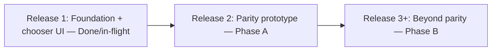
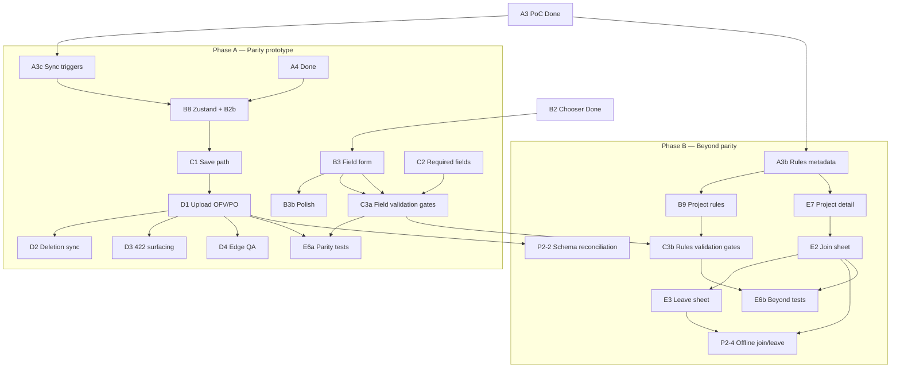

# Traditional Projects — Engineering Build Plan

Phase 2 deliverable for the **Traditional Project Support POD**: exhaustive ticket breakdown for Linear, with implementation notes, Figma references, dependencies, and point estimates.

**Linear project:** [Traditional Projects in App](https://linear.app/inaturalist/project/traditional-projects-in-app-85969e27f9f8) — all implementation tickets for this feature belong in this project (team: **Mobile**).

**Abbreviations:** PO = project observation, OFV = observation field value, POF = project observation field. See [traditional-projects-glossary.md](traditional-projects-glossary.md).

**Audits:** [iOS porting reference](traditional-projects-porting-reference_iOS.md) · [Android porting analysis](traditional-projects-porting-analysis_Android.md)

**Designs:** [Figma — Add to Projects section](https://www.figma.com/design/MChpvx4ZrKEVVwsWKt4lkI/iNaturalist-Mobile-UI-Design?node-id=29821-78787&m=dev)

---

## Summary

| Phase | Points | ~Ideal days (4 pts/day) | Scope |
|-------|--------|-------------------------|-------|
| **Delivered / in-flight** | 74 | — | F0, A1–A4, E1, E8, B1, B2; B3, B4–B7 in progress |
| **Phase A — Parity (remaining)** | 75 | 19 | A3c, B8, B3b, BUG, C1–C4, C3a, D1–D4, D3, E5a, E6a |
| **Phase B — Beyond parity** | 77 | 19 | A3b, B9, C3b, E2, E3, E7, E5b, E6b, P2-2, P2-4 |
| **Total (active)** | **226** | **57** | Excludes cancelled tickets |

**Estimation:** 1 ideal engineer-day = **4 story points**. Use points for Linear sizing.

**Shippable prototype:** Phase A completes classic iOS/Android parity for add-to-project, field form, save/upload, and server 422 surfacing. Basic join/leave and project detail already ship on `main` without the feature flag. Phase B starts after the parity prototype is tested.

**Cancelled (traceability only, 0 pts):** P2-1 (merged into E2), P2-3 (merged into D2), P2-5 (out of scope per 2026-06-10 meeting), E4 (folded into E7 — detail subtitle only; list type already in `ProjectListItem`).

---

## Product meeting outcomes (2026-06-10)

**Attendees:** Tony Iwane, Abhas Misraraj, Johannes Klein

| Topic | Decision |
|-------|----------|
| **Join flow** | Bottom sheet with **3 radio options** (pattern: geo-privacy sheet). About, curators, and rules live on the **public traditional project detail page** — not a separate join screen. |
| **Leave flow** | **3-option full sheet only** — drop simple variant (`29821-81792`). |
| **Incremental release** | Ship **add-to-project first** (feature flag) for already-joined projects; join/leave + project detail enhancements can follow. Foundation/data before UI polish. |
| **Incomplete chooser data** | Back/save with incomplete projects → **Missing info sheet**; LEAVE keeps **only completed** projects; **clear incomplete project state** (no partial data on ObsEdit). |
| **Project rules validation** | Show **project rules at top of chooser** with required/checkmark UI (same pattern as observation fields). Validate **client-checkable rules** (photo, sound, location, captive/cultivated, etc.) before save — **primary strategy** to avoid post-upload 422 complexity. |
| **ObsEdit re-edit** | When editing an obs **already in a traditional project**, ObsEdit must show project requirements/fields (not only via chooser from scratch). |
| **Hidden coords at join** | **In scope** — part of join bottom sheet (absorbs former P2-1). |
| **422 / D3** | **Phase A (parity):** surface server 422 at upload time (classic-app behavior). **Phase B (B9):** client-side rules reduce 422 rate. |
| **P2-5 ObsDetails OFV** | **Out of scope** — not POD scope or classic parity (Tony/Abhas confirmed). |
| **Default select seeding** | **Do not seed** — explicit user input required (reinforces existing plan). |
| **Upload model** | Observation uploads first; **project_observation link is created last** and can 422 — cannot block obs upload server-side for project rules. |

**Action items (not blocking implementation):**

- ~~**Johannes:** Spike which project rules are client-checkable vs server-only~~ — **Done** (2026-06-10); findings in [B9 spike appendix](#b9-spike-appendix--project-rules-validation) below.
- **Tony:** Curator/admin count data for layout.
- ~~**Abhas:** Finalize join/leave bottom sheets, project detail sections, cursor states; annotate Figma~~ — **Done** (2026-06).

---

## Phasing rationale

Work is split into **parity** (Phase A) and **beyond parity** (Phase B). Phase A ends in a **shippable prototype** that matches what the classic iOS and Android apps do. Phase B adds POD-mandated enhancements the classic apps lack and starts only after the prototype is tested.

### Phase A — Classic parity (shippable prototype)

Everything the classic apps support today:

- Add observation to joined traditional projects (chooser, field form, all 7 field types)
- Required-field validation before save (Android validates at picker confirm; iOS validator is dead code — RN wires C2/C3a)
- Save PO/OFV to Realm; upload OFVs then POs; sync deletions (D2, incl. OFV clear → DELETE — iOS parity)
- Server 422 surfacing on failed PO/OFV upload (D3 — classic apps store `validationErrorMsg` / SharedPreferences)
- ObsDetails local project display for unsynced adds (C4)
- Joined-projects sync triggers (A3c); post-join fetch (E8, **Done**)
- Feature flag for beta rollout (E1, **Done**)

**Already on `main` (no ticket):** basic join/leave via `ProjectDetailsContainer` (`joinProject` / `leaveProject`); project detail with type label, description, and requirements link.

**Not in Phase A:** client-side project rules in chooser (B9), join/leave bottom sheets with location permissions (E2/E3), project detail re-layout (E7), upload-time pre-validation blocking (C3b), upload-time schema reconciliation (P2-2), offline join/leave queue (P2-4).

### Phase B — Beyond parity (post-prototype)

POD-mandated items classic apps lack:

- Client-side project rules validation in chooser (B9) + rules metadata sync (A3b)
- Pre-upload gate for membership rules (C3b)
- Join flow with hidden-coordinate grant via bottom sheet (E2, formerly P2-1)
- Leave flow with keep/remove observations and hidden-coordinate revoke (3-option sheet, E3)
- Project detail About / Project Admins / inline Project Rules sections (E7)
- Upload-time schema reconciliation (P2-2), offline join/leave queue (P2-4)

### Incremental release strategy



- **Release 1 (done/in-flight):** F0, A1–A4, E1, E8, B1, B2, B3–B7 — add-to-project UI for already-joined projects; feature flag off by default.
- **Release 2 (Phase A):** B8, C1–C4, C3a, D1–D4, D3, E5a, E6a — save, required-field validation, upload pipeline, 422 surfacing; **shippable parity prototype**.
- **Release 3+ (Phase B):** A3b, B9, C3b, E7, E2, E3, P2-2, P2-4, E5b, E6b — rules validation, enhanced join/leave/detail, resilience upgrades.

---

## Key engineering decisions

| Area | Decision |
|------|----------|
| **Joined projects cache** | Standalone Realm `Project` model with embedded `ProjectObservationField` → `ObservationField` (mirrors iOS `ExploreProjectRealm`). |
| **Per-observation data** | Embedded `ProjectObservation` + `ObservationFieldValue` on `Observation` (same pattern as `ObservationPhoto`). |
| **In-flight edits** | Zustand observation POJO in `createObservationFlowSlice.ts`; persist on save via `saveLocalObservationForUpload`. |
| **Upload** | Extend `observationUploader.ts`: after obs + media → OFVs → POs (PO link last; can 422 independently). Deletes: PO before OFV. |
| **Membership rules vs preferences** | Only `project_observation_rules` cause rule 422s on traditional `POST /v1/project_observations`. `rule_preferences` / `search_parameters` are ES/display for traditional — show in UI, **do not SAVE-gate on prefs alone**. |
| **Project rules** | **Phase B (B9):** validate `project_observation_rules` in chooser before save/upload. **Phase A (D3):** surface server 422 when rules fail at upload time (classic-app parity). |
| **Join/leave UI** | **Phase A:** basic join/leave on project detail (`main`). **Phase B (E2/E3):** bottom sheet with 3 radio options (geo-privacy pattern). |
| **Incremental release** | Phase A = shippable parity prototype; Phase B = enhancements after prototype testing. |
| **Field semantics** | Traditional = `project_type` not collection/umbrella; select = **text** + >1 `allowed_values` (`dna` = free text in RN); all values strings; **do not** seed required fields with first allowed value (iOS bug). |
| **OFV semantics** | Global on observation; keyed by `obsFieldId` in Realm (no `projectId` on OFV); iOS `valueForObsField:` parity; upload body has no `project_id`. Schema **v70** introduced by A4. |
| **UI** | Chooser = full stack screen; reuse `DropdownItem`, `RadioButtonSheet`, `DateTimePicker`, `TaxonSearch`. |

---

## Figma design reference map

**Status: Final (2026-06).** Section: [Add to Projects](https://www.figma.com/design/MChpvx4ZrKEVVwsWKt4lkI/iNaturalist-Mobile-UI-Design?node-id=29821-78787&m=dev) (`29821:78787`).

| Frame | Node | Tickets |
|-------|------|---------|
| [Obs Edit — No Projects Added](https://www.figma.com/design/MChpvx4ZrKEVVwsWKt4lkI/iNaturalist-Mobile-UI-Design?node-id=29821-80570&m=dev) | `29821:80570` | B1 |
| [Obs Edit — Projects Added](https://www.figma.com/design/MChpvx4ZrKEVVwsWKt4lkI/iNaturalist-Mobile-UI-Design?node-id=29821-80653&m=dev) | `29821:80653` | B1 |
| [Logged out state](https://www.figma.com/design/MChpvx4ZrKEVVwsWKt4lkI/iNaturalist-Mobile-UI-Design?node-id=29967-46496&m=dev) | `29967:46496` | B1 |
| [No Projects Selected](https://www.figma.com/design/MChpvx4ZrKEVVwsWKt4lkI/iNaturalist-Mobile-UI-Design?node-id=29821-80612&m=dev) | `29821:80612` | B2 |
| [Add to Projects — No Projects](https://www.figma.com/design/MChpvx4ZrKEVVwsWKt4lkI/iNaturalist-Mobile-UI-Design?node-id=29821-80722&m=dev) | `29821:80722` | B2 |
| [Project Selected — No Requirements Met](https://www.figma.com/design/MChpvx4ZrKEVVwsWKt4lkI/iNaturalist-Mobile-UI-Design?node-id=29876-27135&m=dev) | `29876:27135` | B3, B9, C3 |
| [Project Selected — Some Requirements Met](https://www.figma.com/design/MChpvx4ZrKEVVwsWKt4lkI/iNaturalist-Mobile-UI-Design?node-id=29876-27108&m=dev) | `29876:27108` | B3, B9, C3 |
| [Project Selected — All Requirements Met](https://www.figma.com/design/MChpvx4ZrKEVVwsWKt4lkI/iNaturalist-Mobile-UI-Design?node-id=29876-27162&m=dev) | `29876:27162` | B3 |
| [Cursor State](https://www.figma.com/design/MChpvx4ZrKEVVwsWKt4lkI/iNaturalist-Mobile-UI-Design?node-id=30019-20243&m=dev) | `30019:20243` | B3, B4 |
| [Cursor in Progress](https://www.figma.com/design/MChpvx4ZrKEVVwsWKt4lkI/iNaturalist-Mobile-UI-Design?node-id=30019-20915&m=dev) | `30019:20915` | B3, B4 |
| [Project Rules & Obs Fields — None Met](https://www.figma.com/design/MChpvx4ZrKEVVwsWKt4lkI/iNaturalist-Mobile-UI-Design?node-id=30002-15858&m=dev) | `30002:15858` | B4–B7, B9 (catalog) |
| [Project Rules and Obs Fields — All Met](https://www.figma.com/design/MChpvx4ZrKEVVwsWKt4lkI/iNaturalist-Mobile-UI-Design?node-id=30021-58210&m=dev) | `30021:58210` | B4–B7, B9 (catalog) |
| [Text String Input](https://www.figma.com/design/MChpvx4ZrKEVVwsWKt4lkI/iNaturalist-Mobile-UI-Design?node-id=30026-58576&m=dev) | `30026:58576` | B4 |
| [Number Input](https://www.figma.com/design/MChpvx4ZrKEVVwsWKt4lkI/iNaturalist-Mobile-UI-Design?node-id=30026-59552&m=dev) | `30026:59552` | B4 |
| [Date Input](https://www.figma.com/design/MChpvx4ZrKEVVwsWKt4lkI/iNaturalist-Mobile-UI-Design?node-id=30028-13392&m=dev) | `30028:13392` | B6 |
| [Time Input](https://www.figma.com/design/MChpvx4ZrKEVVwsWKt4lkI/iNaturalist-Mobile-UI-Design?node-id=30028-13467&m=dev) | `30028:13467` | B6 |
| [Date & Time Input](https://www.figma.com/design/MChpvx4ZrKEVVwsWKt4lkI/iNaturalist-Mobile-UI-Design?node-id=30028-13542&m=dev) | `30028:13542` | B6 |
| [Value Input (select)](https://www.figma.com/design/MChpvx4ZrKEVVwsWKt4lkI/iNaturalist-Mobile-UI-Design?node-id=30060-87134&m=dev) | `30060:87134` | B5 |
| [Species Search](https://www.figma.com/design/MChpvx4ZrKEVVwsWKt4lkI/iNaturalist-Mobile-UI-Design?node-id=29821-80733&m=dev) | `29821:80733` | B7 |
| [Missing Info Bottom Sheet](https://www.figma.com/design/MChpvx4ZrKEVVwsWKt4lkI/iNaturalist-Mobile-UI-Design?node-id=29821-80736&m=dev) | `29821:80736` | C3 |
| [Join + Location Permissions](https://www.figma.com/design/MChpvx4ZrKEVVwsWKt4lkI/iNaturalist-Mobile-UI-Design?node-id=30019-21511&m=dev) | `30019:21511` | E2 |
| [Edit Location Permissions](https://www.figma.com/design/MChpvx4ZrKEVVwsWKt4lkI/iNaturalist-Mobile-UI-Design?node-id=30019-58169&m=dev) | `30019:58169` | E2, E7 |
| [Leave Project](https://www.figma.com/design/MChpvx4ZrKEVVwsWKt4lkI/iNaturalist-Mobile-UI-Design?node-id=29821-81668&m=dev) | `29821:81668` | E3 |
| [Traditional Project — Not Joined](https://www.figma.com/design/MChpvx4ZrKEVVwsWKt4lkI/iNaturalist-Mobile-UI-Design?node-id=30019-21238&m=dev) | `30019:21238` | E7 (incl. former E4 subtitle) |
| [Traditional Project — Joined](https://www.figma.com/design/MChpvx4ZrKEVVwsWKt4lkI/iNaturalist-Mobile-UI-Design?node-id=30019-21546&m=dev) | `30019:21546` | E7 |

**Partial coverage:** E4 Projects tab browse list — no dedicated list-row frame; infer type label from project detail subtitle (`Traditional Project` on `30019:21238`) and existing `ProjectListItem` + `displayProjectType.ts`.

---

## Open product questions

1. **Remove all observations on leave** — What API removes a user's existing project observations? Web spike required (part of E3).

---

# Delivered and in-flight

Tickets below are **Done** or **In Progress** — not re-estimated in Phase A/B totals.

| ID | Title | Pts | Status | Linear |
|----|-------|-----|--------|--------|
| F0 | Engineering glossary | 2 | Done | MOB-1490 |
| A1 | API wrappers + types | 4 | Done | MOB-1491 |
| A2 | Realm models + migration | 12 | Done | MOB-1492 |
| A3 | Joined-projects sync (PoC) | 4 | Done | MOB-1496 |
| A4 | Download mapping | 8 | Done | MOB-1497 |
| E1 | Feature flag | 2 | Done | MOB-1493 |
| E8 | Post-join offline sync | 2 | Done | MOB-1524 |
| B1 | ObsEdit Projects row | 4 | Done | MOB-1501 |
| B2 | Project chooser screen (UI shell) | 12 | Done | MOB-1502 |
| B3 | Per-project field form | 8 | In Progress | MOB-1503 |
| B4–B7 | Field input components (7 types) | 16 | In Progress | MOB-1504 |

**Parity baseline already on `main` (no ticket):** `ProjectDetailsContainer` join/leave; project detail type label, description, requirements link.

---

# Phase A — Classic parity (shippable prototype)

Remaining tickets to reach classic iOS/Android parity. When complete, ship behind `TraditionalProjectsEnabled` for testing.

## Workstream F — Documentation (2 pts) — Done

### F0 — Engineering glossary

| | |
|---|---|
| **Points** | 2 |
| **Status** | **Done** — MOB-1490 |
| **Linear labels** | `docs`, `traditional-projects`, `parity` |

**Description:** Create and maintain [traditional-projects-glossary.md](traditional-projects-glossary.md) for shared vocabulary across implementers.

**Acceptance criteria:**

- All required terms documented with API key, RN/Realm name, classic-app equivalent, common confusion
- "How the pieces fit together" flow diagram included
- Cross-links to audit docs and build-plan tickets

---

## Workstream A — Data foundation (parity remaining: 3 pts)

### A1 — API wrappers and TypeScript types — Done

| | |
|---|---|
| **Points** | 4 |
| **Status** | **Done** — MOB-1491 |

*(Acceptance criteria unchanged — see git history or MOB-1491.)*

---

### A2 — Realm models and schema migration — Done

| | |
|---|---|
| **Points** | 12 |
| **Status** | **Done** — MOB-1492 |

*(Acceptance criteria unchanged — see git history or MOB-1492.)*

---

### A3 — Joined-projects sync to Realm (PoC) — Done

| | |
|---|---|
| **Points** | 4 |
| **Status** | **Done** — MOB-1496, PR #3767 (2026-06-25) |

*(Acceptance criteria unchanged — see MOB-1496.)*

---

### A3c — Joined-projects sync triggers and pagination

| | |
|---|---|
| **Points** | 3 |
| **Phase** | A (parity) |
| **Dependencies** | A3 |
| **Linear** | MOB-1535 (triggers, **Done**); MOB-1568 (pagination + chooser online guard) |
| **Linear labels** | `sync`, `offline`, `traditional-projects`, `parity` |

**Description:** Dedicated sync triggers and full pagination so joined projects are cached without requiring the user to visit Projects UI first. Classic apps re-fetch joined projects when opening the chooser.

**MOB-1535 (Done):** `syncJoinedProjects` helper, deferred startup trigger, chooser mount trigger, empty-list prune, deferred startup user guard.

**MOB-1568:** Full pagination, chooser online guard, error swallowing, pagination-aware prune rules.

**Acceptance criteria:**

- Paginate `fetchUserProjects({ per_page: 100, page, fields })` until all pages fetched
- Additional triggers: deferred startup task (`useDeferredStartup`), chooser screen mount (if online), callable from E8 post-join
- Optional `useJoinedProjects` Realm query hook: **not needed** — B2 (`AddToProjects`) reads joined traditional projects directly via `RealmContext.useQuery` on `Project`

**Related:** E8 (Done), B2

---

### A4 — Download mapping for remote observations — Done

| | |
|---|---|
| **Points** | 8 |
| **Status** | **Done** — MOB-1497 |

*(Acceptance criteria unchanged — see MOB-1497.)*

---

## Workstream B — ObsEdit add-to-project UI (parity remaining: 12 pts + BUG)

### B1 — Projects row in ObsEdit — Done

| | |
|---|---|
| **Points** | 4 |
| **Status** | **Done** — MOB-1501 |

*(Acceptance criteria unchanged — see MOB-1501.)*

---

### B2 — Project chooser screen — Done (UI shell)

| | |
|---|---|
| **Points** | 12 |
| **Status** | **Done** — MOB-1502 (B2a UI shell) |
| **Note** | B2b chooser persistence ships in **B8** (Phase A). |

*(B2a acceptance criteria unchanged — see MOB-1502.)*

---

### B3 — Per-project observation field form — In Progress

| | |
|---|---|
| **Points** | 8 |
| **Status** | **In Progress** — MOB-1503 |
| **Linear labels** | `ui`, `traditional-projects`, `parity` |

*(Acceptance criteria unchanged — see MOB-1503.)*

---

### B3b — Per-project field form polish

| | |
|---|---|
| **Points** | 4 |
| **Phase** | A (parity) |
| **Dependencies** | B3 |
| **Linear** | MOB-1550 |
| **Linear labels** | `ui`, `traditional-projects`, `parity` |

**Description:** Figma polish for the expandable field form shell delivered in MOB-1503.

**Acceptance criteria:**

- Expand/collapse animation
- Fields sorted by `position`
- Row selection icon driven by validation state (filled checkmark when project has no required fields; global pass/fail per project for submit)
- Text/number fields: inline cursor at placeholder position (`30019:20243`); cursor moves while typing (`30019:20915`); dismiss by tapping another field or outside keyboard
- Supports arbitrary field count (virtualized list / nested FlashList)
- Background color per Figma (`#f1f7e5` / grey — match design tokens)
- Project rules rows not tappable (evaluative only — B9 in Phase B)

---

### B4 — Field inputs: text and numeric — In Progress (MOB-1504)

### B5 — Field inputs: select — In Progress (MOB-1504)

### B6 — Field inputs: date, time, datetime — In Progress (MOB-1504)

### B7 — Field inputs: taxon — In Progress (MOB-1504)

*(Full acceptance criteria in MOB-1504 — see original B4–B7 sections in git history.)*

---

### B8 — Zustand observation flow state for projects

| | |
|---|---|
| **Points** | 6 |
| **Phase** | A (parity) |
| **Dependencies** | A4 |
| **Linear** | MOB-1498 |
| **Linear labels** | `state`, `traditional-projects`, `parity` |

**Description:** Extend observation POJO in `createObservationFlowSlice` with project selections and OFV map. Includes **B2b chooser persistence**.

**Acceptance criteria:**

- `updateObservationKeys` accepts `projectObservations` and `observationFieldValues` (flat array on observation POJO, not a per-project map)
- Chooser SAVE merges into current observation in `observations[]`
- Toggle OFF stages **PO** removal only: track PO uuids to delete at save (synced) vs drop (never synced); do **not** delete/clear OFV when a project is toggled off
- Survives rotation via existing observation flow patterns
- Load initial state from Realm when editing existing obs
- When ObsEdit opens for synced/local obs with existing PO/OFV (A4), hydrate project selections and field values into Zustand so chooser and ObsEdit row show current state
- **B2b:** Sticky SAVE commits to Zustand and pops navigator; draft selection hydrated from existing POs on open; SAVE disabled when selection unchanged

---

### BUG — DateTimePicker datetime date not stored

| | |
|---|---|
| **Points** | 2 |
| **Phase** | A (parity) |
| **Linear** | MOB-1551 |
| **Linear labels** | `bug`, `traditional-projects`, `parity` |

**Description:** Fix pre-existing bug in `DateTimePicker.tsx` datetime two-step mode (blocks B6 datetime fields).

**Acceptance criteria:**

- Fix one-line state update in DateTimePicker
- Add regression unit test

---

## Workstream C — Save and validation (parity: 21 pts)

### C1 — Save path for POs and OFVs

| | |
|---|---|
| **Points** | 8 |
| **Phase** | A (parity) |
| **Dependencies** | A4, B8 |
| **Linear** | MOB-1508 |
| **Linear labels** | `realm`, `obs-edit`, `traditional-projects`, `parity` |

**Description:** Persist project observations and field values when saving observation locally.

**Acceptance criteria:**

- `Observation.saveLocalObservationForUpload` writes embedded PO/OFV with `_updated_at`, `_synced_at` null for new/changed
- New PO/OFV get client UUIDs; new OFVs have **no `projectId`** (global per `obsFieldId`)
- Removed synced PO/OFV create tombstone / `_pending_deletion` flag for upload pipeline
- `needs_sync` on parent observation set true when project data changes
- Re-edit path: when user saves ObsEdit for obs with existing PO/OFV, only changed projects/fields marked dirty

---

### C2 — Validation module (required fields)

| | |
|---|---|
| **Points** | 4 |
| **Phase** | A (parity) |
| **Dependencies** | A4 |
| **Linear** | MOB-1499 |
| **Linear labels** | `validation`, `traditional-projects`, `parity` |

**Description:** Pure functions to validate **POF/OFV required fields** before save/upload. Membership rules are **B9 (Phase B)** — separate module, separate error strings.

**Acceptance criteria:**

- `validateProjectFieldsForObservation(obs, projects)`: returns `{ valid, errors: [{ projectTitle, fieldName, reason }] }`
- Required: non-empty string after trim
- Numeric: must parse as float when non-empty
- 2+ required POFs: all must have OFVs (matches `"Missing required observation field: {name}"` server message)
- Multi-project: two projects sharing a field read the **same** OFV; required checks use `findForObsField` per POF
- Unit tests in `tests/unit/` covering required, numeric, multi-project cases

---

### C3a — Wire required-field validation gates (parity)

| | |
|---|---|
| **Points** | 5 |
| **Phase** | A (parity) |
| **Dependencies** | C2, B3 |
| **Linear** | MOB-1509 |
| **Figma** | [`29821-80736`](https://www.figma.com/design/MChpvx4ZrKEVVwsWKt4lkI/iNaturalist-Mobile-UI-Design?node-id=29821-80736&m=dev) |
| **Linear labels** | `validation`, `ui`, `traditional-projects`, `parity` |

**Description:** Block chooser SAVE when required project fields fail; show Missing info sheet on back. Classic Android validates at picker confirm; iOS has dead-code validator — RN wires C2 here. **Does not include B9 membership rules gate** (see C3b, Phase B).

**Acceptance criteria:**

- Chooser SAVE: run field validation (C2); block pop if invalid; inline pass/fail per field row (B3)
- Chooser back without SAVE: if invalid/incomplete selections, show "Missing info" sheet — LEAVE / KEEP EDITING
- LEAVE on Missing info sheet: **only completed projects** persist to Zustand/ObsEdit; **clear incomplete project selections and partial field values**
- ObsEdit Upload button: run **C2 required-field validation** before `addToUploadQueue` (like `missingBasics`)
- Offline: validation runs locally without network

**Implementation notes:**

- `BottomButtonsContainer.tsx` insertion point alongside `passesEvidenceTest` / `hasIdentification`.
- Membership rules: classic apps upload and let server 422 — handled by D3 in Phase A.

---

### C4 — ObsDetails local project display

| | |
|---|---|
| **Points** | 4 |
| **Phase** | A (parity) |
| **Dependencies** | A2 |
| **Linear** | MOB-1500 |
| **Linear labels** | `obs-details`, `traditional-projects`, `parity` |

**Description:** Show pending/unsynced project memberships from Realm on observation detail for local observations.

**Acceptance criteria:**

- `ProjectSection` / `ProjectButton` read from Realm observation when local/unsynced, not only remote API
- Indicate count including not-yet-uploaded traditional project adds
- Navigate to project list with local data

---

## Workstream D — Upload pipeline (parity: 32 pts)

### D1 — Upload OFVs and POs after observation

| | |
|---|---|
| **Points** | 12 |
| **Phase** | A (parity) |
| **Dependencies** | A1, C1 |
| **Linear** | MOB-1510 |
| **Linear labels** | `upload`, `traditional-projects`, `parity` |

**Description:** Extend observation uploader to sync project child records.

**Acceptance criteria:**

- After `attachMediaToObservation` in `observationUploader.ts`: upload dirty OFVs, then dirty POs
- OFV: POST or PUT per `wasSynced()`; nested body shape (`observation_field_id` only — no `project_id`)
- PO: POST flat body; requires server `observation.id`
- `markRecordUploaded` in `realmSync.ts` handles `ProjectObservation` and `ObservationFieldValue`
- `countTotalIncrements` in upload slice includes new child ops for progress UI
- Skip children when parent obs has no server id yet (retry next upload)

---

### D2 — Deletion sync for POs and OFVs

| | |
|---|---|
| **Points** | 8 |
| **Phase** | A (parity) |
| **Dependencies** | D1 |
| **Linear** | MOB-1511 |
| **Linear labels** | `upload`, `traditional-projects`, `parity` |

**Description:** Sync removals of project links and field values to server before uploads. Absorbs former **P2-3** (OFV clear → DELETE is iOS parity).

**Acceptance criteria:**

- Process tombstoned/deleted PO before OFV (iOS `deletedRecordsNeedingSync` order)
- `DELETE /v1/project_observations/{id}` and `DELETE /v1/observation_field_values/{id}`
- OFV DELETE when user **clears** a synced field value (or explicit remove), not when removing a PO — **P2-3 scope**
- 404/403 treated as success (iOS audit §5.3)
- Local Realm records removed after successful delete sync

---

### D3 — Server 422 surfacing (parity)

| | |
|---|---|
| **Points** | 4 |
| **Phase** | A (parity) |
| **Dependencies** | D1 |
| **Linear** | MOB-1512 |
| **Linear labels** | `upload`, `errors`, `traditional-projects`, `parity` |

**Description:** Surface project validation failures from server during upload. Classic iOS stores `validationErrorMsg`; Android uses SharedPreferences per obs+project. **Phase A primary defense** until B9 ships in Phase B.

**Acceptance criteria:**

- On 422 from PO or OFV upload: parse `errors[]`, set per-obs message on observation (e.g. `validationErrorMsg` field or upload slice)
- Message includes project title when PO fails: "Couldn't be added to project {title}. {error}"
- No dedicated MyObs error UI unless product requires — minimal surfacing acceptable
- Failed PO link does not block observation upload retry; manual retry after user fixes fields
- Clear validation message on re-save / re-upload attempt

**Implementation notes:**

- Covers all membership rule failures at upload time (classic behavior). B9 (Phase B) adds client-side pre-check to reduce 422 rate.

---

### D4 — Multi-obs and edge-case QA

| | |
|---|---|
| **Points** | 8 |
| **Phase** | A (parity) |
| **Dependencies** | D1, D2 |
| **Linear** | MOB-1513 |
| **Linear labels** | `qa`, `traditional-projects`, `parity` |

**Description:** Harden upload/edit flows for synced observations, multi-obs carousel, and id remapping.

**Acceptance criteria:**

- Edit synced observation: add/remove projects, upload deltas only
- Multi-observation flow: each obs carries independent project state
- Local observation id → server id remaps PO/OFV `observation_id` references (Android `ObservationProvider` pattern)
- Manual test checklist documented in ticket/PR

---

## Workstream E — Release (parity: 7 pts)

### E1 — Feature flag — Done

| | |
|---|---|
| **Points** | 2 |
| **Status** | **Done** — MOB-1493 |

---

### E5a — i18n strings (parity)

| | |
|---|---|
| **Points** | 1 |
| **Phase** | A (parity) |
| **Linear** | MOB-1495 |
| **Linear labels** | `i18n`, `traditional-projects`, `parity` |

**Description:** Add parity-scope user-facing strings to `src/i18n/strings.ftl`.

**Acceptance criteria:**

- Chooser labels, field placeholders, validation errors
- Missing info sheet body (LEAVE / KEEP EDITING)
- Logged-out alert on ObsEdit (`29967:46496`)
- Run i18n CLI to regenerate locale JSON

---

### E6a — Integration tests (parity prototype)

| | |
|---|---|
| **Points** | 6 |
| **Phase** | A (parity) |
| **Dependencies** | D1, C3a |
| **Linear** | MOB-1516 |
| **Linear labels** | `tests`, `traditional-projects`, `parity` |

**Description:** End-to-end tests for **parity** traditional project flows — sufficient to sign off the shippable prototype.

**Acceptance criteria:**

- Factoria factories: `ProjectWithFields`, `ObservationWithProjectFields`
- Integration test: open ObsEdit → chooser → toggle project → fill required field → save → verify Realm
- Integration test: C2 validation blocks upload when required field empty
- Integration test: offline save persists PO/OFV locally
- Integration test: D3 surfaces 422 message when PO upload fails rules
- Tests in `tests/integration/` following `renderApp` patterns

---

# Phase B — Beyond parity (post-prototype)

Starts after Phase A parity prototype is tested. All tickets below are enhancements the classic apps lack.

## Workstream A — Rules metadata (5 pts)

### A3b — Joined-projects rules metadata sync

| | |
|---|---|
| **Points** | 5 |
| **Phase** | B (beyond) |
| **Dependencies** | A3 |
| **Linear** | MOB-1534 |
| **Linear labels** | `sync`, `offline`, `realm`, `traditional-projects`, `beyond-parity` |

**Description:** Extend A3 PoC to persist membership rules metadata for offline B9 validation and E7 project detail sections.

**Acceptance criteria:**

- Extend Realm `Project` schema (likely **v71**, after A4 v70): `project_observation_rules[]`, `rule_preferences[]`, `search_parameters[]`, bioblitz `start_time`/`end_time`
- Fetch with `rule_details: true` + expanded field set (match `ProjectRequirements.tsx` pattern)
- Map and persist rule operands; cache `taxon.ancestor_ids` / list taxon IDs when API provides them; defer to D3 fallback when omitted
- Extend `Project.mapApiToRealm` / upsert path — reuse `Project.upsertRemoteProjects`

**Blocks:** B9, E7 (offline rules sections)

---

## Workstream B — Client-side project rules (10 pts)

### B9 — Client-side project rules in chooser

| | |
|---|---|
| **Points** | 10 |
| **Phase** | B (beyond) |
| **Dependencies** | B3, C2, A3b |
| **Linear** | MOB-1522 |
| **Figma** | [`29876-27135`](https://www.figma.com/design/MChpvx4ZrKEVVwsWKt4lkI/iNaturalist-Mobile-UI-Design?node-id=29876-27135&m=dev), [`30002-15858`](https://www.figma.com/design/MChpvx4ZrKEVVwsWKt4lkI/iNaturalist-Mobile-UI-Design?node-id=30002-15858&m=dev), [`30021-58210`](https://www.figma.com/design/MChpvx4ZrKEVVwsWKt4lkI/iNaturalist-Mobile-UI-Design?node-id=30021-58210&m=dev) |
| **Linear labels** | `validation`, `ui`, `traditional-projects`, `beyond-parity` |

**Description:** Display membership rules and preferences at top of each toggled project's field form; validate `project_observation_rules` before SAVE (not `rule_preferences` alone). Classic apps do not validate rules client-side.

**Acceptance criteria:**

- **Two UI sections** per expanded project (rules first, obs fields second):
  1. **Membership rules** — from `project_observation_rules` (pass/fail indicators; evaluative from obs state; **not tappable**; gates SAVE)
  2. **Project preferences** — from `rule_preferences` (informational; reuse `ProjectRequirements.tsx` wording; **no SAVE block** on prefs alone)
  3. **Obs fields** — below rules; pass/fail depends on user input; tappable rows (B4–B7)
- Implement `validateProjectRules(obs, project)` pure function with OR-within-operator / AND-across-operator semantics (see [appendix](#b9-spike-appendix--project-rules-validation))
- **P0 validators:** `identified?`, `georeferenced?`, `has_a_photo?`, `has_a_sound?`, `has_media?`, `in_taxon?`, `not_in_taxon?`, `verifiable?`
- **P1 validators:** `wild?`, `captive?`, `observed_after?`, `observed_before?`, bioblitz window; non-rule: duplicate PO, collection/umbrella block, observer privacy
- **P2 (optional):** `on_list?` if list taxa cached; `rule_preferences` date/month as UI warning only (not hard block)
- **Defer to D3:** `observed_in_place?`, `coordinates_shareable_by_project_curators?`, establishment prefs, `members_only` (badge only)
- Inline warnings when rules fail; block chooser SAVE when P0/P1 membership rules fail
- Unit tests: 5 spike test cases + OR/AND combination cases in `tests/unit/`

---

## Workstream C — Rules validation wiring (3 pts)

### C3b — Wire project-rules validation gates (beyond)

| | |
|---|---|
| **Points** | 3 |
| **Phase** | B (beyond) |
| **Dependencies** | C3a, B9 |
| **Linear** | MOB-1561 |
| **Linear labels** | `validation`, `ui`, `traditional-projects`, `beyond-parity` |

**Description:** Extend C3a gates with B9 membership rules validation. Block upload when client-checkable project rules fail — enhancement beyond classic apps (which upload and 422).

**Acceptance criteria:**

- Chooser SAVE: run C2 + B9; block pop if invalid; inline pass/fail per rule row (B9)
- ObsEdit Upload button: run B9 validation in addition to C2
- Gate order: C2 (POF/OFV fields) → B9 (membership rules) → pop/block upload

---

## Workstream E — Join/leave, detail, release (41 pts)

### E2 — Join flow: bottom sheet

| | |
|---|---|
| **Points** | 10 |
| **Phase** | B (beyond) |
| **Dependencies** | E7 |
| **Linear** | MOB-1514 |
| **Figma** | [`30019-21511`](https://www.figma.com/design/MChpvx4ZrKEVVwsWKt4lkI/iNaturalist-Mobile-UI-Design?node-id=30019-21511&m=dev), [`30019-58169`](https://www.figma.com/design/MChpvx4ZrKEVVwsWKt4lkI/iNaturalist-Mobile-UI-Design?node-id=30019-58169&m=dev) |
| **Linear labels** | `projects`, `ui`, `traditional-projects`, `beyond-parity` |

**Description:** Join traditional project via location-permissions bottom sheet (3 radio options, geo-privacy pattern). Absorbs former P2-1. **Parity baseline:** basic join on project detail already ships on `main`.

**Acceptance criteria:**

- Tapping Join on project detail opens `30019:21511` bottom sheet: 3 location-permission radio options (web parity)
- **Confirm & Join** sets location permissions AND adds user to project in one action
- User reads About, Project Admins, and Project Rules on project detail page (E7) before joining
- Joined traditional projects: **Edit location permissions** button opens `30019:58169`
- On join success: `POST join` with selected options; triggers **E8** post-join sync
- Optimistic UI with rollback on join API failure

---

### E3 — Leave flow with retention options

| | |
|---|---|
| **Points** | 12 |
| **Phase** | B (beyond) |
| **Dependencies** | A3 |
| **Linear** | MOB-1515 |
| **Figma** | [`29821-81668`](https://www.figma.com/design/MChpvx4ZrKEVVwsWKt4lkI/iNaturalist-Mobile-UI-Design?node-id=29821-81668&m=dev) |
| **Linear labels** | `projects`, `ui`, `traditional-projects`, `beyond-parity` |

**Description:** Leave project sheet with observation retention and hidden-coordinate options. **Parity baseline:** generic leave confirm on `main`.

**Acceptance criteria:**

- **3-option full sheet only:** (1) leave obs in project, curators keep coord access (2) leave obs, revoke hidden coord access (3) remove all user's obs from project
- CANCEL / LEAVE (destructive) buttons
- On success: `DELETE leave`, remove `Project` from Realm joined cache
- **Spike (2 pts included):** document web API for option 3 and `prefers_curator_coordinate_access` update for option 2

---

### E7 — Project detail page — sections and membership UI

| | |
|---|---|
| **Points** | 10 |
| **Phase** | B (beyond) |
| **Dependencies** | A3, A3b |
| **Linear** | MOB-1523 |
| **Figma** | [`30019-21238`](https://www.figma.com/design/MChpvx4ZrKEVVwsWKt4lkI/iNaturalist-Mobile-UI-Design?node-id=30019-21238&m=dev), [`30019-21546`](https://www.figma.com/design/MChpvx4ZrKEVVwsWKt4lkI/iNaturalist-Mobile-UI-Design?node-id=30019-21546&m=dev) |
| **Linear labels** | `projects`, `ui`, `traditional-projects`, `beyond-parity` |

**Description:** Re-layout `ProjectDetails.tsx`: About, Project Admins, Project Rules (traditional only), membership UI. **Parity baseline:** type label, description, requirements link already on `main`.

**Acceptance criteria:**

- **All project types:** project-type subtitle under title per Figma `30019:21238`
- **All project types (joined):** **Manage Membership** heading; **Leave Project** button label
- **Traditional only:** About section, Project Admins section, inline Project Rules section
- **Traditional joined:** **Edit location permissions** entry → E2 edit sheet
- Not joined: Join Project CTA → E2 bottom sheet

---

### E5b — i18n strings (beyond parity)

| | |
|---|---|
| **Points** | 1 |
| **Phase** | B (beyond) |
| **Linear** | MOB-1562 |
| **Linear labels** | `i18n`, `traditional-projects`, `beyond-parity` |

**Description:** Add beyond-parity strings: join/leave location-permission options, project detail section headings, rules validation messages.

**Acceptance criteria:**

- Location-permission option labels (join + edit sheets)
- "Confirm & Join", "Manage Membership", "Leave Project", "Edit location permissions"
- Project Admins / Project Rules section headings
- B9 rule failure messages

---

### E6b — Integration tests (beyond parity)

| | |
|---|---|
| **Points** | 6 |
| **Phase** | B (beyond) |
| **Dependencies** | D1, C3b, E2, E3 |
| **Linear** | MOB-1563 |
| **Linear labels** | `tests`, `traditional-projects`, `beyond-parity` |

**Description:** End-to-end tests for **beyond-parity** flows — run after Phase B features land.

**Acceptance criteria:**

- Integration test: B9 blocks chooser SAVE when membership rule fails
- Integration test: join bottom sheet with location permission selection
- Integration test: leave sheet with 3 retention options
- Integration test: project detail shows About/Admins/Rules sections

---

## Workstream P2 — Resilience (20 pts)

### P2-2 — Upload-time schema reconciliation

| | |
|---|---|
| **Points** | 8 |
| **Phase** | B (beyond) |
| **Dependencies** | D1, C2 |
| **Linear** | MOB-1518 |
| **Linear labels** | `upload`, `beyond-parity` |

**Description:** Re-fetch `project_observation_fields` before upload; re-validate OFVs against fresh schema. Neither classic app does this.

**Acceptance criteria:**

- Before uploading PO/OFV for an obs, refresh field definitions for selected projects if stale
- Re-run validation; block upload with actionable message if new required field added server-side

---

### P2-4 — Offline join/leave queue

| | |
|---|---|
| **Points** | 12 |
| **Phase** | B (beyond) |
| **Dependencies** | E2, E8, E3 |
| **Linear** | MOB-1520 |
| **Linear labels** | `offline`, `beyond-parity` |

**Description:** Queue join/leave when offline; replay when online. Classic apps hard-block offline.

**Acceptance criteria:**

- Optimistic UI with rollback on failure
- Persist pending join/leave ops in Realm or MMKV

---

# Cancelled tickets

| ID | Reason | Linear |
|----|--------|--------|
| P2-1 | Merged into E2 (hidden coords at join) | MOB-1517 |
| P2-3 | Merged into D2 (OFV clear → DELETE is iOS parity) | MOB-1519 |
| P2-5 | Out of scope (ObsDetails OFV display) | MOB-1521 |
| E4 | Folded into E7 (detail subtitle) | MOB-1494 |

---

## B9 spike appendix — project rules validation

**Source:** Rails server spike (2026-06-10). Traditional PO create validates via `validates_rules_from :project` in `lib/ruler/ruler/has_rules_for.rb` — evaluates **`project_observation_rules` only**, not `rule_preferences`.

### Executive summary

| Category | Count |
|----------|-------|
| Rules that can 422 at PO create | ~25 (operators + non-rule PO validations) |
| Client-checkable (yes) | 10 |
| Client-checkable (partial) | 9 |
| Server-only | 6 |
| `rule_preferences` (display on traditional, not PO-validated) | 11 |

### Rule combination semantics

- **Same `operator`** → **OR** (any one rule in group passes)
- **Different operators** → **AND** (all operator groups must pass)
- **422 shape:** `{ errors: ["Didn't pass rule: …"] }` or `"Didn't pass rules: A OR B"`

### Recommended validators (B9 priority)

| Priority | Operators / checks | Client-checkable |
|----------|-------------------|------------------|
| **P0** | `identified?`, `georeferenced?`, `has_a_photo?`, `has_a_sound?`, `has_media?`, `in_taxon?`, `not_in_taxon?`, `verifiable?` | yes / partial |
| **P1** | `wild?`, `captive?`, `observed_after?`, `observed_before?`, bioblitz window; duplicate PO; collection/umbrella block; observer privacy | yes / partial |
| **P2** | `on_list?` (if list cached); `rule_preferences` date/month (warning only) | partial |
| **Defer** | `observed_in_place?`, `coordinates_shareable_by_project_curators?`, establishment prefs, `members_only` | no |

### Key operator checks (membership rules)

| Operator | Check | Client? |
|----------|-------|---------|
| `identified?` | `taxon_id` present (any rank) | yes |
| `georeferenced?` | lat/lng or private_lat/private_lng (non-zero) | yes |
| `has_a_photo?` / `has_a_sound?` / `has_media?` | persisted media counts | partial (timing race) |
| `verifiable?` | `quality_grade IN ('needs_id','research')` | partial (stale QG) |
| `in_taxon?` / `not_in_taxon?` | taxon ancestry match | partial (needs `ancestor_ids`) |
| `wild?` / `captive?` | `captive_cultivated` / quality metrics | partial |
| `observed_after?` / `observed_before?` | `time_observed_at` / `observed_on` vs operand | yes |
| `observed_in_place?` | PostGIS point-in-polygon | **no** |
| `on_list?` | exact `listed_taxa.taxon_id` match | partial (needs cached list) |

### `rule_preferences` (display only on traditional PO create)

Shown in chooser/E7 for UI parity; **not SAVE-gated**: `quality_grade`, `photos`, `sounds`, `d1`, `d2`, `observed_on`, `month`, `native`, `introduced`, `members_only`, annotation terms. Traditional projects enforce equivalents via `project_observation_rules` operators (e.g. `verifiable?` not `quality_grade` pref).

### POF/OFV validation (C2 — separate from B9)

| Scenario | 422 message |
|----------|-------------|
| 1 required POF | Auto `has_observation_field?` rule |
| 2+ required POFs | `"Missing required observation field: {name}"` |

Upload order: observation → media → **OFVs** → **POs** last.

### Server-only fallback (D3)

Rules that may still 422 after B9 client checks:

- `observed_in_place?` (PostGIS geometry)
- `coordinates_shareable_by_project_curators?` (runtime `ProjectUser` prefs)
- Stale `verifiable?` / quality grade vs server `get_quality_grade`
- `has_a_photo?` / `has_a_sound?` media join timing race
- Stale/missing taxon ancestry for `in_taxon?`
- Observer privacy / invite-only / curators-only when submitter ≠ observer
- Misconfigured collection-only operators (`observed_by_user?`, `in_project?`)

### API gaps (server backlog)

- `rule_preferences` displayed but not PO-enforced on traditional — client validating prefs may over-block
- Place rules lack geometry in mobile cache — cannot offline-validate `observed_in_place?`
- Taxon rules may lack `ancestor_ids` in default payload — include when `rule_details=true`
- `on_list?` needs `project_list_taxon_ids[]` on project when `rule_details=true`

### Test cases

1. **Pass** — `in_taxon?` (Aves) + `georeferenced?`; obs has child taxon + coords → 200 PO
2. **Fail** — `in_taxon?` + `georeferenced?`; obs has taxon, no coords → 422 `"must be georeferenced"`
3. **Fail** — `verifiable?`; obs casual despite photo+coords+date → 422 `"must be verifiable"`
4. **Edge** — `has_a_photo?` after upload race (PO before photo join) → 422; client may false-pass
5. **Edge** — `observed_in_place?` with obscured private coords inside place → 200; client checking public coords only would false-negative

### `validateProjectRules` pseudocode

```javascript
function validateProjectRules(obs, project) {
  const errors = [];
  const rulesByOperator = groupBy(project.project_observation_rules, "operator");
  for (const [operator, rules] of rulesByOperator) {
    const passed = rules.some(rule => evaluateRule(obs, project, rule));
    if (!passed) {
      errors.push(formatRuleTerms(rules)); // OR-join wording per server
    }
  }
  return errors;
}
```

### Rails source index

| File | Role |
|------|------|
| `app/controllers/project_observations_controller.rb` | PO create API, 422 JSON |
| `app/models/project_observation.rb` | Rule methods + non-rule validations |
| `lib/ruler/ruler/has_rules_for.rb` | AND/OR combination, error messages |
| `app/models/project_observation_rule.rb` | Operator definitions, `terms` strings |
| `app/models/project.rb` | `RULE_PREFERENCES`, aggregation |
| `app/models/observation.rb` | `verifiable?`, `georeferenced?`, `captive_cultivated?` |
| `app/models/project_observation_field.rb` | Required POF → `has_observation_field?` rule |
| `spec/models/project_observation_rule_spec.rb` | OR/AND semantics tests |

---

## Dependency graph



---

## Parallelization and milestones

### Phase A milestones (parity prototype)

| Milestone | Tickets | Pts |
|-----------|---------|-----|
| **TPOD-A1 Parity: chooser persistence** | A3c, B8, B3b, BUG | 15 |
| **TPOD-A2 Parity: save + upload** | C1, C2, C3a, C4, D1, D2, D3, D4, E5a, E6a | 60 |

**Shippable prototype gate:** TPOD-A1 + TPOD-A2 complete + B3/B4–B7 (in progress) → test behind feature flag.

### Phase B milestones (beyond parity — after prototype tested)

| Milestone | Tickets | Pts |
|-----------|---------|-----|
| **TPOD-B1 Beyond: rules validation** | A3b, B9, C3b, E5b | 19 |
| **TPOD-B2 Beyond: join/leave/detail** | E7, E2, E3, E6b, P2-2, P2-4 | 58 |

### Completed milestones (unchanged)

| Milestone | Tickets | Status |
|-----------|---------|--------|
| TPOD-M0 Foundation | F0, A1, A2, E1 | Done |
| TPOD-M1 Sync & Realm (partial) | A3, A4, E8 | Done |
| TPOD-M2 Chooser UI (partial) | B1, B2, B3, B4–B7 | Done / in progress |

### Parallelization notes

- **Phase A critical path:** B3/B4–B7 (in flight) → B8 → C1 → D1 → D3 → E6a
- **Phase A parallel:** A3c, B3b, BUG, C2, C4, E5a alongside critical path
- **Phase B critical path:** A3b → B9 → C3b; E7 → E2 → E3 → E6b
- **Phase B parallel:** P2-2, P2-4, E5b after their dependencies land

### Suggested Linear labels

`traditional-projects`, `parity`, `beyond-parity`, plus area labels: `api`, `realm`, `upload`, `obs-edit`, `ui`, `validation`, `projects`, `tests`, `docs`, `feature-flag`, `offline`, `needs-product`, `needs-design`

*(Legacy labels `phase-1` / `phase-2` map to `parity` / `beyond-parity`.)*

---

## Ticket index (quick reference)

| ID | Title | Pts | Phase | Deps | Linear |
|----|-------|-----|-------|------|--------|
| F0 | Engineering glossary | 2 | Done | — | MOB-1490 |
| A1 | API wrappers + types | 4 | Done | — | MOB-1491 |
| A2 | Realm models + migration | 12 | Done | — | MOB-1492 |
| A3 | Joined-projects sync (PoC) | 4 | Done | A1, A2 | MOB-1496 |
| A3c | Sync triggers + pagination | 3 | A | A3 | MOB-1535 |
| A4 | Download mapping | 8 | Done | A2 | MOB-1497 |
| A3b | Rules metadata sync | 5 | B | A3 | MOB-1534 |
| B1 | ObsEdit Projects row | 4 | Done | E1 | MOB-1501 |
| B2 | Project chooser screen | 12 | Done | A3 | MOB-1502 |
| B3 | Per-project field form | 8 | In Progress | B2, A4 | MOB-1503 |
| B3b | Field form polish | 4 | A | B3 | MOB-1550 |
| B4–B7 | Field inputs (7 types) | 16 | In Progress | B3 | MOB-1504 |
| B8 | Zustand project state + B2b | 6 | A | A4 | MOB-1498 |
| BUG | DateTimePicker datetime bug | 2 | A | — | MOB-1551 |
| B9 | Client-side project rules | 10 | B | B3, C2, A3b | MOB-1522 |
| C1 | Save POs/OFVs | 8 | A | A4, B8 | MOB-1508 |
| C2 | Validation module (required fields) | 4 | A | A4 | MOB-1499 |
| C3a | Required-field validation gates | 5 | A | C2, B3 | MOB-1509 |
| C3b | Project-rules validation gates | 3 | B | C3a, B9 | MOB-1561 |
| C4 | ObsDetails local projects | 4 | A | A2 | MOB-1500 |
| D1 | Upload OFVs + POs | 12 | A | A1, C1 | MOB-1510 |
| D2 | Deletion sync (+ P2-3) | 8 | A | D1 | MOB-1511 |
| D3 | Server 422 surfacing | 4 | A | D1 | MOB-1512 |
| D4 | Multi-obs edge QA | 8 | A | D1, D2 | MOB-1513 |
| E1 | Feature flag | 2 | Done | — | MOB-1493 |
| E8 | Post-join offline sync | 2 | Done | A3 | MOB-1524 |
| E5a | i18n strings (parity) | 1 | A | — | MOB-1495 |
| E5b | i18n strings (beyond) | 1 | B | — | MOB-1562 |
| E6a | Integration tests (parity) | 6 | A | D1, C3a | MOB-1516 |
| E6b | Integration tests (beyond) | 6 | B | D1, C3b, E2, E3 | MOB-1563 |
| E2 | Join bottom sheet | 10 | B | E7 | MOB-1514 |
| E3 | Leave retention sheet | 12 | B | A3 | MOB-1515 |
| E7 | Project detail sections | 10 | B | A3, A3b | MOB-1523 |
| P2-2 | Upload-time reconciliation | 8 | B | D1, C2 | MOB-1518 |
| P2-4 | Offline join/leave queue | 12 | B | E2, E8, E3 | MOB-1520 |
| P2-1 | Hidden coords at join | 0 | Cancelled | → E2 | MOB-1517 |
| P2-3 | OFV delete propagation | 0 | Cancelled | → D2 | MOB-1519 |
| P2-5 | OFV on ObsDetails | 0 | Cancelled | — | MOB-1521 |
| E4 | Project type indicator | 0 | Cancelled | → E7 | MOB-1494 |

**Linear mapping (MOB-1490 – MOB-1563):**

| Ticket | Linear | Ticket | Linear |
|--------|--------|--------|--------|
| F0 | MOB-1490 | C1 | MOB-1508 |
| A1 | MOB-1491 | C3a | MOB-1509 |
| A2 | MOB-1492 | C3b | MOB-1561 |
| E1 | MOB-1493 | D1 | MOB-1510 |
| E4 | MOB-1494 (cancelled → E7) | D2 | MOB-1511 |
| E5a | MOB-1495 | D3 | MOB-1512 |
| E5b | MOB-1562 | D4 | MOB-1513 |
| A3 | MOB-1496 (Done) | E2 | MOB-1514 |
| A3b | MOB-1534 | E3 | MOB-1515 |
| A3c | MOB-1535 | E6a | MOB-1516 |
| A4 | MOB-1497 | E6b | MOB-1563 |
| B8 | MOB-1498 | P2-1 | MOB-1517 (cancelled) |
| C2 | MOB-1499 | P2-2 | MOB-1518 |
| C4 | MOB-1500 | P2-3 | MOB-1519 (cancelled → D2) |
| B1 | MOB-1501 | P2-4 | MOB-1520 |
| B2 | MOB-1502 | P2-5 | MOB-1521 (cancelled) |
| B3 | MOB-1503 | B9 | MOB-1522 |
| B3b | MOB-1550 | E7 | MOB-1523 |
| BUG | MOB-1551 | E8 | MOB-1524 (Done) |
| B4–B7 | MOB-1504 | | |
| B5 | MOB-1505 (canceled → MOB-1504) | | |
| B6 | MOB-1506 (canceled → MOB-1504) | | |
| B7 | MOB-1507 (canceled → MOB-1504) | | |
