# Traditional Projects — Engineering Glossary

Reference for mobile engineers implementing Traditional Project support in the React Native app. Abbreviations used across tickets: **PO** = project observation, **OFV** = observation field value, **POF** = project observation field.

**Linear project:** [Traditional Projects in App](https://linear.app/inaturalist/project/traditional-projects-in-app-85969e27f9f8)

Related docs:

- [traditional-projects-build-plan.md](traditional-projects-build-plan.md) — ticket breakdown
- [traditional-projects-porting-reference_iOS.md](traditional-projects-porting-reference_iOS.md) — iOS audit
- [traditional-projects-porting-analysis_Android.md](traditional-projects-porting-analysis_Android.md) — Android audit

---

## How the pieces fit together

```mermaid
flowchart LR
    Join[User joins project] --> Cache[Project + POFs cached in Realm]
    Cache --> Chooser[User opens Add to Projects on obs edit]
    Chooser --> Toggle[Toggle traditional project ON]
    Toggle --> Rules[Check membership rules B9]
    Rules --> OFVs[User fills OFVs per POF]
    OFVs --> Save[Save observation locally]
    Save --> Upload[Upload: obs → media → OFVs → POs]
    Upload --> PO[POST project_observation links obs to project]
```

1. User **joins** a project (online) → project metadata and **project observation fields** (POFs) are cached locally.
2. While editing an observation, user opens **Add to Projects** and toggles one or more **traditional** joined projects on.
3. For each toggled project, the app shows **membership rules** (B9 gate) and **POFs**; user enters **OFVs** (answers).
4. On save, **PO** and **OFV** records are written to Realm with dirty/sync flags.
5. On upload, after the observation exists server-side: **OFVs** upload first, then **POs** (server validates `project_observation_rules` and required POFs on PO create).

---

## Terms (alphabetical)

### `allowed_values`

| | |
|---|---|
| **Definition** | Pipe-delimited list of permitted answers for a text or DNA observation field. |
| **API** | `observation_field.allowed_values` — string like `"male\|female\|unknown"`. |
| **RN / Realm** | Stored on embedded `ObservationField.allowedValues` (string array after split). |
| **Classic apps** | iOS: split on `\|` in Mantle transformer; Android: `allowed_values.split("\\|")`. |
| **Confusion** | Not present on numeric/date/taxon types. Multiple values on text/dna ⇒ UI treats field as **select**, not free text. |
| **Tickets** | B4, B5; see iOS audit §2.2, Android §5. |

### Collection project

| | |
|---|---|
| **Definition** | Project type that **automatically** includes observations matching query rules. Users cannot manually add/remove obs. |
| **API** | `project_type: "collection"`. |
| **RN / Realm** | `ApiProject.project_type === "collection"`; read-only in chooser. |
| **Classic apps** | iOS `ExploreProjectTypeCollection`; Android `PROJECT_TYPE_COLLECTION`. |
| **Confusion** | Membership on an observation appears as `non_traditional_projects` in API responses — **not** via `project_observations`. |
| **Tickets** | B2, B3; iOS audit §2.1, §3.2. |

### Dirty flags / tombstone

| | |
|---|---|
| **Definition** | Local state tracking whether a record needs upload or deletion on the server. |
| **API** | N/A (client-only). |
| **RN / Realm** | `_synced_at`, `_updated_at`, `needs_sync` on Observation; same pattern on embedded PO/OFV. Staged removals use tombstone/deleted-record pattern (see upload pipeline). |
| **Classic apps** | iOS: `timeSynced` / `timeUpdatedLocally`, `ExploreDeletedRecord`; Android: `is_new` / `is_deleted`, `_synced_at` / `_updated_at`. |
| **Confusion** | `needs_sync` on Observation does not yet include PO/OFV children — extend in A2, C1, D1. |
| **Tickets** | A2, C1, D1, D2; iOS audit §5.1–5.3, Android §2. |

### Joined project

| | |
|---|---|
| **Definition** | A project the **signed-in user** is a member of. Distinct from an observation being *in* a project. |
| **API** | `GET /v1/users/{userId}/projects` (paginated, includes `project_observation_fields`). |
| **RN / Realm** | Cached in standalone `Project` Realm objects; membership list on User or query all `Project` rows synced from that endpoint. |
| **Classic apps** | iOS: `ExploreUserRealm.joinedProjects`; Android: `projects` table wiped and re-filled on sync. |
| **Confusion** | Joined ≠ observation is in project. Chooser only lists joined traditional projects for manual toggle. |
| **Tickets** | A3, B2, E8 (post-join cache), E2 (join UI); iOS audit §2.5, §4, Android §6. |

### `non_traditional_projects`

| | |
|---|---|
| **Definition** | On an observation payload: collection/umbrella projects the obs is auto-included in (computed server-side). |
| **API** | `observation.non_traditional_projects[]` with nested `project`. |
| **RN / Realm** | Read-only in `ApiObservation`; shown in ObsDetails today via remote fetch. Not manually editable. |
| **Classic apps** | Android passes as `UMBRELLA_PROJECT_IDs` to picker for read-only display. |
| **Confusion** | Name says "non_traditional" but means **new-style** (collection/umbrella), not "not traditional". |
| **Tickets** | B2; existing `ProjectSection.tsx`. |

### Observation field

| | |
|---|---|
| **Definition** | Global field **definition** (name, datatype, allowed values) reused across projects. |
| **API** | Nested as `observation_field` inside `project_observation_fields[]`. |
| **RN / Realm** | `ObservationField` (embedded on `Project.projectObservationFields` and referenced by OFV). |
| **Classic apps** | iOS `ExploreObsFieldRealm`; Android `ProjectField` / `field_id`. |
| **Confusion** | Not the user's answer — that is an **OFV**. |
| **Tickets** | A1, A2; iOS audit §2.2–2.4, Android §2 `project_fields`. |

### Observation field value (OFV)

| | |
|---|---|
| **Definition** | The user's **answer** for one observation field on one observation. |
| **API** | `observation_field_values` / `ofvs`; nested body on POST: `{ observation_field_value: { observation_id, observation_field_id, value, uuid } }`. |
| **RN / Realm** | Embedded `ObservationFieldValue` on `Observation` (uuid PK, `value` string, link to `ObservationField`). |
| **Classic apps** | iOS `ExploreObsFieldValueRealm`; Android `project_field_values`. |
| **Confusion** | Values are **always strings** (taxon id, dates, numbers as text). OFVs are on the observation, not on the PO record. |
| **Tickets** | A1, A2, B3–B7, C1, D1; iOS audit §2.4, §5.1, Android §2, §6. |

### `prefers_curator_coordinate_access`

| | |
|---|---|
| **Definition** | Whether project curators may view **hidden/obscured coordinates** for the member's observations in that project. |
| **API** | `PUT /v1/project_users/{id}` with `prefers_curator_coordinate_access` (web; RN to confirm). |
| **RN / Realm** | Not persisted locally in Phase 1 beyond leave-flow choice; may sync via join/leave API. |
| **Classic apps** | **Not implemented** in iOS or Android native apps. |
| **Confusion** | Leave sheet option 2 ("prevent curators from viewing hidden coordinates") maps here — distinct from removing obs from project. |
| **Tickets** | E3 (leave), P2-1 (join). |

### Project observation (PO)

| | |
|---|---|
| **Definition** | Server record linking **one observation** to **one traditional project** (manual membership). |
| **API** | `project_observations`; POST body flat: `{ observation_id, project_id, uuid }`. |
| **RN / Realm** | Embedded `ProjectObservation` on `Observation` (client `uuid`, server `projectObsId`). |
| **Classic apps** | iOS `ExploreProjectObservationRealm`; Android `project_observations` with `is_new` / `is_deleted`. |
| **Confusion** | Not "an observation made for a project" in casual language — it is the **join row**. Requires server `observation_id`; uploads **after** OFVs. |
| **Tickets** | A1, A2, C1, D1; iOS audit §2.4, §5.1, Android §2, §6. |

### `project_observation_rules`

| | |
|---|---|
| **Definition** | Membership **rule rows** on a project — operators like `in_taxon?`, `georeferenced?`, `verifiable?` that the server evaluates when creating a **PO**. |
| **API** | `project_observation_rules[]` on project payload with `operator`, `operand_type`, `operand_id`; expanded operands when `rule_details: true`. |
| **RN / Realm** | Cached on `Project` (A3) for offline B9 validation in chooser. |
| **Classic apps** | Not validated client-side in native apps. |
| **Confusion** | These **cause 422** on traditional `POST /v1/project_observations`. Distinct from `rule_preferences` (display/ES on traditional). |
| **Tickets** | A3, B9, E7; see build plan [B9 spike appendix](traditional-projects-build-plan.md#b9-spike-appendix--project-rules-validation). |

### Project observation field (POF)

| | |
|---|---|
| **Definition** | Configuration attaching an observation field to a **specific project**: required flag, sort position. |
| **API** | `project_observation_fields[]` on project payload: `{ id, required, position, observation_field }`. |
| **RN / Realm** | Embedded `ProjectObservationField` on `Project` (or denormalized on join sync). |
| **Classic apps** | iOS `ExploreProjectObsFieldRealm`; Android `project_fields` with `is_required`, `position`. |
| **Confusion** | Same global field can appear on multiple projects with different `required` / `position`. |
| **Tickets** | A2, A3, B3; iOS audit §2.3–2.4, Android §2. |

### Rule combination (membership rules)

| | |
|---|---|
| **Definition** | How multiple `project_observation_rules` combine when validating a PO. |
| **API** | Rails `validates_rules_from :project` in `lib/ruler/ruler/has_rules_for.rb`. |
| **RN / Realm** | B9 `validateProjectRules` must mirror: **OR within same `operator`**, **AND across different operators**. |
| **Classic apps** | Server-only; native apps do not pre-validate. |
| **Confusion** | Three `in_taxon?` rules = match **any** listed taxon tree; `in_taxon?` + `georeferenced?` = **both** required. |
| **Tickets** | B9; `spec/models/project_observation_rule_spec.rb`. |

### `rule_preferences`

| | |
|---|---|
| **Definition** | Collection-project **search filter** preferences (`quality_grade`, `photos`, `d1`, `month`, `native`, etc.) stored on project and indexed for ES. |
| **API** | `rule_preferences[]` — `{ field, value }` from `Project::RULE_PREFERENCES`. |
| **RN / Realm** | Cached on `Project` (A3); displayed in `ProjectRequirements.tsx` and E7. |
| **Classic apps** | Shown on web requirements UI; **not enforced** on traditional PO create. |
| **Confusion** | RN must **show** prefs for UI parity but **not SAVE-gate** on prefs alone — traditional enforces via `project_observation_rules` operators instead. |
| **Tickets** | A3, B9 (display), E7; build plan B9 appendix. |

### Select field

| | |
|---|---|
| **Definition** | UI pattern for choosing one of several fixed answers — **not** an API `datatype`. |
| **API** | Inferred when `datatype` is `text` or `dna` and `allowed_values` has **more than one** entry. |
| **RN / Realm** | Render with `RadioButtonSheet` / list picker (B5). |
| **Classic apps** | iOS `ProjectObsFieldViewController`; Android Spinner. |
| **Confusion** | Exactly one allowed value ⇒ render as free text, not select. Zero allowed values ⇒ free text. |
| **Tickets** | B5; iOS audit §2.2, §3.4, Android §5. |

### Traditional project

| | |
|---|---|
| **Definition** | Original iNaturalist project type: users **manually** add observations and fill custom fields. |
| **API** | `project_type` is `""` (empty string) or absent/null — **not** `collection` or `umbrella`. |
| **RN / Realm** | `isTraditionalProject(project)` ⇒ `project_type !== "collection" && project_type !== "umbrella"`. |
| **Classic apps** | iOS `ExploreProjectTypeOldStyle` / `!isNewStyleProject`; Android anything not collection/umbrella. |
| **Confusion** | POD scope is **only** traditional manual add — not changing collection/umbrella behavior. |
| **Tickets** | All B-track, E-track; iOS audit §2.1. |

### Umbrella project

| | |
|---|---|
| **Definition** | Container project grouping other projects; observations included by rules, not manual add. |
| **API** | `project_type: "umbrella"`. |
| **RN / Realm** | Same read-only treatment as collection in chooser footer. |
| **Classic apps** | iOS `ExploreProjectTypeUmbrella`; Android `PROJECT_TYPE_UMBRELLA`. |
| **Confusion** | Listed in chooser explainer only — no toggle. |
| **Tickets** | B2; iOS audit §2.1. |

### Upload order

| | |
|---|---|
| **Definition** | Sequence of API calls when syncing an observation with project data. |
| **API** | 1) Observation POST/PUT 2) photos/sounds 3) **OFVs** 4) **POs**. Deletes: **PO** before **OFV** before other children. |
| **RN / Realm** | Extend `src/uploaders/observationUploader.ts` Step 3b. |
| **Classic apps** | iOS `childrenNeedingUpload` order; Android `syncObservationFields` then `postProjectObservations`. |
| **Confusion** | PO POST often fails with 422 if required OFVs missing — hence OFVs first. |
| **Tickets** | D1, D2; iOS audit §5.2, Android §6. |
