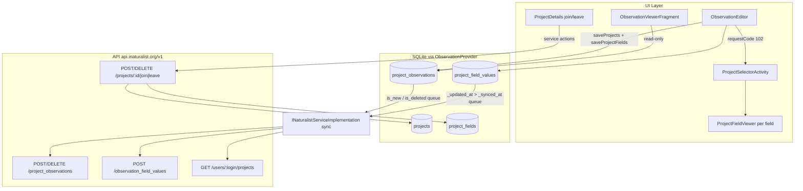

# Traditional Projects in iNaturalistAndroid — Porting Analysis

This document maps where every part of the Traditional Project feature lives in the iNaturalistAndroid repo, with direct code references. It covers the four POD work streams from the "Traditional Project Support POD Scope": add-to-project in the obs editor, the per-project obs field form (all field types + validation), join/leave flows, and offline sync. It ends with gaps where the Android app does NOT implement something the POD scope requires.

All file paths are relative to the iNaturalistAndroid repository root. Line numbers refer to the state of the repo as of June 2026 (`master`).

## 1. Architecture overview



Key design choice: all project selection AND project-field editing happens inside `ProjectSelectorActivity` (launched from the obs editor); the editor itself only stores results and persists them on save. Sync is a flag-based offline queue processed by a background service.

## 2. Local data model (offline persistence)

All four tables live in `inaturalist.db` (version 23), created in `iNaturalist/src/main/java/org/inaturalist/android/ObservationProvider.java` `onCreate`. No SQL foreign keys — relationships are logical. This is the model the RN app's Realm schema must reproduce.

```java
// iNaturalist/src/main/java/org/inaturalist/android/ObservationProvider.java L65-L72
public void onCreate(SQLiteDatabase db) {
    db.execSQL(Observation.sqlCreate());
    db.execSQL(ObservationPhoto.sqlCreate());
    db.execSQL(ObservationSound.sqlCreate());
    db.execSQL(Project.sqlCreate());
    db.execSQL(ProjectObservation.sqlCreate());
    db.execSQL(ProjectField.sqlCreate());
    db.execSQL(ProjectFieldValue.sqlCreate());
}
```

### `projects` — joined projects (`Project.java`)

```java
// iNaturalist/src/main/java/org/inaturalist/android/Project.java L143-L152
public static String sqlCreate() {
    return "CREATE TABLE " + TABLE_NAME + " ("
            + Project._ID + " INTEGER PRIMARY KEY,"
            + "title TEXT,"
            + "description TEXT,"
            + "icon_url TEXT,"
            + "project_type TEXT,"
            + "id INTEGER,"
            + "check_list_id INTEGER"
            + ");";
}
```

- Traditional-by-negation: only collection/umbrella constants exist; anything else (incl. null) is treated as traditional/selectable.

```java
// iNaturalist/src/main/java/org/inaturalist/android/Project.java L28-L29
public static final String PROJECT_TYPE_COLLECTION = "collection";
public static final String PROJECT_TYPE_UMBRELLA = "umbrella";
```

- No sync flags; the table is wiped and re-inserted from the server on every sync (`saveJoinedProjects()`, see section 6).

### `project_observations` — obs-to-project join + offline queue (`ProjectObservation.java`)

```java
// iNaturalist/src/main/java/org/inaturalist/android/ProjectObservation.java L110-L119
public static String sqlCreate() {
    return "CREATE TABLE " + TABLE_NAME + " ("
            + ProjectObservation._ID + " INTEGER PRIMARY KEY,"
            + "project_id INTEGER,"
            + "observation_id INTEGER,"
            + "is_deleted INTEGER,"
            + "is_new INTEGER, "
            + "id INTEGER, "
            + "UNIQUE(project_id, observation_id) ON CONFLICT REPLACE"
            + ");";
}
```

- `is_new = 1` means "pending POST", `is_deleted = 1` means "pending DELETE". This is the entire offline add/remove queue. `id` is the server-side project_observation id once synced.
- `observation_id` duality: holds local `Observation._id` before the obs is uploaded; once the obs gets a server ID, the provider rewrites `observation_id` in both `project_observations` and `project_field_values`:

```java
// iNaturalist/src/main/java/org/inaturalist/android/ObservationProvider.java L586-L596
if ((count > 0) && (values.containsKey(Observation.ID)) && (values.get(Observation.ID) != null)) {
    ContentValues cv = new ContentValues();
    cv.put(ProjectObservation.OBSERVATION_ID, values.getAsInteger(Observation.ID));
    Logger.tag(TAG).debug("Update project observation from " + id + " to " + values.getAsInteger(Observation.ID));
    db.update(ProjectObservation.TABLE_NAME, cv, ProjectObservation.OBSERVATION_ID + "=" + id, null);

    cv = new ContentValues();
    cv.put(ProjectFieldValue.OBSERVATION_ID, values.getAsInteger(Observation.ID));
    db.update(ProjectFieldValue.TABLE_NAME, cv, ProjectFieldValue.OBSERVATION_ID + "=" + id, null);
}
```

### `project_fields` — field definitions per project (`ProjectField.java`)

```java
// iNaturalist/src/main/java/org/inaturalist/android/ProjectField.java L148-L160
public static String sqlCreate() {
    return "CREATE TABLE " + TABLE_NAME + " ("
            + ProjectField._ID + " INTEGER PRIMARY KEY,"
            + "field_id INTEGER,"
            + "project_id INTEGER,"
            + "name TEXT, "
            + "description TEXT, "
            + "data_type TEXT, "
            + "allowed_values TEXT, "
            + "is_required INTEGER, "
            + "position INTEGER, "
            + "UNIQUE(field_id, project_id) ON CONFLICT REPLACE"
            + ");";
}
```

- `allowed_values` is a pipe-separated string (e.g. `"a|b|c"`). Sourced from API `project_observation_fields` (nested `observation_field` object + `required` + `position`). Replaced wholesale per project on download; no sync flags.

### `project_field_values` — user-entered values + offline queue (`ProjectFieldValue.java`)

```java
// iNaturalist/src/main/java/org/inaturalist/android/ProjectFieldValue.java L141-L154
public static String sqlCreate() {
    return "CREATE TABLE " + TABLE_NAME + " ("
            + ProjectFieldValue._ID + " INTEGER PRIMARY KEY,"
            + "_created_at INTEGER,"
            + "_synced_at INTEGER,"
            + "_updated_at INTEGER,"
            + "created_at INTEGER,"
            + "id INTEGER,"
            + "observation_id INTEGER,"
            + "updated_at INTEGER,"
            + "value TEXT,"
            + "field_id INTEGER,"
            + "UNIQUE(field_id, observation_id) ON CONFLICT REPLACE"
            + ");";
}
```

- `value` is always TEXT — taxon IDs, dates, numbers are all stored as strings.
- Dirty state = `(_synced_at IS NULL) OR (_updated_at > _synced_at)` — same timestamp pattern as observations:

```java
// iNaturalist/src/main/java/org/inaturalist/android/INaturalistServiceImplementation.java L1931-L1934
c = mContext.getContentResolver().query(ProjectFieldValue.CONTENT_URI,
        ProjectFieldValue.PROJECTION,
        "(_synced_at IS NULL) OR (_updated_at > _synced_at AND _synced_at IS NOT NULL)",
```

## 3. Add-to-project flow in the observation editor

### Entry point (`ObservationEditor.java`)

- UI row `R.id.select_projects` + count badge; label logic in `refreshProjectList()` (lines 274-285): "Add to projects" when 0, "Projects" + count otherwise.
- State held across rotation, keyed by `field_id`:

```java
// iNaturalist/src/main/java/org/inaturalist/android/ObservationEditor.java L2334-L2336
@State public ArrayList<Integer> mProjectIds;
private ArrayList<ProjectField> mProjectFields;
@State public HashMap<Integer, ProjectFieldValue> mProjectFieldValues = null;
```

- Initial load for an existing observation: query `project_observations` filtering soft-deleted rows. Also supports preselecting a project via intent extra `OBSERVATION_PROJECT`.

```java
// iNaturalist/src/main/java/org/inaturalist/android/ObservationEditor.java L1202-L1214
// Get IDs of project-observations
if ((mObservation.id == null) && (mObservation._id == null)) {
    mProjectIds = new ArrayList<Integer>();
} else {
    int obsId = (mObservation.id == null ? mObservation._id : mObservation.id);
    Cursor c = getActivity().getContentResolver().query(ProjectObservation.CONTENT_URI, ProjectObservation.PROJECTION,
            "(observation_id = " + obsId + ") AND ((is_deleted = 0) OR (is_deleted is NULL))",
            null, ProjectObservation.DEFAULT_SORT_ORDER);
```

- Launch picker (request code `PROJECT_SELECTOR_REQUEST_CODE = 102`) passing: observation ID, `IS_CONFIRMATION=true`, current field-value map, selected project IDs, and the IDs of collection/umbrella projects the obs is auto-included in (from obs JSON `non_traditional_projects`) as `UMBRELLA_PROJECT_IDs`.

```java
// iNaturalist/src/main/java/org/inaturalist/android/ObservationEditor.java L948-L957
mProjectSelector.setOnClickListener(new View.OnClickListener() {
    @Override
    public void onClick(View v) {
        Intent intent = new Intent(getActivity(), ProjectSelectorActivity.class);
        intent.putExtra(INaturalistService.OBSERVATION_ID, (mObservation.id == null ? mObservation._id : mObservation.id));
        intent.putExtra(ProjectSelectorActivity.IS_CONFIRMATION, true);
        intent.putExtra(ProjectSelectorActivity.PROJECT_FIELDS, mProjectFieldValues);

        // Show both "regular" projects and umbrella/collection projects the observation belongs to
        intent.putIntegerArrayListExtra(INaturalistService.PROJECT_ID, mProjectIds);
```

- Result handling: replaces `mProjectIds` and `mProjectFieldValues` wholesale from the picker result.

```java
// iNaturalist/src/main/java/org/inaturalist/android/ObservationEditor.java L3006-L3017
} else if (requestCode == PROJECT_SELECTOR_REQUEST_CODE) {
    if (resultCode == Activity.RESULT_OK) {
        ArrayList<Integer> projectIds = data.getIntegerArrayListExtra(ProjectSelectorActivity.PROJECT_IDS);
        HashMap<Integer, ProjectFieldValue> values = (HashMap<Integer, ProjectFieldValue>) data.getSerializableExtra(ProjectSelectorActivity.PROJECT_FIELDS);

        if (!mProjectIds.equals(projectIds)) {
            AnalyticsClient.getInstance().logEvent(AnalyticsClient.EVENT_NAME_OBS_PROJECTS_CHANGED);
        }

        mProjectIds = projectIds;
        mProjectFieldValues = values;
```

### Persisting on observation save

- `saveProjects()`, three-phase soft delete against `project_observations`:
  1. rows whose project is no longer selected get `is_deleted = true` (lines 2737-2751)
  2. re-selected rows get `is_deleted = false` (lines 2754-2773)
  3. newly selected projects get a new row with `is_new = true, is_deleted = false`:

```java
// iNaturalist/src/main/java/org/inaturalist/android/ObservationEditor.java L2775-L2788
// Finally, add new project-observation records
ArrayList<Integer> newIds = (ArrayList<Integer>) CollectionUtils.subtract(mProjectIds, existingIds);

for (int i = 0; i < newIds.size(); i++) {
    updatedProjects = true;
    int projectId = newIds.get(i);
    ProjectObservation projectObservation = new ProjectObservation();
    projectObservation.project_id = projectId;
    projectObservation.observation_id = obsId;
    projectObservation.is_new = true;
    projectObservation.is_deleted = false;

    getActivity().getContentResolver().insert(ProjectObservation.CONTENT_URI, projectObservation.getContentValues());
}
```

- `saveProjectFields()`: upserts each non-null value into `project_field_values`; new rows are written with `_synced_at = now - 100` so `_updated_at > _synced_at` marks them dirty for upload.

```java
// iNaturalist/src/main/java/org/inaturalist/android/ObservationEditor.java L2707-L2726
private void saveProjectFields() {
    if (mProjectFieldValues == null) return;

    for (ProjectFieldValue fieldValue : mProjectFieldValues.values()) {
        if (fieldValue.value == null) {
            continue;
        }

        if (fieldValue._id == null) {
            // New field value
            ContentValues cv = fieldValue.getContentValues();
            cv.put(ProjectFieldValue._SYNCED_AT, System.currentTimeMillis() - 100);
            Uri newRow = getActivity().getContentResolver().insert(ProjectFieldValue.CONTENT_URI, cv);
            getActivity().getContentResolver().update(newRow, fieldValue.getContentValues(), null, null);
        } else {
            // Update field value
            getActivity().getContentResolver().update(fieldValue.getUri(), fieldValue.getContentValues(), null, null);
        }
    }
}
```

- Any project change bumps the observation's `_updated_at`, which enqueues the parent observation for sync.

### Loading field definitions/values

- `refreshProjectFields()` delegates to static helper `ProjectFieldViewer.getProjectFields()` (`ProjectFieldViewer.java` lines 670-706): queries `project_fields` per selected project + `project_field_values` for the observation, returns a `field_id → value` map. Fields filtered/sorted by `position` (`sortProjectFields`, lines 709-739).

```java
// iNaturalist/src/main/java/org/inaturalist/android/ObservationEditor.java L4630-L4642
ProjectFieldViewer.getProjectFields(getActivity(), mProjectIds, (mObservation.id == null ? mObservation._id : mObservation.id), new ProjectFieldViewer.ProjectFieldsResults() {
    @Override
    public void onProjectFieldsResults(ArrayList projectFields, HashMap<Integer, ProjectFieldValue> projectValues) {
        mProjectFields = projectFields;

        if (mProjectFieldValues == null) {
            mProjectFieldValues = projectValues;
        }

        addProjectFieldViewers();
    }
});
```

## 4. Project picker + per-project field form (`ProjectSelectorActivity.java`)

- Loads joined projects offline-first via service action `ACTION_GET_JOINED_PROJECTS` (reads local `projects` table). Receiver at lines 88-197 sorts alphabetically and splits the list: traditional projects on top, then a header ("Collection and Umbrella Projects") and the non-selectable collection/umbrella projects.
- Collection/umbrella rows cannot be toggled — `onItemClick` returns early; they only show a read-only "included" indicator if the obs is in them.

```java
// iNaturalist/src/main/java/org/inaturalist/android/ProjectSelectorActivity.java L656-L675
String projectType = project.getString("project_type");
boolean isUmbrellaProject = ((projectType != null) && ((projectType.equals(Project.PROJECT_TYPE_COLLECTION)) || (projectType.equals(Project.PROJECT_TYPE_UMBRELLA))));

if (isUmbrellaProject) {
    // Umbrella/collection projects cannot be selected / expanded
    return;
}

Integer projectId = Integer.valueOf(project.getInt("id"));

if (mObservationProjects.contains(projectId)) {
    mObservationProjects.remove(projectId);
} else {
    mObservationProjects.add(projectId);
}

mAdapter.notifyDataSetChanged();
```

- Text search over project titles (lines 299-312, 397-427).
- When a traditional project is checked (confirmation mode), the row expands inline with its field form: one `ProjectFieldViewer` per field (adapter `getView`, lines 496-628; layout `project_selector_confirmation_item.xml`), plus a "required" indicator if any field is required.
- Field values are harvested from the viewers on every list rebind and on save (`saveProjectFieldValues()`, lines 362-381) into a `field_id → ProjectFieldValue` map.
- Confirm (action-bar save): runs `validateProjectFields()`, then returns `PROJECT_IDS` + `PROJECT_FIELDS` to the editor.

```java
// iNaturalist/src/main/java/org/inaturalist/android/ProjectSelectorActivity.java L210-L225
case R.id.save_projects:
    saveProjectFieldValues();

    if (!validateProjectFields()) {
        return false;
    }

    Intent intent = new Intent();
    Bundle bundle = new Bundle();
    bundle.putIntegerArrayList(PROJECT_IDS, mObservationProjects);
    bundle.putSerializable(PROJECT_FIELDS, mProjectFieldValues);
    intent.putExtras(bundle);

    setResult(RESULT_OK, intent);
    finish();
```

## 5. Observation field types and validation (`ProjectFieldViewer.java`)

Datatype rendering (one widget shown per `data_type`, lines ~409-541). This is the canonical list of field types the RN form must support:

- `text` without `allowed_values` → free-text EditText
- `text` with `allowed_values` → Spinner/dropdown; values parsed by pipe-splitting
- `numeric` → numeric-keyboard EditText; value must parse as float
- `date` → date picker dialog; stored as `yyyy-MM-dd`
- `time` → time picker; stored as 24h `HH:mm`
- `datetime` → datetime picker dialog (`showDateTimeDialog`, lines 548-607); displayed `yyyy-MM-dd HH:mm`, stored as ISO8601
- `taxon` → launches `TaxonSearchActivity` with extra `FIELD_ID` (request code 301); value stored as the taxon ID string; existing values resolved back to a taxon via service `ACTION_GET_TAXON`
- any other datatype → rendered as nothing, `getValue()` returns null

Allowed-values parsing (select fields):

```java
// iNaturalist/src/main/java/org/inaturalist/android/ProjectFieldViewer.java L409-L413
if ((mField.data_type.equals("text")) && (mField.allowed_values != null) && (!mField.allowed_values.equals(""))) {
    mSpinner.setVisibility(View.VISIBLE);
    String[] allowedValues = mField.allowed_values.split("\\|");
    mSpinnerAdapter = new ArrayAdapter<String>(mContext, android.R.layout.simple_spinner_item, android.R.id.text1, allowedValues);
```

Taxon field launch:

```java
// iNaturalist/src/main/java/org/inaturalist/android/ProjectFieldViewer.java L529-L534
mTaxonContainer.setOnClickListener(new View.OnClickListener() {
    @Override
    public void onClick(View v) {
        Intent intent = new Intent(mContext, TaxonSearchActivity.class);
        intent.putExtra(TaxonSearchActivity.FIELD_ID, mField.field_id);
        mContext.startActivityForResult(intent, PROJECT_FIELD_TAXON_SEARCH_REQUEST_CODE);
```

Validation:

- `isValid()`: required fields must be non-empty; numeric values must parse as float.

```java
// iNaturalist/src/main/java/org/inaturalist/android/ProjectFieldViewer.java L272-L292
public Boolean isValid() {
    if (mField.is_required) {
        String value = getValue();
        if (value == null || value.equals("")) {
            // Mandatory field
            return false;
        }
    }

    if ((mField.data_type.equals("numeric")) && (!mEditText.getText().toString().equals(""))) {
        try {
            float value = Float.valueOf(mEditText.getText().toString());
        } catch (Exception exc) {
            // Invalid number
            return false;
        }
    }


    return true;
}
```

- `ProjectSelectorActivity.validateProjectFields()`: on confirm, validates all viewers of all checked projects; on failure shows toast `R.string.invalid_project_field` ("Please enter a valid value for field '%1s'") and blocks the save.

```java
// iNaturalist/src/main/java/org/inaturalist/android/ProjectSelectorActivity.java L693-L715
private boolean validateProjectFields() {
    if (mIsConfirmation) {
        HashMap<Integer, List<ProjectFieldViewer>> finalProjectFields = new HashMap<Integer, List<ProjectFieldViewer>>();
        for (int projectId : mObservationProjects) {
            finalProjectFields.put(projectId, mProjectFieldViewers.get(projectId));
        }
        for (int projectId : finalProjectFields.keySet()) {
            List<ProjectFieldViewer> fields = finalProjectFields.get(projectId);
            if (fields == null) break;
            for (ProjectFieldViewer fieldViewer : fields) {
                if (!fieldViewer.isValid()) {
                    Toast.makeText(this, String.format(getString(R.string.invalid_project_field), fieldViewer.getField().name), Toast.LENGTH_LONG).show();
                    return false;
                }
            }
        }
        mProjectFieldViewers = finalProjectFields;
    }
    return true;
}
```

- Important behavior to know when porting: validation runs ONLY on the picker's confirm action. It does NOT run on checkbox toggle, on observation save, or before upload. Server-side rejections are handled post-hoc (section 6). The POD requires blocking upload client-side — stronger than Android's behavior. (Also note the `if (fields == null) break;` quirk above: it aborts validation of all remaining projects instead of skipping one.)

## 6. Sync and API layer (`INaturalistServiceImplementation.java`)

Hosts:

```java
// iNaturalist/src/main/java/org/inaturalist/android/INaturalistService.java L428-L429
public static String HOST = "https://www.inaturalist.org";
public static String API_HOST = "https://api.inaturalist.org/v1";
```

### Endpoints

- Join: `POST {API_HOST}/projects/{id}/join` (empty body), then `GET {API_HOST}/projects/{id}` to fetch `project_observation_fields`:

```java
// iNaturalist/src/main/java/org/inaturalist/android/INaturalistServiceImplementation.java L4894-L4914
public void joinProject(int projectId) throws AuthenticationException {
    post(String.format(Locale.ENGLISH, "%s/projects/%d/join", API_HOST, projectId), (JSONObject) null);

    try {
        JSONArray result = get(String.format(Locale.ENGLISH, "%s/projects/%d", API_HOST, projectId));
        if (result == null) return;
        JSONArray results = result.getJSONObject(0).getJSONArray("results");
        BetterJSONObject jsonProject = new BetterJSONObject(results.getJSONObject(0));
        Project project = new Project(jsonProject);

        Cursor c = mContext.getContentResolver().query(Project.CONTENT_URI, Project.PROJECTION, "id = ?", new String[]{String.valueOf(project.id)}, null);

        if (c.getCount() == 0) {
            // Add joined project locally
            ContentValues cv = project.getContentValues();
            mContext.getContentResolver().insert(Project.CONTENT_URI, cv);
        }
        c.close();

        // Save project fields
        addProjectFields(jsonProject.getJSONArray("project_observation_fields").getJSONArray(), jsonProject.getInt("id"));
```

- Leave: `DELETE {API_HOST}/projects/{id}/leave`:

```java
// iNaturalist/src/main/java/org/inaturalist/android/INaturalistServiceImplementation.java L4921-L4926
public void leaveProject(int projectId) throws AuthenticationException {
    delete(String.format(Locale.ENGLISH, "%s/projects/%d/leave", API_HOST, projectId), null);

    // Remove locally saved project (because we left it)
    mContext.getContentResolver().delete(Project.CONTENT_URI, "(id IS NOT NULL) and (id = " + projectId + ")", null);
}
```

- Add obs to project: `POST {API_HOST}/project_observations`:

```java
// iNaturalist/src/main/java/org/inaturalist/android/INaturalistServiceImplementation.java L4955-L4968
String url = API_HOST + "/project_observations";

JSONObject params = new JSONObject();
JSONObject projectObs = new JSONObject();
try {
    projectObs.put("observation_id", observationId);
    projectObs.put("project_id", projectId);
    params.put("project_observation", projectObs);
} catch (JSONException e) {
    e.printStackTrace();
    return null;
}

JSONArray json = post(url, params);
```

- Remove obs from project: `DELETE {API_HOST}/project_observations/{id}` when the server id is known; legacy fallback on the Rails host otherwise:

```java
// iNaturalist/src/main/java/org/inaturalist/android/INaturalistServiceImplementation.java L4934-L4937
String url = projectObservationId != null ?
        String.format(Locale.ENGLISH, "%s/project_observations/%d", API_HOST, projectObservationId) :
        String.format(Locale.ENGLISH, "%s/projects/%d/remove.json?observation_id=%d", HOST, projectId, observationId);
JSONArray json = request(url, "delete", null, null, true, true, false);
```

- Field values: `POST {API_HOST}/observation_field_values`. There is NO PUT/DELETE for field values anywhere; clearing a value never syncs.

```java
// iNaturalist/src/main/java/org/inaturalist/android/INaturalistServiceImplementation.java L5435-L5446
JSONObject params = new JSONObject();
JSONObject obsFieldValue = new JSONObject();
try {
    obsFieldValue.put("observation_id", localField.observation_id);
    obsFieldValue.put("observation_field_id", localField.field_id);
    obsFieldValue.put("value", localField.value);

    params.put("observation_field_value", obsFieldValue);
} catch (JSONException e) {
    e.printStackTrace();
}
JSONArray result = post(API_HOST + "/observation_field_values", params);
```

- Joined projects list: `GET {API_HOST}/users/{login}/projects?per_page=100&page=N`, paginated; each result's `project_observation_fields` is stored locally via `addProjectFields()` (delete-all-then-reinsert per project, lines 4832-4853):

```java
// iNaturalist/src/main/java/org/inaturalist/android/INaturalistServiceImplementation.java L5133-L5153 (abridged)
do {
    String url = API_HOST + "/users/" + Uri.encode(mLogin) + "/projects?per_page=100&page=" + page;
    JSONArray json = get(url, true);
    // ...
    for (int i = 0; i < results.length(); i++) {
        JSONObject project = results.getJSONObject(i);
        project.put("joined", true);
        finalJson.put(project);
        addProjectFields(project.getJSONArray("project_observation_fields"), project.optInt("id"));
    }
} while (projectsDownloaded < totalResults);
```

- Standalone field metadata (for values referencing fields not in any joined project): `GET {HOST}/observation_fields/{id}.json` — `addProjectField()` lines 5694-5710.
- User obs download includes project data via `extra=observation_photos,projects,fields` (`getUserObservations()` lines 5317-5347).

### Offline queue processing (per-observation upload order)

```java
// iNaturalist/src/main/java/org/inaturalist/android/INaturalistServiceImplementation.java L2035-L2036
syncObservationFields(observation);
postProjectObservations(observation);
```

1. POST observation body
2. photos/sounds
3. `syncObservationFields(observation)` — uploads dirty field values, with last-writer-wins conflict resolution against remote OFVs (lines 5356-5514); sets `_synced_at` on success
4. `postProjectObservations(observation)` — DELETEs rows with `is_deleted = 1` (then hard-deletes locally), POSTs rows with `is_new = 1` (then clears flag and stores server `id`). Skips entirely if the observation has no server id yet:

```java
// iNaturalist/src/main/java/org/inaturalist/android/INaturalistServiceImplementation.java L2716-L2720
private boolean postProjectObservations(Observation observation) throws AuthenticationException, CancelSyncException, SyncFailedException {
    if (observation.id == null) {
        // Observation not synced yet - cannot sync its project associations yet
        return true;
    }
```

```java
// iNaturalist/src/main/java/org/inaturalist/android/INaturalistServiceImplementation.java L2759-L2791
// Next, add new project observations
c = mContext.getContentResolver().query(ProjectObservation.CONTENT_URI,
        ProjectObservation.PROJECTION,
        "is_new = 1 AND observation_id = ?",
        new String[]{String.valueOf(observation.id)},
        ProjectObservation.DEFAULT_SORT_ORDER);

c.moveToFirst();
while (c.isAfterLast() == false) {
    checkForCancelSync();
    ProjectObservation projectObservation = new ProjectObservation(c);
    BetterJSONObject result = addObservationToProject(projectObservation.observation_id, projectObservation.project_id);

    if ((result == null) && (mResponseErrors == null)) {
        c.close();
        throw new SyncFailedException();
    }

    increaseProgressForObservation(observation);

    if (mResponseErrors != null) {
        handleProjectFieldErrors(projectObservation.observation_id, projectObservation.project_id);
    } else {
        // Unmark as new
        projectObservation.is_new = false;
        // Save external ID
        projectObservation.id = result.getInt("id");
        ContentValues cv = projectObservation.getContentValues();
        mContext.getContentResolver().update(projectObservation.getUri(), cv, null, null);

        // Clean the errors for the observation
        mApp.setErrorsForObservation(projectObservation.observation_id, projectObservation.project_id, new JSONArray());
    }
```

Field values upload BEFORE project membership so required-field validation passes server-side. End of full sync: `saveJoinedProjects()` (wipe + re-insert `projects` table, lines 3010-3038) and `storeProjectObservations()` (insert-only reconciliation of downloaded memberships, lines 2968-2993).

The queue-discovery query that decides which observations have pending project changes (handles both local and server observation IDs):

```java
// iNaturalist/src/main/java/org/inaturalist/android/INaturalistServiceImplementation.java L2188-L2191
c = mContext.getContentResolver().query(ProjectObservation.CONTENT_URI,
        ProjectObservation.PROJECTION,
        "((is_deleted = 1) OR (is_new = 1)) AND " +
                "((observation_id = ?) OR (observation_id = ?))",
```

Join/leave are NOT queued offline — they fire immediately from `ProjectDetails` and silently fail without network (no retry queue, no rollback of the optimistic UI).

### Error handling (server rejects add-to-project)

- A failed `POST /project_observations` or `/observation_field_values` with API `errors` is a soft failure: row stays `is_new = 1` (retried next sync), `handleProjectFieldErrors()` (lines 2901-2965) formats the error (strings `failed_to_add_to_project` / `failed_to_add_obs_to_project`), stores it per observation+project in SharedPreferences via `INaturalistApp.setErrorsForObservation()` (`INaturalistApp.java` lines 671-689), and shows a toast. See the `mResponseErrors != null` branch in the `postProjectObservations` citation above.
- Stored errors surface in the editor (`ObservationEditor` ~line 1934), obs detail (`ObservationViewerFragment` ~2006), and obs list rows (`ObservationCursorAdapter` ~517).

## 7. Join / leave flows (`ProjectDetails.java`)

- Join: if project has `terms`, shows confirm dialog "Do you agree to the following?" with the raw terms text; on agree (or no terms) optimistically flips the button, fires `ACTION_JOIN_PROJECT`. Local effect on success: insert `projects` row + replace `project_fields` for that project. Requires login (redirects to onboarding otherwise).

```java
// iNaturalist/src/main/java/org/inaturalist/android/ProjectDetails.java L253-L269 (abridged)
} else {
    String terms = mProject.getString("terms");
    if ((terms != null) && (terms.length() > 0)) {
        mHelper.confirm(getString(R.string.do_you_agree_to_the_following), mProject.getString("terms"), new DialogInterface.OnClickListener() {
            @Override
            public void onClick(DialogInterface dialogInterface, int i) {
                joinProject();
            }
        // ... cancel listener ...
        }, R.string.yes, R.string.no);
    } else {
        joinProject();
    }
}
```

```java
// iNaturalist/src/main/java/org/inaturalist/android/ProjectDetails.java L277-L289
private void joinProject() {
    if (!isLoggedIn()) {
        // User not logged-in - redirect to onboarding screen
        startActivity(new Intent(ProjectDetails.this, OnboardingActivity.class).setFlags(Intent.FLAG_ACTIVITY_CLEAR_TOP | Intent.FLAG_ACTIVITY_SINGLE_TOP));
        return;
    }

    mJoinLeaveProject.setText(R.string.leave);
    mProject.put("joined", true);

    Intent serviceIntent = new Intent(INaturalistService.ACTION_JOIN_PROJECT, null, ProjectDetails.this, INaturalistService.class);
    serviceIntent.putExtra(INaturalistService.PROJECT_ID, mProject.getInt("id"));
    INaturalistService.callService(this, serviceIntent);
```

- Leave: single confirm dialog — title `leave_project` ("Leave Project"), message `leave_project_confirmation` ("Are you sure you want to leave this project?"), Yes/No. Fires `ACTION_LEAVE_PROJECT`. Local effect: deletes the `projects` row only — `project_fields`, `project_observations`, `project_field_values` are left in place.

```java
// iNaturalist/src/main/java/org/inaturalist/android/ProjectDetails.java L234-L244
if ((isJoined != null) && (isJoined == true)) {
    mHelper.confirm(getString(R.string.leave_project), getString(R.string.leave_project_confirmation),
            new DialogInterface.OnClickListener() {
                public void onClick(DialogInterface dialog, int buttonId) {
                    // Leave the project
                    mJoinLeaveProject.setText(R.string.join);
                    mProject.put("joined", false);

                    Intent serviceIntent = new Intent(INaturalistService.ACTION_LEAVE_PROJECT, null, ProjectDetails.this, INaturalistService.class);
                    serviceIntent.putExtra(INaturalistService.PROJECT_ID, mProject.getInt("id"));
                    INaturalistService.callService(ProjectDetails.this, serviceIntent);
```

- Project browsing: `ProjectsActivity.java` hosts Joined/Nearby/Featured tabs (`BaseTab.java` does the loading); "joined" state for nearby/featured lists is computed by checking whether the project id exists in the local `projects` table. No project-type badge or joined indicator is shown in browse lists.

```java
// iNaturalist/src/main/java/org/inaturalist/android/INaturalistServiceImplementation.java L4770-L4780
// Determine which projects are already joined
for (int i = 0; i < json.length(); i++) {
    Cursor c;
    try {
        c = mContext.getContentResolver().query(Project.CONTENT_URI, Project.PROJECTION, "id = '" + json.getJSONObject(i).getInt("id") + "'", null, Project.DEFAULT_SORT_ORDER);
        c.moveToFirst();
        int count = c.getCount();
        c.close();
        if (count > 0) {
            json.getJSONObject(i).put("joined", true);
        }
```

- Read-only display of an observation's projects: `ObservationViewerFragment` "Included in N projects" row → `ObservationProjectsViewer.java` (list only; field values are never displayed on the obs detail screen).

## 8. Gaps: what the Android app does NOT have (vs POD scope)

These items are in the POD scope but have no Android reference implementation — they will need design/API research from web behavior instead:

- Hidden-coordinate access permission at join time: `preferred_curator_coordinate_access` appears nowhere in this codebase. Join is a bare POST. (Web-only today, as the POD notes.)
- Leave flow with "keep or remove my observations": Android shows only a generic yes/no confirmation; no observation-retention option and no related API param.
- Client-side blocking of upload on unfilled required fields: Android only validates inside the picker's confirm action; the upload path itself never re-validates (server rejection is handled as a retryable soft error). The POD requires a hard pre-upload gate.
- Deleting a field value remotely: no DELETE for `observation_field_values`; clearing a value locally never propagates.
- Field-value map keyed by `field_id` only — the same observation field shared by two selected projects collides (a known Android quirk to avoid reproducing).

## 9. Porting checklist (behavioral spec for RN, no engineering yet)

- Persist locally: joined projects (with `project_type`), per-project field definitions (`field_id`, `data_type`, `allowed_values`, `is_required`, `position`), obs-project links with pending add/remove state, and field values with dirty tracking — all must survive offline.
- Only allow manual add for traditional projects (project_type not collection/umbrella); show collection/umbrella membership read-only.
- Field form supports: free text, select (pipe-separated `allowed_values`), numeric, date, time, datetime, taxon (taxon picker, value = taxon id as string).
- Validate required + numeric fields before letting the user confirm project selection AND before upload (stricter than Android).
- Upload ordering: observation first, then field values, then project_observations; handle local-id → server-id remapping for queued records.
- Server validation errors on add-to-project: keep the pending record, surface a per-observation/per-project error, retry on next sync.
- Join: POST join → fetch project → cache `project_observation_fields` locally (fields must be available offline for the form). Leave: DELETE leave → remove local project (+ decide cleanup policy for orphaned local data, which Android gets wrong).
- Refresh joined-projects + field definitions on every full sync via `GET /users/{login}/projects` (paginated).

## 10. Offline behavior in detail

The core "add observation to project" flow works offline; join/leave does not.

### Works offline

- Selecting projects and filling fields: the picker reads joined projects from the local `projects` table, not the network — `ACTION_GET_JOINED_PROJECTS` resolves to `getJoinedProjectsOffline()`. Field definitions (datatype, required flag, allowed values) are cached in `project_fields` at join/sync time, so the field form renders offline.

```java
// iNaturalist/src/main/java/org/inaturalist/android/INaturalistServiceImplementation.java L5097-L5102
private SerializableJSONArray getJoinedProjectsOffline() {
    JSONArray projects = new JSONArray();
    Cursor c = mContext.getContentResolver().query(Project.CONTENT_URI, Project.PROJECTION, null, null, Project.DEFAULT_SORT_ORDER);

    c.moveToFirst();
    int count = c.getCount();
```

- Queuing changes (no network call on save):
  - Project memberships → `project_observations` rows with `is_new = 1` (add) or `is_deleted = 1` (remove), written in `ObservationEditor.saveProjects()` (lines 2729-2790).
  - Field values → `project_field_values` rows marked dirty via `_updated_at > _synced_at`, written in `saveProjectFields()` (lines 2707-2726).
- Sync later: on the next sync the queue is flushed per observation — `syncObservationFields(observation)` then `postProjectObservations(observation)` (lines 2035-2036). If the observation itself hasn't been uploaded yet, the queued rows reference its local `_id`; once the obs gets a server ID, `ObservationProvider` rewrites `observation_id` in both tables (lines 586-596).

### Does NOT work offline

- Joining/leaving a project: `ProjectDetails` fires `ACTION_JOIN_PROJECT` / `ACTION_LEAVE_PROJECT` immediately; on failure there is no retry queue, and the optimistically flipped button is never rolled back. You cannot join a new project offline — which also means its field definitions never get cached.
- Taxon-type fields: the taxon picker (`TaxonSearchActivity`) and resolving an existing taxon-ID value back to a name (`ACTION_GET_TAXON`) both require network.
- Clearing a field value: never syncs at all (online or offline) — there is no DELETE for observation field values in the codebase.

The POD requirement "observations can be added to projects while offline" matches Android's behavior only for projects joined while online — the local caching of projects + field definitions is what makes it possible and is the pattern the RN port must replicate.

## 11. Upload-time reconciliation

Two different things can change server-side between the user filling the form and the upload: field values and field definitions. They are handled very differently.

### Field values: last-writer-wins reconciliation

`syncObservationFields(observation)` (`INaturalistServiceImplementation.java` lines 5356-5514) does real conflict resolution before pushing. For each dirty local value it fetches the observation's remote `observation_field_values` via `GET /observations/{id}` (lines 5382-5409), then decides direction:

```java
// iNaturalist/src/main/java/org/inaturalist/android/INaturalistServiceImplementation.java L5422-L5431
if (!fields.containsKey(Integer.valueOf(localField.field_id))) {
    // No remote field - add it
    shouldOverwriteRemote = true;
} else {
    remoteField = fields.get(Integer.valueOf(localField.field_id));

    if ((remoteField.updated_at != null) && (remoteField.updated_at.before(localField._updated_at))) {
        shouldOverwriteRemote = true;
    }
}
```

- Remote field missing, or remote `updated_at` older than local `_updated_at` → POST the local value (lines 5433-5446, see the OFV POST citation in section 6).
- Remote newer → overwrite local with the remote value, no API call:

```java
// iNaturalist/src/main/java/org/inaturalist/android/INaturalistServiceImplementation.java L5467-L5475
} else {
    // Overwrite local value
    localField.created_at = remoteField.created_at;
    localField.id = remoteField.id;
    localField.observation_id = remoteField.observation_id;
    localField.field_id = remoteField.field_id;
    localField.value = remoteField.value;
    localField.updated_at = remoteField.updated_at;
}
```

- Remote values the device has never seen are inserted locally afterwards (lines 5488-5512); unknown field metadata is fetched via `addProjectField()`.

Caveat: the comparison is server timestamp vs. device clock (`remoteField.updated_at.before(localField._updated_at)`), so it is clock-skew sensitive.

### Field definitions: no reconciliation at upload time

If `project_observation_fields` changed server-side (new required field, changed `allowed_values`, removed field), the upload proceeds against the stale cached `project_fields` definitions. There is no schema re-fetch and no client-side re-validation before upload — validation only ever ran in the picker UI. Definitions are refreshed only after all uploads, at the tail of the sync:

```java
// iNaturalist/src/main/java/org/inaturalist/android/INaturalistServiceImplementation.java L2056-L2060
if (mApp.loggedIn() && mIsSyncing) {
    // Update observation comments/IDs for the observations
    storeProjectObservations();
    saveJoinedProjects();
}
```

Resulting failure modes:

- New required field added since the form was filled → `POST /project_observations` rejected server-side; soft failure: row keeps `is_new = 1` (retried every sync), `handleProjectFieldErrors()` (lines 2901-2965) stores the error per observation+project and shows a toast. The user must re-open the editor (definitions cache is fresh by then), fill the new field, and sync again.
- `allowed_values` changed → stale value POSTed as-is; server accepts or rejects (same soft-failure path).
- Field removed from project → the orphaned local value still POSTs to `/observation_field_values` and generally succeeds, since observation field values are not project-scoped server-side.

Server is the validator of record for schema drift; the client's only "reconciliation" is retry-with-error-surface. For the RN port, the POD's pre-upload validation requirement means validating against a potentially stale schema — decide whether to re-fetch `project_observation_fields` at upload time or accept Android's eventual-consistency behavior.
