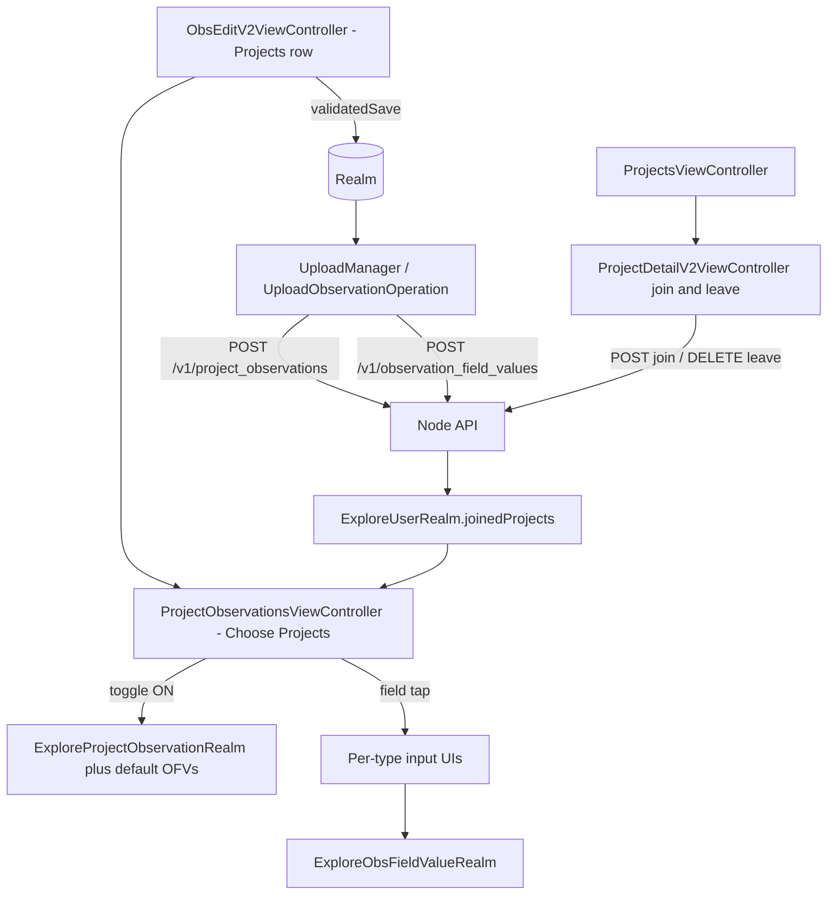
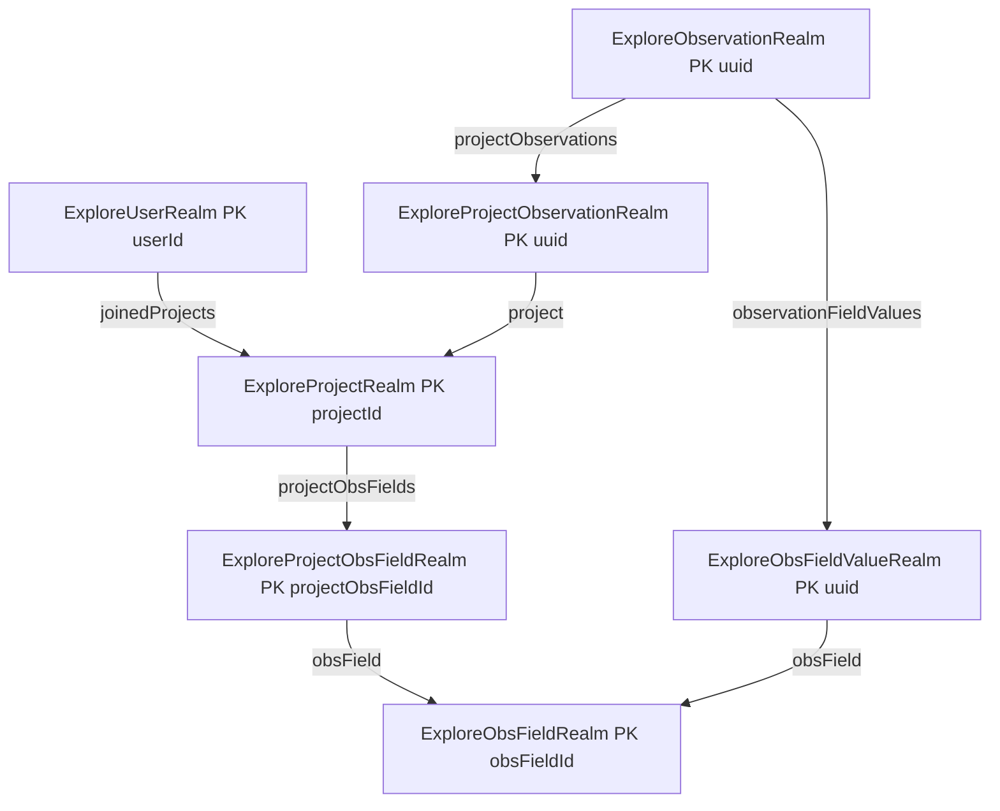

# Traditional Projects — iOS Feature Analysis (Porting Reference)

Audit deliverable for the Traditional Project Support POD (Phase 1/2): where the "add observation to a Traditional Project" feature lives in the classic Objective-C iOS app (`INaturalistIOS`), with verbatim code citations so this document is readable without the iOS repo checked out.

All file paths are relative to the `INaturalistIOS` repository root. Citation blocks are formatted as `startLine:endLine:path` and were verified against the source at the time of writing.

Scope note: this document covers the **iOS** classic app only. The POD's Phase 1 audit also calls for classic Android and web flows (including the web-only hidden-coordinates join permission), which must be audited in those codebases separately. Release mechanics like feature flags have no precedent in this app and are likewise out of scope here.

---

## 1. Architecture at a glance

The feature spans four layers. All live data is **Realm** (Core Data models are legacy migration sources only); API JSON is parsed via transient **Mantle** models; all network traffic goes through the **Node API** (`https://api.inaturalist.org/v1`).



Entity relationships:



---

## 2. Data models

### 2.1 Project type detection (traditional vs collection/umbrella)

The project type enum:

```12:16:INaturalistIOS/Models/ViewProtocols/ProjectVisualization.h
typedef NS_ENUM(NSInteger, ExploreProjectType) {
    ExploreProjectTypeCollection,
    ExploreProjectTypeUmbrella,
    ExploreProjectTypeOldStyle
};
```

`OldStyle` = Traditional. The API's `project_type` string maps to the enum; an empty string maps to OldStyle:

```44:52:INaturalistIOS/Models/Mantle/ExploreProject.m
+ (NSValueTransformer *)typeJSONTransformer {
    NSDictionary *typeMappings = @{
                                   @"collection": @(ExploreProjectTypeCollection),
                                   @"umbrella": @(ExploreProjectTypeUmbrella),
                                   @"": @(ExploreProjectTypeOldStyle),
                                   };
    
    return [NSValueTransformer mtl_valueMappingTransformerWithDictionary:typeMappings];
}
```

A missing/nil `project_type` also defaults to OldStyle:

```55:67:INaturalistIOS/Models/Mantle/ExploreProject.m
- (void)setNilValueForKey:(NSString *)key {
    if ([key isEqualToString:@"locationId"]) {
        self.locationId = 0;
    } else if ([key isEqualToString:@"latitude"]) {
        self.latitude = kCLLocationCoordinate2DInvalid.latitude;
    } else if ([key isEqualToString:@"longitude"]) {
        self.longitude = kCLLocationCoordinate2DInvalid.longitude;
    } else if ([key isEqualToString:@"type"]) {
        self.type = ExploreProjectTypeOldStyle;
    } else {
        [super setNilValueForKey:key];
    }
}
```

The single check that gates all traditional-only UI, plus the user-facing type labels:

```153:165:INaturalistIOS/Models/Realm/ExploreProjectRealm.m
- (BOOL)isNewStyleProject {
    return self.type == ExploreProjectTypeUmbrella || self.type == ExploreProjectTypeCollection;
}

- (NSString *)titleForTypeOfProject {
    if (self.type == ExploreProjectTypeCollection) {
        return NSLocalizedString(@"Collection Project", @"Collection type of project, which automatically collects observations into it.");
    } else if (self.type == ExploreProjectTypeUmbrella) {
        return NSLocalizedString(@"Umbrella Project", @"Umbrella type of project, which contains other projects within it.");
    } else {
        return NSLocalizedString(@"Traditional Project", @"Traditional inat type of project, where users have to manually add observations to the project.");
    }
}
```

Traditional = `!isNewStyleProject`.

### 2.2 Observation field datatypes (the "7 types")

```11:19:INaturalistIOS/Models/Mantle/ExploreObsField.h
typedef NS_ENUM(NSInteger, ExploreObsFieldDataType) {
    ExploreObsFieldDataTypeText,
    ExploreObsFieldDataTypeNumeric,
    ExploreObsFieldDataTypeDate,
    ExploreObsFieldDataTypeTime,
    ExploreObsFieldDataTypeDateTime,
    ExploreObsFieldDataTypeTaxon,
    ExploreObsFieldDataTypeDna
};
```

API `datatype` string mapping:

```29:41:INaturalistIOS/Models/Mantle/ExploreObsField.m
+ (NSValueTransformer *)dataTypeJSONTransformer {
    NSDictionary *typeMappings = @{
        @"text": @(ExploreObsFieldDataTypeText),
        @"numeric": @(ExploreObsFieldDataTypeNumeric),
        @"date": @(ExploreObsFieldDataTypeDate),
        @"time": @(ExploreObsFieldDataTypeTime),
        @"datetime": @(ExploreObsFieldDataTypeDateTime),
        @"taxon": @(ExploreObsFieldDataTypeTaxon),
        @"dna": @(ExploreObsFieldDataTypeDna),
    };
    
    return [NSValueTransformer mtl_valueMappingTransformerWithDictionary:typeMappings];
}
```

**There is no "select" datatype.** Select fields are inferred at runtime: text/dna fields with more than one allowed value (see section 3.4). The API sends `allowed_values` as a pipe-delimited string, split on `|`:

```23:27:INaturalistIOS/Models/Mantle/ExploreObsField.m
+ (NSValueTransformer *)allowedValuesJSONTransformer {
    return [MTLValueTransformer transformerWithBlock:^id(NSString *allowedValues) {
        return [allowedValues componentsSeparatedByString:@"|"];
    }];
}
```

The text-or-dna helper used everywhere:

```80:82:INaturalistIOS/Models/Realm/ExploreObsFieldRealm.m
- (BOOL)canBeTreatedAsText {
    return self.dataType == ExploreObsFieldDataTypeText || self.dataType == ExploreObsFieldDataTypeDna;
}
```

### 2.3 Mantle models (API JSON parsing)

`ExploreProject` JSON key mappings — note `project_observation_fields` is included in project payloads, which is what enables offline field definitions:

```16:30:INaturalistIOS/Models/Mantle/ExploreProject.m
+ (NSDictionary *)JSONKeyPathsByPropertyKey{
    return @{
             @"title": @"title",
             @"projectId": @"id",
             @"locationId": @"place_id",
             @"latitude": @"latitude",
             @"longitude": @"longitude",
             @"iconUrl": @"icon",
             @"type": @"project_type",
             @"bannerColorString": @"banner_color",
             @"bannerImageUrl": @"header_image_url",
             @"inatDescription": @"description",
             @"projectObsFields": @"project_observation_fields",
             };
}
```

Note: Mantle instances always report `joined == NO`; joined state is Realm-only:

```69:71:INaturalistIOS/Models/Mantle/ExploreProject.m
- (BOOL)joined {
    return NO;
}
```

`ExploreProjectObsField` (the per-project field config carrying `required` and `position`):

```13:22:INaturalistIOS/Models/Mantle/ExploreProjectObsField.h
@interface ExploreProjectObsField : MTLModel <MTLJSONSerializing>

@property (nonatomic, assign) BOOL required;
@property (nonatomic, assign) NSInteger position;
@property (nonatomic, assign) NSInteger projectObsFieldId;
@property (nonatomic) ExploreObsField *obsField;

@end
```

```15:30:INaturalistIOS/Models/Mantle/ExploreProjectObsField.m
+ (NSDictionary *)JSONKeyPathsByPropertyKey{
    return @{
        @"required": @"required",
        @"position": @"position",
        @"projectObsFieldId": @"id",
        @"obsField": @"observation_field",
    };
}

- (void)setNilValueForKey:(NSString *)key {
    if ([key isEqualToString:@"required"]) {
        self.required = FALSE;
    } else if ([key isEqualToString:@"position"]) {
        self.position = 0;
    }
}
```

`ExploreObsField`:

```13:21:INaturalistIOS/Models/Mantle/ExploreObsField.m
+ (NSDictionary *)JSONKeyPathsByPropertyKey{
    return @{
        @"allowedValues": @"allowed_values",
        @"name": @"name",
        @"inatDescription": @"description",
        @"obsFieldId": @"id",
        @"dataType": @"datatype",
    };
}
```

`ExploreProjectObservation` (the observation-to-project join record as fetched from the server):

```13:19:INaturalistIOS/Models/Mantle/ExploreProjectObservation.m
+ (NSDictionary *)JSONKeyPathsByPropertyKey{
    return @{
             @"projectObsId": @"id",
             @"uuid": @"uuid",
             @"project": @"project",
             };
}
```

`ExploreObsFieldValue`:

```14:21:INaturalistIOS/Models/Mantle/ExploreObsFieldValue.m
+ (NSDictionary *)JSONKeyPathsByPropertyKey{
    return @{
        @"obsFieldValueId": @"id",
        @"value": @"value",
        @"obsField": @"observation_field",
        @"uuid": @"uuid",
    };
}
```

On fetched observations, the relevant nested JSON keys are `project_observations` and `ofvs` (excerpt of the larger mapping):

```52:66:INaturalistIOS/Models/Mantle/ExploreObservation.m
             @"user": @"user",
             @"observationPhotos": @"observation_photos",
             @"observationSounds": @"observation_sounds",
             @"comments": @"comments",
             @"identifications": @"identifications",
             @"faves": @"faves",
             @"projectObservations": @"project_observations",
             @"taxon": @"taxon",
             @"dataQuality": @"quality_grade",
             @"uuid": @"uuid",
             @"captive": @"captive",
             @"geoprivacy": @"geoprivacy",
             @"ownersIdentificationFromVision": @"owners_identification_from_vision",
             @"observationFieldValues": @"ofvs",
             };
```

```136:142:INaturalistIOS/Models/Mantle/ExploreObservation.m
+ (NSValueTransformer *)projectObservationsJSONTransformer {
    return [NSValueTransformer mtl_JSONArrayTransformerWithModelClass:ExploreProjectObservation.class];
}

+ (NSValueTransformer *)observationFieldValuesJSONTransformer {
    return [NSValueTransformer mtl_JSONArrayTransformerWithModelClass:ExploreObsFieldValue.class];
}
```

### 2.4 Realm models (source of truth)

`ExploreProjectRealm` — PK `projectId`:

```15:41:INaturalistIOS/Models/Realm/ExploreProjectRealm.h
@interface ExploreProjectRealm : RLMObject <ProjectVisualization>

@property NSString *title;
@property NSInteger projectId;
@property NSInteger locationId;
@property CLLocationDegrees latitude;
@property CLLocationDegrees longitude;
@property NSString *iconUrlString;
@property NSString *bannerImageUrlString;
@property NSString *bannerColorString;
@property ExploreProjectType type;
@property NSString *inatDescription;

- (BOOL)isNewStyleProject;

- (instancetype)initWithMantleModel:(ExploreProject *)model;

// to-many relationships
@property RLMArray<ExploreProjectObsFieldRealm *><ExploreProjectObsFieldRealm> *projectObsFields;

+ (NSDictionary *)valueForMantleModel:(ExploreProject *)model;
+ (NSDictionary *)valueForCoreDataModel:(id)model;

- (NSString *)titleForTypeOfProject;


@end
```

```120:122:INaturalistIOS/Models/Realm/ExploreProjectRealm.m
+ (NSString *)primaryKey {
    return @"projectId";
}
```

Fields are displayed sorted by `position`:

```146:151:INaturalistIOS/Models/Realm/ExploreProjectRealm.m
- (NSArray *)sortedProjectObservationFields {
    RLMSortDescriptor *positionSort = [RLMSortDescriptor sortDescriptorWithKeyPath:@"position" ascending:YES];
    RLMResults *sortedResults = [self.projectObsFields sortedResultsUsingDescriptors:@[ positionSort ]];
    // convert to NSArray
    return [sortedResults valueForKey:@"self"];
}
```

`ExploreProjectObsFieldRealm` — PK `projectObsFieldId`, carries the per-project `required` flag, with an inverse link back to its project:

```16:29:INaturalistIOS/Models/Realm/ExploreProjectObsFieldRealm.h
@interface ExploreProjectObsFieldRealm : RLMObject

@property BOOL required;
@property NSInteger position;
@property NSInteger projectObsFieldId;
@property ExploreObsFieldRealm *obsField;

@property (readonly) ExploreProjectRealm *project;

- (instancetype)initWithMantleModel:(ExploreProjectObsField *)model;
+ (NSDictionary *)valueForMantleModel:(ExploreProjectObsField *)model;
+ (NSDictionary *)valueForCoreDataModel:(id)model;

@end
```

```74:88:INaturalistIOS/Models/Realm/ExploreProjectObsFieldRealm.m
+ (NSString *)primaryKey {
    return @"projectObsFieldId";
}

+ (NSDictionary *)linkingObjectsProperties {
    return @{
        @"projects": [RLMPropertyDescriptor descriptorWithClass:ExploreProjectRealm.class
                                                   propertyName:@"projectObsFields"],
    };
}

- (ExploreProjectRealm *)project {
    // should only be one project attached to this linking object property
    return [self.projects firstObject];
}
```

`ExploreObsFieldRealm` — PK `obsFieldId`:

```12:26:INaturalistIOS/Models/Realm/ExploreObsFieldRealm.h
@interface ExploreObsFieldRealm : RLMObject

@property RLMArray<RLMString> *allowedValues;
@property NSString *name;
@property NSString *inatDescription;
@property NSInteger obsFieldId;
@property ExploreObsFieldDataType dataType;

- (instancetype)initWithMantleModel:(ExploreObsField *)model;
+ (NSDictionary *)valueForMantleModel:(ExploreObsField *)model;
+ (NSDictionary *)valueForCoreDataModel:(id)model;

- (BOOL)canBeTreatedAsText;

@end
```

`ExploreProjectObservationRealm` — PK is a **client-generated `uuid`**; `projectObsId` is the server id (0 until uploaded):

```17:31:INaturalistIOS/Models/Realm/ExploreProjectObservationRealm.h
@interface ExploreProjectObservationRealm : RLMObject <Uploadable>

@property NSInteger projectObsId;
@property NSString *uuid;
@property ExploreProjectRealm *project;

@property NSDate *timeSynced;
@property NSDate *timeUpdatedLocally;

@property (readonly) ExploreObservationRealm *observation;

+ (NSDictionary *)valueForMantleModel:(ExploreProjectObservation *)model;
+ (NSDictionary *)valueForCoreDataModel:(id)model;

@end
```

```88:102:INaturalistIOS/Models/Realm/ExploreProjectObservationRealm.m
+ (NSString *)primaryKey {
    return @"uuid";
}

+ (NSDictionary *)linkingObjectsProperties {
    return @{
        @"observations": [RLMPropertyDescriptor descriptorWithClass:ExploreObservationRealm.class
                                                       propertyName:@"projectObservations"],
    };
}

- (ExploreObservationRealm *)observation {
    // should only be one observation attached to this linking object property
    return [self.observations firstObject];
}
```

`ExploreObsFieldValueRealm` — PK client `uuid`; `value` is **always a string** (taxon ids stored as strings):

```17:32:INaturalistIOS/Models/Realm/ExploreObsFieldValueRealm.h
@interface ExploreObsFieldValueRealm : RLMObject <Uploadable>

@property NSInteger obsFieldValueId;
@property NSString *value;
@property NSString *uuid;
@property ExploreObsFieldRealm *obsField;

@property NSDate *timeSynced;
@property NSDate *timeUpdatedLocally;

@property (readonly) ExploreObservationRealm *observation;

+ (NSDictionary *)valueForMantleModel:(ExploreObsFieldValue *)model;
+ (NSDictionary *)valueForCoreDataModel:(id)model;

@end
```

```99:113:INaturalistIOS/Models/Realm/ExploreObsFieldValueRealm.m
+ (NSString *)primaryKey {
    return @"uuid";
}

+ (NSDictionary *)linkingObjectsProperties {
    return @{
        @"observations": [RLMPropertyDescriptor descriptorWithClass:ExploreObservationRealm.class
                                                       propertyName:@"observationFieldValues"],
    };
}

- (ExploreObservationRealm *)observation {
    // should only be one observation attached to this linking object property
    return [self.observations firstObject];
}
```

`ExploreObservationRealm` holds the to-many arrays plus `validationErrorMsg` (the upload-failure flag):

```58:69:INaturalistIOS/Models/Realm/ExploreObservationRealm.h
// to-many relationships
@property RLMArray<ExploreObservationPhotoRealm *><ExploreObservationPhotoRealm> *observationPhotos;
@property RLMArray<ExploreObservationSoundRealm *><ExploreObservationSoundRealm> *observationSounds;
@property RLMArray<ExploreCommentRealm *><ExploreCommentRealm> *comments;
@property RLMArray<ExploreIdentificationRealm *><ExploreIdentificationRealm> *identifications;
@property RLMArray<ExploreFaveRealm *><ExploreFaveRealm> *faves;
@property RLMArray<ExploreObsFieldValueRealm *><ExploreObsFieldValueRealm> *observationFieldValues;
@property RLMArray<ExploreProjectObservationRealm *><ExploreProjectObservationRealm> *projectObservations;

@property (readonly) NSArray *observationMedia;

@property NSString *validationErrorMsg;
```

OFV lookup by field, used by all the field UI:

```402:410:INaturalistIOS/Models/Realm/ExploreObservationRealm.m
- (ExploreObsFieldValueRealm *)valueForObsField:(ExploreObsFieldRealm *)field {
    for (ExploreObsFieldValueRealm *ofv in self.observationFieldValues) {
        if (ofv.obsField.obsFieldId == field.obsFieldId) {
            return ofv;
        }
    }
    
    return nil;
}
```

Cascade delete of project links and field values when an observation is deleted (excerpt):

```729:744:INaturalistIOS/Models/Realm/ExploreObservationRealm.m
        // the server will cascade delete these for us
        // so just cascade the local stuff
        [realm deleteObjects:observation.observationPhotos];
        [realm deleteObjects:observation.observationSounds];
        [realm deleteObjects:observation.projectObservations];
        [realm deleteObjects:observation.observationFieldValues];
        [realm deleteObjects:observation.comments];
        [realm deleteObjects:observation.identifications];
        
        // create a deleted record for the observation
        ExploreDeletedRecord *dr = [observation deletedRecordForModel];
        [realm addOrUpdateObject:dr];
        
        // delete the observation
        [realm deleteObject:observation];
        [realm commitWriteTransaction];
```

### 2.5 Joined-projects persistence

Membership is a user-to-projects list — there is **no** `joined` flag on the project model:

```28:29:INaturalistIOS/Models/Realm/ExploreUserRealm.h
@property RLMArray<ExploreProjectRealm *><ExploreProjectRealm> *joinedProjects;
- (BOOL)hasJoinedProjectWithId:(NSInteger)projectId;
```

```111:116:INaturalistIOS/Models/Realm/ExploreUserRealm.m
- (BOOL)hasJoinedProjectWithId:(NSInteger)projectId {
    for (ExploreProjectRealm *project in self.joinedProjects) {
        if (project.projectId == projectId) { return YES; }
    }
    return NO;
}
```

### 2.6 Legacy Core Data

`Project`, `ProjectObservation`, `ProjectObservationField`, `ObservationField`, `ObservationFieldValue`, `ProjectUser` under `INaturalistIOS/Models/CoreData/` are migration sources only. Each Realm class has a `valueForCoreDataModel:` (e.g. `ExploreProjectRealm.m` lines 41–103) converting string project types and pipe-delimited allowed values. Not relevant to the RN port beyond confirming the active store is Realm.

---

## 3. Add-to-project flow in observation edit

### 3.1 Entry point: the Projects row in obs edit

The obs edit table sections:

```50:55:INaturalistIOS/Controllers/Observations/Observation Details/ObsEditV2ViewController.m
typedef NS_ENUM(NSInteger, ConfirmObsSection) {
    ConfirmObsSectionPhotos = 0,
    ConfirmObsSectionIdentify,
    ConfirmObsSectionNotes,
    ConfirmObsSectionDelete,
};
```

The Projects row is Notes section, item 5. Cell builder (shows count of attached projects):

```1701:1716:INaturalistIOS/Controllers/Observations/Observation Details/ObsEditV2ViewController.m
- (UITableViewCell *)projectsCellInTableView:(UITableView *)tableView {
    DisclosureCell *cell = [tableView dequeueReusableCellWithIdentifier:@"disclosure"];
    
    cell.titleLabel.text = [self projectsTitle];
    FAKIcon *project = [FAKIonIcons iosBriefcaseOutlineIconWithSize:44];
    [project addAttribute:NSForegroundColorAttributeName value:[UIColor colorWithHexString:@"#777777"]];
    cell.cellImageView.image = [project imageWithSize:CGSizeMake(44, 44)];
    
    if (self.standaloneObservation.projectObservations.count > 0) {
        cell.secondaryLabel.text = [NSString stringWithFormat:@"%ld", (unsigned long)self.standaloneObservation.projectObservations.count];
    }
    
    cell.selectionStyle = UITableViewCellSelectionStyleNone;
    cell.accessoryType = UITableViewCellAccessoryDisclosureIndicator;
    return cell;
}
```

```1744:1746:INaturalistIOS/Controllers/Observations/Observation Details/ObsEditV2ViewController.m
- (NSString *)projectsTitle {
    return NSLocalizedString(@"Projects", @"choose projects button title.");
}
```

Tap handler — requires login, then pushes the chooser with the in-flight observation and itself as delegate:

```1419:1435:INaturalistIOS/Controllers/Observations/Observation Details/ObsEditV2ViewController.m
            } else if (indexPath.item == 5) {
                INaturalistAppDelegate *appDelegate = (INaturalistAppDelegate *)[[UIApplication sharedApplication] delegate];
                if (appDelegate.loginController.isLoggedIn) {
                    UIStoryboard *sb = [UIStoryboard storyboardWithName:@"MainStoryboard" bundle:[NSBundle mainBundle]];
                    ProjectObservationsViewController *vc =  [sb instantiateViewControllerWithIdentifier:@"projectObservationsVC"];
                    vc.observation = self.standaloneObservation;
                    vc.delegate = self;
                    [self.navigationController pushViewController:vc animated:YES];                    
                } else {
                    UIAlertController *alert = [UIAlertController alertControllerWithTitle:NSLocalizedString(@"You must be logged in!", nil)
                                                                                   message:NSLocalizedString(@"You must be logged in to access projects.", nil)
                                                                            preferredStyle:UIAlertControllerStyleAlert];
                    [alert addAction:[UIAlertAction actionWithTitle:NSLocalizedString(@"OK",nil)
                                                              style:UIAlertActionStyleCancel
                                                            handler:nil]];
                    [self presentViewController:alert animated:YES completion:nil];
                }
```

### 3.2 The chooser: `ProjectObservationsViewController`

Public interface and the delegate protocol used to stage removals back in obs edit:

```14:26:INaturalistIOS/Controllers/Projects/ProjectObservationsViewController.h
@protocol ProjectObservationsViewControllerDelegate <NSObject>
@optional
- (void)projectObsDelegateDeletedProjectObservation:(ExploreProjectObservationRealm *)po;
- (void)projectObsDelegateDeletedObsFieldValue:(ExploreObsFieldValueRealm *)ofv;
@end


@interface ProjectObservationsViewController : UITableViewController

@property ExploreObservationRealm *observation;
@property (weak, nonatomic) id <ProjectObservationsViewControllerDelegate> delegate;

@end
```

`viewDidLoad` reads joined projects from Realm and only re-syncs when the network is reachable (this is the offline-aware path):

```86:141:INaturalistIOS/Controllers/Projects/ProjectObservationsViewController.m
- (void)viewDidLoad {
    [super viewDidLoad];
    
    NSArray *sorts = @[
        [RLMSortDescriptor sortDescriptorWithKeyPath:@"type" ascending:NO],
        [RLMSortDescriptor sortDescriptorWithKeyPath:@"title" ascending:YES],
    ];
    
    INaturalistAppDelegate *appDelegate = (INaturalistAppDelegate *)[[UIApplication sharedApplication] delegate];
    if (appDelegate.loginController.isLoggedIn) {
        ExploreUserRealm *meUser = appDelegate.loginController.meUserLocal;
        if (meUser) {
            self.joinedProjects = [[meUser joinedProjects] sortedResultsUsingDescriptors:sorts];
            __weak typeof(self)weakSelf = self;
            self.joinedToken = [self.joinedProjects addNotificationBlock:^(RLMResults * _Nullable results, RLMCollectionChange * _Nullable change, NSError * _Nullable error) {
                [weakSelf.tableView reloadData];
            }];
        }
    }
    
    self.title = NSLocalizedString(@"Choose Projects", @"title for project observations chooser");
    
    self.tableView.tableHeaderView = ({
        InsetLabel *label = [InsetLabel new];
        label.insets = UIEdgeInsetsMake(10, 10, 10, 10);
        label.text = NSLocalizedString(@"Please note: Observations will be automatically included in a collection project if they meet its requirements.",
                                       @"helpful note about observations and collection projects on the screen where you can add observations to projects.");
        label.numberOfLines = 0;
        label.backgroundColor = [[UIColor lightGrayColor] colorWithAlphaComponent:0.2];
        label;
    });
    [self.tableView.tableHeaderView sizeToFit];

    self.tableView.backgroundColor = [UIColor whiteColor];
    self.tableView.estimatedRowHeight = 44.0f;
    self.tableView.rowHeight = UITableViewAutomaticDimension;
    [self.tableView registerClass:[UITableViewCell class] forCellReuseIdentifier:@"cell"];
    [self.tableView registerClass:[ObsFieldSimpleValueCell class] forCellReuseIdentifier:SimpleFieldIdentifier];
    [self.tableView registerClass:[ObsFieldLongTextValueCell class] forCellReuseIdentifier:LongTextFieldIdentifier];
    
    if ([[INatReachability sharedClient] isNetworkReachable]) {
        INaturalistAppDelegate *appDelegate = (INaturalistAppDelegate *)[[UIApplication sharedApplication] delegate];
        if ([appDelegate.loginController isLoggedIn]) {
            ExploreUserRealm *me = [appDelegate.loginController meUserLocal];
            // start by clearing all joined projects
            RLMRealm *realm = [RLMRealm defaultRealm];
            [realm beginWriteTransaction];
            [me.joinedProjects removeAllObjects];
            [realm commitWriteTransaction];
            
            // sync first page, that will trigger page 2 if
            // necessary and so on
            [self syncUserProjectsUserId:me.userId page:1];
        }
    }
}
```

The paginated joined-projects sync (each result is upserted by PK, which refreshes the project's `projectObsFields` to latest server state):

```59:84:INaturalistIOS/Controllers/Projects/ProjectObservationsViewController.m
- (void)syncUserProjectsUserId:(NSInteger)userId page:(NSInteger)page {

    __weak typeof(self)weakSelf = self;
    [[self projectsApi] projectsForUser:userId page:page handler:^(NSArray *results, NSInteger totalCount, NSError *error) {
        ExploreUserRealm *meUser = [ExploreUserRealm objectForPrimaryKey:@(userId)];
        if (!meUser) { return; }        // can't join projects if we don't have a me user
        
        RLMRealm *realm = [RLMRealm defaultRealm];
        [realm beginWriteTransaction];
        for (ExploreProject *eg in results) {
            NSDictionary *value = [ExploreProjectRealm valueForMantleModel:eg];
            ExploreProjectRealm *project = [ExploreProjectRealm createOrUpdateInDefaultRealmWithValue:value];
            [meUser.joinedProjects addObject:project];
        }
        [realm commitWriteTransaction];

        // update tableview
        [weakSelf.tableView reloadData];
        
        NSInteger totalReceived = results.count + ((page-1) * [[weakSelf projectsApi] projectsPerPage]);
        if (totalReceived < totalCount) {
            // recursively fetch another page of joined projects
            [weakSelf syncUserProjectsUserId:userId page:page+1];
        }
    }];
}
```

Table structure: one section per joined project; field rows only for traditional projects whose switch is ON:

```413:429:INaturalistIOS/Controllers/Projects/ProjectObservationsViewController.m
- (NSInteger)tableView:(UITableView *)tableView numberOfRowsInSection:(NSInteger)section {
    ExploreProjectRealm *project = [self projectForSection:section];
    if ([project isNewStyleProject]) {
        // don't show fields for new style projects
        return 0;
    }
    
    if ([self projectIsSelected:project]) {
        return project.projectObsFields.count;
    } else {
        return 0;
    }
}

- (NSInteger)numberOfSectionsInTableView:(UITableView *)tableView {
    return [self.joinedProjects count];
}
```

Section header: project icon/title/type plus the toggle switch — hidden for collection/umbrella:

```355:393:INaturalistIOS/Controllers/Projects/ProjectObservationsViewController.m
- (UIView *)tableView:(UITableView *)tableView viewForHeaderInSection:(NSInteger)section {

    ExploreProjectRealm *project = [self projectForSection:section];
    BOOL projectIsSelected = [self projectIsSelected:project];
    
    CGFloat height = [self tableView:tableView heightForHeaderInSection:section];
    
    UINib *nib = [UINib nibWithNibName:@"ProjectObservationHeaderView" bundle:[NSBundle mainBundle]];
    ProjectObservationHeaderView *header = [[nib instantiateWithOwner:nil options:nil] firstObject];
    header.frame = CGRectMake(0, 0, tableView.bounds.size.width, height);
    
    header.projectTitleLabel.text = project.title;
    header.projectTypeLabel.text = [project titleForTypeOfProject];
    
    if ([project isNewStyleProject]) {
        header.selectedSwitch.hidden = YES;
        header.backgroundColor = [[UIColor lightGrayColor] colorWithAlphaComponent:0.2];
    } else {
        header.selectedSwitch.hidden = NO;
        [header.selectedSwitch setOn:projectIsSelected animated:NO];
        header.selectedSwitch.tag = section;
        [header.selectedSwitch addTarget:self action:@selector(selectedChanged:) forControlEvents:UIControlEventValueChanged];
        header.backgroundColor = [UIColor whiteColor];
    }
    
    
    if ([project iconUrl]) {
        header.projectThumbnailImageView.backgroundColor = [UIColor clearColor];
        header.projectThumbnailImageView.contentMode = UIViewContentModeScaleAspectFill;
        [header.projectThumbnailImageView setImageWithURL:[project iconUrl]];
    } else {
        // use standard projects icon
        header.projectThumbnailImageView.backgroundColor = [UIColor colorWithHexString:@"#cccccc"];
        header.projectThumbnailImageView.image = [UIImage inat_defaultProjectImage];
        header.projectThumbnailImageView.contentMode = UIViewContentModeCenter;
    }
    
    return header;
}
```

Header view outlets:

```11:18:INaturalistIOS/Views/ProjectObservationHeaderView.h
@interface ProjectObservationHeaderView : UIView

@property IBOutlet UIImageView *projectThumbnailImageView;
@property IBOutlet UILabel *projectTitleLabel;
@property IBOutlet UILabel *projectTypeLabel;
@property IBOutlet UISwitch *selectedSwitch;

@end
```

"Is this observation in this project?" is answered by scanning the observation's project links:

```657:665:INaturalistIOS/Controllers/Projects/ProjectObservationsViewController.m
- (BOOL)projectIsSelected:(ExploreProjectRealm *)project {
    for (ExploreProjectObservationRealm *po in self.observation.projectObservations) {
        if (po.project.projectId == project.projectId) {
            return YES;
        }
    }
    
    return NO;
}
```

### 3.3 Toggling a project ON/OFF

Toggle ON creates a `ExploreProjectObservationRealm` plus one default OFV per project field, **written to the default Realm immediately** (even for unsaved observations). Toggle OFF stages deletions via the delegate:

```675:732:INaturalistIOS/Controllers/Projects/ProjectObservationsViewController.m
- (void)selectedChanged:(UISwitch *)switcher {
    NSInteger section = switcher.tag;
    ExploreProjectRealm *project = [self projectForSection:section];
    if (!project) return;
    
    NSIndexPath *sectionIp = [NSIndexPath indexPathForRow:NSNotFound inSection:section];
    
    if (switcher.isOn) {
        // have to create a ProjectObs and some OFVs for this observation
        
        // create and add project observation
        ExploreProjectObservationRealm *po = [ExploreProjectObservationRealm new];
        po.project = project;
        po.uuid = [[[NSUUID UUID] UUIDString] lowercaseString];
        
        RLMRealm *realm = [RLMRealm defaultRealm];
        [realm beginWriteTransaction];
        [realm addOrUpdateObject:po];
        [self.observation.projectObservations addObject:po];
        [realm commitWriteTransaction];
        
        for (ExploreProjectObsFieldRealm *pof in project.sortedProjectObservationFields) {
            ExploreObsFieldValueRealm *ofv = [ExploreObsFieldValueRealm new];
            ofv.uuid = [[[NSUUID UUID] UUIDString] lowercaseString];
            ofv.obsField = pof.obsField;
            ofv.value = pof.obsField.allowedValues.firstObject;
            
            [realm beginWriteTransaction];
            [realm addOrUpdateObject:ofv];
            [self.observation.observationFieldValues addObject:ofv];
            [realm commitWriteTransaction];
        }
    } else {
        ExploreProjectObservationRealm *poToDelete = nil;
        for (ExploreProjectObservationRealm *po in self.observation.projectObservations) {
            if (po.project.projectId == project.projectId) {
                poToDelete = po;
            }
        }
        
        if (poToDelete) {
            [self.delegate projectObsDelegateDeletedProjectObservation:poToDelete];
        }
        
        // do the ofvs for this project's pofs
        for (ExploreProjectObsFieldRealm *pof in project.projectObsFields) {
            ExploreObsFieldValueRealm *ofvToDelete = [self.observation valueForObsField:pof.obsField];
            if (ofvToDelete) {
                [self.delegate projectObsDelegateDeletedObsFieldValue:ofvToDelete];
            }
        }
    }
    
    [self.tableView reloadData];
    [self.tableView scrollToRowAtIndexPath:sectionIp
                          atScrollPosition:UITableViewScrollPositionTop
                                  animated:YES];
}
```

The delegate methods in obs edit stage the removals into `recordsToDelete` (committed only at save):

```1099:1115:INaturalistIOS/Controllers/Observations/Observation Details/ObsEditV2ViewController.m
-(void)projectObsDelegateDeletedProjectObservation:(ExploreProjectObservationRealm *)po {
    NSInteger indexOfProjectObs = [self.standaloneObservation.projectObservations indexOfObject:po];

    if (indexOfProjectObs != NSNotFound) {
        [self.recordsToDelete addObject:po];
        [self.standaloneObservation.projectObservations removeObjectAtIndex:indexOfProjectObs];
    }
}

- (void)projectObsDelegateDeletedObsFieldValue:(ExploreObsFieldValueRealm *)ofv {
    NSInteger indexOfObsFieldValue = [self.standaloneObservation.observationFieldValues indexOfObject:ofv];
    
    if (indexOfObsFieldValue != NSNotFound) {
        [self.recordsToDelete addObject:ofv];
        [self.standaloneObservation.observationFieldValues removeObjectAtIndex:indexOfObsFieldValue];
    }
}
```

### 3.4 Field rows: cell selection decision tree

```324:353:INaturalistIOS/Controllers/Projects/ProjectObservationsViewController.m
- (UITableViewCell *)tableView:(UITableView *)tableView cellForRowAtIndexPath:(NSIndexPath *)indexPath {
    ExploreProjectRealm *project = [self projectForSection:indexPath.section];
    ExploreProjectObsFieldRealm *pof = [[project sortedProjectObservationFields] objectAtIndex:indexPath.item];
    
    if ([pof.obsField canBeTreatedAsText]) {
        if (pof.obsField.allowedValues.count > 1) {
            // simple value cell
            ObsFieldSimpleValueCell *cell = [tableView dequeueReusableCellWithIdentifier:SimpleFieldIdentifier];
            [self configureSimpleCell:cell forProjectObsField:pof];
            return cell;
        } else {
            ObsFieldLongTextValueCell *cell = [tableView dequeueReusableCellWithIdentifier:LongTextFieldIdentifier];
            [self configureLongTextCell:cell forProjectObsField:pof];
            return cell;
        }
    } else if (pof.obsField.dataType == ExploreObsFieldDataTypeNumeric ||
               pof.obsField.dataType == ExploreObsFieldDataTypeDate ||
               pof.obsField.dataType == ExploreObsFieldDataTypeTime ||
               pof.obsField.dataType == ExploreObsFieldDataTypeDateTime ||
               pof.obsField.dataType == ExploreObsFieldDataTypeTaxon) {

        ObsFieldSimpleValueCell *cell = [tableView dequeueReusableCellWithIdentifier:SimpleFieldIdentifier];
        [self configureSimpleCell:cell forProjectObsField:pof];
        return cell;
    } else {
        UITableViewCell *cell = [tableView dequeueReusableCellWithIdentifier:@"cell" forIndexPath:indexPath];
        [self configureCell:cell forIndexPath:indexPath];
        return cell;
    }
}
```

Summary of the mapping:

- text/dna with more than 1 allowed value: select list (push `ProjectObsFieldViewController`)
- text/dna with 0 or 1 allowed values: inline free-text (`ObsFieldLongTextValueCell`)
- numeric: inline overlay text field with decimal pad
- taxon: push `TaxaSearchViewController`
- date and datetime: `ActionSheetDatePicker` in DateAndTime mode
- time: `ActionSheetDatePicker` in Time mode

### 3.5 Per-type input dispatch on row tap

```431:560:INaturalistIOS/Controllers/Projects/ProjectObservationsViewController.m
- (void)tableView:(UITableView *)tableView didSelectRowAtIndexPath:(NSIndexPath *)indexPath {
    [tableView deselectRowAtIndexPath:indexPath animated:YES];
    
    ExploreProjectRealm *project = [self projectForSection:indexPath.section];
    
    if ([project isNewStyleProject]) {
        // there shouldn't be any rows for new style projects
        // bail just in case
        return;
    }
    
    ExploreProjectObsFieldRealm *pof = [[project sortedProjectObservationFields] objectAtIndex:indexPath.item];
    ExploreObsFieldValueRealm *ofv = [self.observation valueForObsField:pof.obsField];
    
    NSInteger initialSelection = 0;
    
    if (ofv) {
        // will be set to NSNotFound if it's not in the allowed values
        initialSelection = [pof.obsField.allowedValues indexOfObject:ofv.value];
    }
    
    if ([pof.obsField canBeTreatedAsText]) {
        if (pof.obsField.allowedValues.count > 1) {
            // text field, multiselect
            ProjectObsFieldViewController *pofVC = [[ProjectObsFieldViewController alloc] initWithNibName:nil bundle:nil];
            pofVC.pof = pof;
            pofVC.ofv = ofv;
            
            [self.navigationController pushViewController:pofVC animated:YES];
        } else {
            // text field, raw entry
            
            // activate the textfield
            ObsFieldLongTextValueCell *cell = (ObsFieldLongTextValueCell *)[tableView cellForRowAtIndexPath:indexPath];
            [cell.textField becomeFirstResponder];
            
            self.tapAwayGesture = [[UITapGestureRecognizer alloc] initWithTarget:self action:@selector(tapAway:)];
            [self.tableView addGestureRecognizer:self.tapAwayGesture];
        }
    } else if (pof.obsField.dataType == ExploreObsFieldDataTypeNumeric) {
        // numeric text entry
        
        // setup a textfield above the label
        ObsFieldSimpleValueCell *cell = [tableView cellForRowAtIndexPath:indexPath];
        cell.valueLabel.hidden = YES;
        
        UITextField *tf = [[UITextField alloc] initWithFrame:cell.valueLabel.frame];
        tf.keyboardType = UIKeyboardTypeDecimalPad;
        tf.textAlignment = NSTextAlignmentRight;
        tf.returnKeyType = UIReturnKeyDone;
        tf.text = cell.valueLabel.text;
        tf.delegate = self;
        [cell.contentView addSubview:tf];
        
        [tf becomeFirstResponder];
        
        self.tapAwayGesture = [[UITapGestureRecognizer alloc] initWithTarget:self action:@selector(tapAway:)];
        [self.tableView addGestureRecognizer:self.tapAwayGesture];
    } else if (pof.obsField.dataType == ExploreObsFieldDataTypeTaxon) {
        // taxon picker
        UIStoryboard *storyboard = [UIStoryboard storyboardWithName:@"MainStoryboard" bundle:nil];
        
        TaxaSearchViewController *search = [storyboard instantiateViewControllerWithIdentifier:@"TaxaSearchViewController"];
        search.hidesDoneButton = YES;
        search.delegate = self;
        // only prime the query if there's a placeholder, not a taxon)
        if (self.observation.speciesGuess && ! self.observation.taxon) {
            search.query = self.observation.speciesGuess;
        }
        [self.navigationController pushViewController:search animated:YES];
        
        // stash the selected index path so we know what ofv to update
        self.taxaSearchIndexPath = indexPath;
    } else if (pof.obsField.dataType == ExploreObsFieldDataTypeDate
               || pof.obsField.dataType == ExploreObsFieldDataTypeDateTime) {
        
        ObsFieldSimpleValueCell *cell = [tableView cellForRowAtIndexPath:indexPath];
        static NSDateFormatter *dateFormatter;
        if (!dateFormatter) {
            dateFormatter = [[NSDateFormatter alloc] init];
            dateFormatter.dateFormat = @"dd MMM yyyy HH:mm:ss ZZZ";
        }
        NSDate *date;
        if (cell.valueLabel.text && cell.valueLabel.text.length > 0) {
            date = [dateFormatter dateFromString:cell.valueLabel.text];
        }
        if (!date) {
            date = [NSDate date];
        }
        
        __weak typeof(self) weakSelf = self;
        [[[ActionSheetDatePicker alloc] initWithTitle:pof.obsField.name
                                       datePickerMode:UIDatePickerModeDateAndTime
                                         selectedDate:date
                                            doneBlock:^(ActionSheetDatePicker *picker, id selectedDate, id origin) {
                                                NSDate *date = (NSDate *)selectedDate;
                                                cell.valueLabel.text = [dateFormatter stringFromDate:date];
                                                [weakSelf saveVisibleObservationFieldValues];
                                         } cancelBlock:nil
                                               origin:self.view] showActionSheetPicker];
        
    } else if (pof.obsField.dataType == ExploreObsFieldDataTypeTime) {
        
        ObsFieldSimpleValueCell *cell = [tableView cellForRowAtIndexPath:indexPath];
        static NSDateFormatter *dateFormatter;
        if (!dateFormatter) {
            dateFormatter = [[NSDateFormatter alloc] init];
            dateFormatter.dateFormat = @"HH:mm:ss";
        }
        NSDate *date;
        if (cell.valueLabel.text && cell.valueLabel.text.length > 0) {
            date = [dateFormatter dateFromString:cell.valueLabel.text];
        }
        if (!date) {
            date = [NSDate date];
        }
        
        __weak typeof(self) weakSelf = self;
        [[[ActionSheetDatePicker alloc] initWithTitle:pof.obsField.name
                                       datePickerMode:UIDatePickerModeTime
                                         selectedDate:date
                                            doneBlock:^(ActionSheetDatePicker *picker, id selectedDate, id origin) {
                                                NSDate *date = (NSDate *)selectedDate;
                                                cell.valueLabel.text = [dateFormatter stringFromDate:date];
                                                [weakSelf saveVisibleObservationFieldValues];
                                            } cancelBlock:nil
                                               origin:self.view] showActionSheetPicker];
        
    }
}
```

Notes:

- `date` fields use the **date+time** picker mode (`UIDatePickerModeDateAndTime`), same as `datetime` — likely a bug worth fixing in RN with a date-only picker. Date format: `dd MMM yyyy HH:mm:ss ZZZ`; time format: `HH:mm:ss`.
- Taxon field values come back via the taxon search delegate, stored as the taxon id string:

```289:316:INaturalistIOS/Controllers/Projects/ProjectObservationsViewController.m
- (void)taxaSearchViewControllerChoseTaxon:(id <TaxonVisualization>)taxon chosenViaVision:(BOOL)visionFlag {
    [self.navigationController popToViewController:self animated:YES];
    
    if (!self.taxaSearchIndexPath) { return; }
    
    
    ExploreProjectRealm *project = [self projectForSection:self.taxaSearchIndexPath.section];
    if (!project) return;
    
    ExploreProjectObsFieldRealm *pof = [project.sortedProjectObservationFields objectAtIndex:self.taxaSearchIndexPath.item];
    
    ExploreObsFieldValueRealm *ofv = [self.observation valueForObsField:pof.obsField];
    if (ofv) {
        RLMRealm *realm = [RLMRealm defaultRealm];
        [realm beginWriteTransaction];
        ofv.value = [NSString stringWithFormat:@"%ld", (long)taxon.taxonId];
        ofv.timeUpdatedLocally = [NSDate date];
        [realm commitWriteTransaction];
    }
    
    [self.tableView beginUpdates];
    [self.tableView reloadRowsAtIndexPaths:@[ self.taxaSearchIndexPath ]
                          withRowAnimation:UITableViewRowAnimationNone];
    [self.tableView endUpdates];
    
    self.taxaSearchIndexPath = nil;
    [self saveVisibleObservationFieldValues];
}
```

### 3.6 The select picker: `ProjectObsFieldViewController`

A simple checkmark list over the allowed values. Selecting writes straight to the OFV in Realm and pops:

```79:98:INaturalistIOS/Controllers/Projects/ProjectObsFieldViewController.m
- (void)tableView:(UITableView *)tableView didSelectRowAtIndexPath:(NSIndexPath *)selectedIndexPath {
    // update selection
    for (NSIndexPath *indexPath in tableView.indexPathsForVisibleRows) {
        UITableViewCell *cell = [tableView cellForRowAtIndexPath:indexPath];
        if ([selectedIndexPath isEqual:indexPath]) {
            cell.accessoryType = UITableViewCellAccessoryCheckmark;
        } else {
            cell.accessoryType = UITableViewCellAccessoryNone;
        }
    }
    
    // update model
    RLMRealm *realm = [RLMRealm defaultRealm];
    [realm beginWriteTransaction];
    self.ofv.value = [self.pof.obsField.allowedValues objectAtIndex:selectedIndexPath.item];
    [realm commitWriteTransaction];
    
    // pop
    [self.navigationController popViewControllerAnimated:YES];
}
```

```106:117:INaturalistIOS/Controllers/Projects/ProjectObsFieldViewController.m
- (void)configureCell:(UITableViewCell *)cell forIndexPath:(NSIndexPath *)indexPath {
    NSString *valueForRow = [self.pof.obsField.allowedValues objectAtIndex:indexPath.item];

    cell.textLabel.text = valueForRow;
    cell.textLabel.numberOfLines = 0;
    
    if ([valueForRow isEqualToString:self.ofv.value]) {
        cell.accessoryType = UITableViewCellAccessoryCheckmark;
    } else {
        cell.accessoryType = UITableViewCellAccessoryNone;
    }
}
```

Note: this controller assumes `ofv` is non-nil (guaranteed because toggling a project ON creates default OFVs).

### 3.7 Persisting field values

Values are persisted by reading the **visible** cells back into OFVs — a fragile pattern (scrolled-off edits depend on `endEditing`/save being called) that should not be replicated in RN:

```207:238:INaturalistIOS/Controllers/Projects/ProjectObservationsViewController.m
- (void)saveVisibleObservationFieldValues {
    RLMRealm *realm = [RLMRealm defaultRealm];

    for (NSIndexPath *indexPath in self.tableView.indexPathsForVisibleRows) {
        ExploreProjectRealm *project = [self projectForSection:indexPath.section];
        if (!project) return;
        
        ExploreProjectObsFieldRealm *pof = [[project sortedProjectObservationFields] objectAtIndex:indexPath.item];
        
        
        ExploreObsFieldValueRealm *ofv = [self.observation valueForObsField:pof.obsField];
        if (ofv) {
            if (![ofv.value isEqualToString:[self currentValueForIndexPath:indexPath]]) {
                [realm beginWriteTransaction];
                ofv.value = [self currentValueForIndexPath:indexPath];
                ofv.timeUpdatedLocally = [NSDate date];
                [realm commitWriteTransaction];
            }
        } else {
            ofv = [ExploreObsFieldValueRealm new];
            ofv.uuid = [[[NSUUID UUID] UUIDString] lowercaseString];
            ofv.obsField = pof.obsField;
            ofv.value = [self currentValueForIndexPath:indexPath];
            ofv.timeUpdatedLocally = [NSDate date];

            [realm beginWriteTransaction];
            [realm addObject:ofv];
            [self.observation.observationFieldValues addObject:ofv];
            [realm commitWriteTransaction];
        }
    }
}
```

It is triggered from text field end-editing, the date/time picker done blocks, the taxon delegate, and `backPressed:`:

```242:252:INaturalistIOS/Controllers/Projects/ProjectObservationsViewController.m
- (void)textFieldDidEndEditing:(UITextField *)textField {
    if ([textField.superview.superview isKindOfClass:[ObsFieldSimpleValueCell class]]) {
        // this textfield needs to be cleared and the value set
        ObsFieldSimpleValueCell *cell = (ObsFieldSimpleValueCell *)textField.superview.superview;
        cell.valueLabel.text = textField.text;
        [textField removeFromSuperview];
        cell.valueLabel.hidden = NO;
    }
    
    [self saveVisibleObservationFieldValues];
}
```

### 3.8 Required-field indication and the visually distinct field form

Required fields are shown **bold**:

```607:634:INaturalistIOS/Controllers/Projects/ProjectObservationsViewController.m
- (void)configureSimpleCell:(ObsFieldSimpleValueCell *)cell forProjectObsField:(ExploreProjectObsFieldRealm *)pof {
    
    cell.fieldLabel.text = pof.obsField.name;
    if (pof.required) {
        cell.fieldLabel.font = [UIFont boldSystemFontOfSize:cell.fieldLabel.font.pointSize];
    } else {
        cell.fieldLabel.font = [UIFont systemFontOfSize:cell.fieldLabel.font.pointSize];
    }
    
    ExploreObsFieldValueRealm *ofv = [self.observation valueForObsField:pof.obsField];
    if (ofv) {
        if (pof.obsField.dataType == ExploreObsFieldDataTypeTaxon) {
            ExploreTaxonRealm *taxon = [ExploreTaxonRealm objectForPrimaryKey:@(ofv.value.integerValue)];
            if (taxon) {
                cell.valueLabel.text = taxon.commonName ?: taxon.scientificName;
            } else {
                cell.valueLabel.text = (ofv.value.length == 0) ? @"unknown" : ofv.value;
            }
        } else {
            cell.valueLabel.text = ofv.value ?: pof.obsField.allowedValues.firstObject;
        }
    } else {
        // show default
        cell.valueLabel.text = pof.obsField.allowedValues.firstObject;
    }
        
    cell.accessoryType = UITableViewCellAccessoryDisclosureIndicator;
}
```

```636:655:INaturalistIOS/Controllers/Projects/ProjectObservationsViewController.m
- (void)configureLongTextCell:(ObsFieldLongTextValueCell *)cell forProjectObsField:(ExploreProjectObsFieldRealm *)pof {
    cell.fieldLabel.text = pof.obsField.name;
    
    if (pof.required) {
        cell.fieldLabel.font = [UIFont boldSystemFontOfSize:cell.fieldLabel.font.pointSize];
    } else {
        cell.fieldLabel.font = [UIFont systemFontOfSize:cell.fieldLabel.font.pointSize];
    }
    
    cell.textField.delegate = self;
    
    ExploreObsFieldValueRealm *ofv = [self.observation valueForObsField:pof.obsField];
    if (ofv) {
        cell.textField.text = ofv.value ?: ofv.obsField.allowedValues.firstObject;
    } else {
        cell.textField.text = nil;
    }
    
    cell.accessoryType = UITableViewCellAccessoryNone;
}
```

The field form is visually distinguished from the rest of the obs edit flow by a green-tinted cell background (POD design requirement "visually distinct"):

```16:21:INaturalistIOS/Views/ObsFieldSimpleValueCell.m
- (instancetype)initWithStyle:(UITableViewCellStyle)style reuseIdentifier:(NSString *)reuseIdentifier {
    
    if (self = [super initWithStyle:style reuseIdentifier:reuseIdentifier]) {
        
        self.backgroundColor = [UIColor colorWithHexString:@"#f1f7e5"];
        self.indentationLevel = 3;
```

```15:19:INaturalistIOS/Views/ObsFieldLongTextValueCell.m
- (instancetype)initWithStyle:(UITableViewCellStyle)style reuseIdentifier:(NSString *)reuseIdentifier {
    if (self = [super initWithStyle:style reuseIdentifier:reuseIdentifier]) {
        
        self.backgroundColor = [UIColor colorWithHexString:@"#f1f7e5"];
```

The free-text placeholder:

```30:38:INaturalistIOS/Views/ObsFieldLongTextValueCell.m
        self.textField = ({
            UITextField *tf = [[UITextField alloc] initWithFrame:CGRectZero];
            tf.translatesAutoresizingMaskIntoConstraints = NO;
            
            tf.font = [UIFont systemFontOfSize:14.0f];
            tf.placeholder = NSLocalizedString(@"Your response here", @"Placeholder for free text observation field value");
            
            tf;
        });
```

Row heights also use bold vs regular font for measurement:

```400:411:INaturalistIOS/Controllers/Projects/ProjectObservationsViewController.m
- (CGFloat)tableView:(UITableView *)tableView heightForRowAtIndexPath:(NSIndexPath *)indexPath {
    ExploreProjectRealm *project = [self projectForSection:indexPath.section];
    ExploreProjectObsFieldRealm *pof = [[project sortedProjectObservationFields] objectAtIndex:indexPath.item];
   
    UIFont *fieldFont = pof.required ? [UIFont boldSystemFontOfSize:17] : [UIFont systemFontOfSize:17];
    
    if ([[pof obsField] canBeTreatedAsText] && [[[pof obsField] allowedValues] count] > 1) {
        return [self heightForSimpleProjectField:pof inTableView:tableView font:fieldFont];
    } else {
        return [self heightForLongTextProjectField:pof inTableView:tableView font:fieldFont];
    }
}
```

Arbitrary field-list length is handled structurally (one table section per project, one row per field), but persistence relies on the visible-rows-only save above — the fragile part for long field lists.

### 3.9 Required-field validation (critical gotcha: it is unwired)

A client-side validator exists:

```187:205:INaturalistIOS/Controllers/Projects/ProjectObservationsViewController.m
- (BOOL)validateProjectObservationsForObservation:(ExploreObservationRealm *)observation
                                    failedProject:(out NSString **)failedProjectName
                                      failedField:(out NSString **)failedFieldName {
    
    for (ExploreProjectObservationRealm *po in self.observation.projectObservations) {
        for (ExploreProjectObsFieldRealm *pof in po.project.projectObsFields) {
            if (pof.required) {
                ExploreObsFieldValueRealm *ofv = [self.observation valueForObsField:pof.obsField];
                if (!ofv || ofv.value == nil || ofv.value.length == 0) {
                    *failedProjectName = po.project.title;
                    *failedFieldName = pof.obsField.name;
                    return NO;
                }
            }
        }
    }
        
    return YES;
}
```

And a back handler that runs it with a "Missing Required Field" alert:

```155:183:INaturalistIOS/Controllers/Projects/ProjectObservationsViewController.m
- (void)backPressed:(UIBarButtonItem *)button {
    // end editing on any rows
    [self.tableView endEditing:YES];
    
    // save the ofvs
    [self saveVisibleObservationFieldValues];
    
    NSString *projectNameFailingValidation = [NSString string];
    NSString *projectFieldFailingValidation = [NSString string];
    
    BOOL validated = [self validateProjectObservationsForObservation:self.observation
                                                       failedProject:&projectNameFailingValidation
                                                         failedField:&projectFieldFailingValidation];
    
    if (validated) {
        [self.navigationController popViewControllerAnimated:YES];
    } else {
        NSString *msg = [NSString stringWithFormat:NSLocalizedString(@"'%@' requires that you fill out the '%@' field.",nil),
                         projectNameFailingValidation,
                         projectFieldFailingValidation];
        UIAlertController *alert = [UIAlertController alertControllerWithTitle:NSLocalizedString(@"Missing Required Field",nil)
                                                                       message:msg
                                                                preferredStyle:UIAlertControllerStyleAlert];
        [alert addAction:[UIAlertAction actionWithTitle:NSLocalizedString(@"OK",nil)
                                                  style:UIAlertActionStyleCancel
                                                handler:nil]];
        [self presentViewController:alert animated:YES completion:nil];
    }
}
```

**However, `backPressed:` is never wired up anywhere** — a repo-wide search finds only its definition at `ProjectObservationsViewController.m:155`, no `addTarget:`/selector references. The standard navigation back button and swipe-back skip validation entirely. This is dead/incomplete code. In practice required-field enforcement is server-side (section 5.4). Also note that toggling a project on seeds each OFV with `allowedValues.firstObject` (section 3.3) — a non-empty default silently satisfies "required" without user interaction. The RN port must implement real pre-upload client validation per the POD requirement; port the validator logic, not the broken wiring.

### 3.10 Saving the observation: `validatedSave`

Obs edit's save does **not** run project required-field validation. It clears `validationErrorMsg`, persists the observation, then materializes the staged removals as delete tombstones:

```969:1016:INaturalistIOS/Controllers/Observations/Observation Details/ObsEditV2ViewController.m
- (void)validatedSave {
    [self.view endEditing:YES];
    
    self.shouldContinueUpdatingLocation = NO;
    [self stopUpdatingLocation];
    
    // clear upload validation error message
    RLMRealm *realm = [RLMRealm defaultRealm];
    [realm beginWriteTransaction];
    self.standaloneObservation.validationErrorMsg = nil;
    [realm commitWriteTransaction];
    
    if (self.isMakingNewObservation) {
        // insert new standalone observation into realm
        RLMRealm *realm = [RLMRealm defaultRealm];
        [realm beginWriteTransaction];
        [realm addObject:self.standaloneObservation];
        [realm commitWriteTransaction];
    } else {
        // merge observation with standalone editing copy
        RLMRealm *realm = [RLMRealm defaultRealm];
        [realm beginWriteTransaction];
        // use addOrUpdateObject: instead of createOrUpdateInRealm: because
        // we want to allow users to delete photos and clear records
        [realm addOrUpdateObject:self.standaloneObservation];
        [realm commitWriteTransaction];
        
        
        // time to make deleted records for our stuff
        // would be nice to make this an inherited or protocol method
        [realm beginWriteTransaction];
        for (RLMObject<Uploadable> *recordToDelete in self.recordsToDelete) {
            [realm addOrUpdateObject:[recordToDelete deletedRecordForModel]];
        }
        [realm commitWriteTransaction];

        // purge from realm
        // have to do this carefully since the handle we have on realm might
        // not be the realm handle where the deleted record was made
        for (RLMObject<Uploadable> *recordToDelete in self.recordsToDelete) {
            if ([recordToDelete realm]) {
                RLMRealm *realm = [recordToDelete realm];
                [realm beginWriteTransaction];
                [realm deleteObject:recordToDelete];
                [realm commitWriteTransaction];
            }
        }
    }
    
    [self.view.window.rootViewController dismissViewControllerAnimated:YES completion:^{
```

---

## 4. API endpoints

All project traffic goes through the Node API:

```36:38:INaturalistIOS/API Endpoints/Node API/INatAPI.m
- (NSString *)apiBaseUrl {
    return @"https://api.inaturalist.org/v1";
}
```

`INatAPI` appends a `locale` query parameter to every request and attaches a JWT `Authorization` header for logged-in requests.

The complete `ProjectsAPI` surface relevant to this feature:

```21:35:INaturalistIOS/API Endpoints/Node API/ProjectsAPI.m
- (NSInteger)projectsPerPage {
    return 100;
}

- (NSInteger)observationsProjectPerPage {
    return 200;
}

- (void)projectsForUser:(NSInteger)userId page:(NSInteger)page handler:(INatAPIFetchCompletionCountHandler)done {
    [[Analytics sharedClient] debugLog:@"Network - fetch a page of user projects from node"];
    NSString *path = [NSString stringWithFormat:@"/v1/users/%ld/projects", (long)userId];
    NSString *query = [NSString stringWithFormat:@"per_page=%ld&page=%ld",
                      (long)self.projectsPerPage, (long)page];
    [self fetch:path query:query classMapping:ExploreProject.class handler:done];
}
```

```61:73:INaturalistIOS/API Endpoints/Node API/ProjectsAPI.m
- (void)joinProject:(NSInteger)projectId handler:(INatAPIFetchCompletionCountHandler)done {
    [[Analytics sharedClient] debugLog:@"Network - join project via node"];
    NSString *path =[NSString stringWithFormat:@"/v1/projects/%ld/join",
                     (long)projectId];
    [self post:path query:nil params:nil classMapping:ExploreProject.class handler:done];
}

- (void)leaveProject:(NSInteger)projectId handler:(INatAPIFetchCompletionCountHandler)done {
    [[Analytics sharedClient] debugLog:@"Network - join project via node"];
    NSString *path = [NSString stringWithFormat:@"/v1/projects/%ld/leave",
                     (long)projectId];
    [self delete:path query:nil handler:done];
}
```

Endpoint summary:

- `GET /v1/users/{userId}/projects?per_page=100&page=N` — joined projects (paginated; includes `project_observation_fields`)
- `POST /v1/projects/{id}/join` — join (no body)
- `DELETE /v1/projects/{id}/leave` — leave
- `POST/PUT /v1/project_observations[/{id}]` — attach observation to project (see 5.1)
- `POST/PUT /v1/observation_field_values[/{id}]` — field values (see 5.1)
- `DELETE /v1/project_observations/{id}` and `DELETE /v1/observation_field_values/{id}` — removals (see 5.3)

There is **no** `GET /v1/projects/{id}` single-project fetch anywhere in `ProjectsAPI.m` — project metadata comes from list/join/search responses. Project detail tab counts use `GET /v1/observations`, `/v1/observations/species_counts`, `/v1/observations/observers`, `/v1/observations/identifiers` filtered by `project_id` (`ProjectsAPI.m` lines 77–104).

---

## 5. Upload / sync pipeline

### 5.1 Upload payloads

Both record types implement the `Uploadable` protocol:

```13:31:INaturalistIOS/Helpers/Uploader/Uploadable.h
@protocol Uploadable <NSObject>

- (NSArray *)childrenNeedingUpload;
- (BOOL)needsUpload;
+ (NSArray *)needingUpload;
- (NSDictionary *)uploadableRepresentation;
- (NSString *)uuid;
+ (NSString *)endpointName;
- (NSDate *)timeSynced;
- (void)setTimeSynced:(NSDate *)date;
- (void)setRecordId:(NSInteger)newRecordId;
- (NSInteger)recordId;

// uploadable stuff needs to be deletable, too
- (ExploreDeletedRecord *)deletedRecordForModel;
// would be nice to be generic here
+ (void)syncedDelete:(id <Uploadable>)model;
+ (void)deleteWithoutSync:(id <Uploadable>)model;
```

Project observation: **flat** body, endpoint `project_observations`. Requires the parent observation's server id, so it can only upload after the observation exists server-side:

```122:136:INaturalistIOS/Models/Realm/ExploreProjectObservationRealm.m
- (NSDictionary *)uploadableRepresentation {
    if (self.observation && self.project) {
        return @{
            @"observation_id": @(self.observation.observationId),
            @"project_id": @(self.project.projectId),
            @"uuid": self.uuid,
        };
    } else {
        return nil;
    }
}

+ (NSString *)endpointName {
    return @"project_observations";
}
```

Observation field value: **nested** body under `observation_field_value`, endpoint `observation_field_values`. The asymmetry with the PO payload is intentional in this codebase:

```132:149:INaturalistIOS/Models/Realm/ExploreObsFieldValueRealm.m
- (NSDictionary *)uploadableRepresentation {
    if (self.obsField && self.observation && self.uuid && self.value) {
        return @{
            @"observation_field_value": @{
                    @"uuid": self.uuid,
                    @"value": self.value,
                    @"observation_id": @(self.observation.observationId),
                    @"observation_field_id": @(self.obsField.obsFieldId),
            },
        };
    } else {
        return nil;
    }
}

+ (NSString *)endpointName {
    return @"observation_field_values";
}
```

Dirty-tracking on both children (`timeSynced` vs `timeUpdatedLocally`):

```110:115:INaturalistIOS/Models/Realm/ExploreProjectObservationRealm.m
- (BOOL)needsUpload {
    if (self.uploadableRepresentation == nil) { return NO; }                                        // nothing to upload
    if (!self.timeSynced) { return YES; }                                                           // never uploaded, needs upload
    if ([self.timeSynced timeIntervalSinceDate:self.timeUpdatedLocally] < 0) { return YES; }        // updated since last sync, needs upload
    return NO;                                                                                      // doesn't need upload
}
```

### 5.2 Upload ordering

Child upload order is fixed: photos, then sounds, then **OFVs**, then **project observations**:

```541:573:INaturalistIOS/Models/Realm/ExploreObservationRealm.m
- (NSArray *)childrenNeedingUpload {
    NSMutableArray *recordsToUpload = [NSMutableArray array];
    
    for (ExploreObservationPhotoRealm *op in self.observationPhotos) {
        if ([op needsUpload]) {
            [recordsToUpload addObject:op];
        }
    }
    
    for (ExploreObservationSoundRealm *os in self.observationSounds) {
        if ([os needsUpload]) {
            [recordsToUpload addObject:os];
        }
    }
    
    for (ExploreObsFieldValueRealm *ofv in self.observationFieldValues) {
        if ([ofv needsUpload]) {
            [recordsToUpload addObject:ofv];
        }
    }
    
    for (ExploreProjectObservationRealm *po in self.projectObservations) {
        if ([po needsUpload]) {
            [recordsToUpload addObject:po];
        }
    }
    
    return [NSArray arrayWithArray:recordsToUpload];
}

- (BOOL)needsUpload {
    return self.timeSynced == nil || [self.timeSynced timeIntervalSinceDate:self.timeUpdatedLocally] < 0;
}
```

Per-observation upload starts with the observation itself (POST for new, PUT for updates), then children serially:

```125:133:INaturalistIOS/Helpers/Uploader/UploadObservationOperation.m
    if (o.needsUpload) {
        NSString *httpMethod = o.timeSynced ? @"PUT" : @"POST";
        [self syncObservation:o method:httpMethod];
    } else if (o.childrenNeedingUpload.count > 0) {
        [self syncChildRecord:o.childrenNeedingUpload.firstObject
                ofObservation:o];
    } else {
        [self syncObservationFinishedSuccess:YES syncError:nil];
    }
}
```

Child dispatch: POST for never-synced records, PUT to `/v1/{endpointName}/{recordId}` for updates:

```233:236:INaturalistIOS/Helpers/Uploader/UploadObservationOperation.m
- (void)syncChildRecord:(id <Uploadable>)child ofObservation:(ExploreObservationRealm *)observation {
    NSString *HTTPMethod = child.timeSynced ? @"PUT" : @"POST";
    
    NSString *childUUID = [child uuid];
```

```358:371:INaturalistIOS/Helpers/Uploader/UploadObservationOperation.m
    NSString *path = nil;
    if ([HTTPMethod isEqualToString:@"PUT"]) {
        path = [NSString stringWithFormat:@"/v1/%@/%ld",
                [[child class] endpointName],
                (long)[child recordId]];
        path = [path stringByAppendingFormat:@"?%@", localeQuery];

        [self.nodeSessionManager PUT:path
                          parameters:[child uploadableRepresentation]
                             success:successBlock
                             failure:failureBlock];
    } else {
        path = [NSString stringWithFormat:@"/v1/%@", [[child class] endpointName]];
        path = [path stringByAppendingFormat:@"?%@", localeQuery];
```

On success the server id is written back to the child (`recordId` maps to `projectObsId` / `obsFieldValueId`):

```250:261:INaturalistIOS/Helpers/Uploader/UploadObservationOperation.m
        RLMRealm *realm = [RLMRealm defaultRealm];
        // this observation has been synced
        [realm beginWriteTransaction];
        localChild.timeSynced = [NSDate date];
        [realm commitWriteTransaction];
        
        // record ids come from the server
        if ([responseObject valueForKey:@"id"]) {
            [realm beginWriteTransaction];
            [localChild setRecordId:[[responseObject valueForKey:@"id"] integerValue]];
            [realm commitWriteTransaction];
        }
```

### 5.3 Deletions: tombstones and ordering

Removals are tracked as `ExploreDeletedRecord` tombstones:

```11:19:INaturalistIOS/Models/Realm/ExploreDeletedRecord.h
@interface ExploreDeletedRecord : RLMObject

@property NSInteger recordId;
@property NSString *modelName;
@property NSString *endpointName;
@property BOOL synced;
// synthetic primary key
@property NSString *modelAndRecordId;
```

Created from the child records (e.g. project observation):

```181:187:INaturalistIOS/Models/Realm/ExploreProjectObservationRealm.m
- (ExploreDeletedRecord *)deletedRecordForModel {
    ExploreDeletedRecord *dr = [[ExploreDeletedRecord alloc] initWithRecordId:self.recordId
                                                                    modelName:@"ProjectObservation"];
    dr.endpointName = [self.class endpointName];
    dr.synced = NO;
    return dr;
}
```

Deletes run in a **specific model order** — project observations before field values — to avoid server 422s:

```187:206:INaturalistIOS/Helpers/Uploader/UploadManager.m
/*
 Arrange deleted records. We need to delete in a specific order in order to avoid
 invalidation errors on the server. For example, a project may require certain fields
 or photos to be a member - deleting the fields or the photos before deleting the
 project observation will result in a 422 validation error from the server.
 
 This is a public method so that the UI can know if there are records to delete
 or not.
 */

- (NSArray *)deletedRecordsNeedingSync {
    // delete in a specific order
    NSMutableArray *recordsToDelete = [NSMutableArray array];
    for (NSString *modelName in @[ @"Observation", @"ProjectObservation", @"ObservationPhoto", @"ObservationFieldValue",  ]) {
        RLMResults *needingDelete = [ExploreDeletedRecord needingSyncForModelName:modelName];
        // convert to array and add to our list of all things to delete
        [recordsToDelete addObjectsFromArray:[needingDelete valueForKey:@"self"]];
    }
    return [NSArray arrayWithArray:recordsToDelete];
}
```

Deletes run before uploads in a session:

```70:75:INaturalistIOS/Helpers/Uploader/UploadManager.m
    if (self.deletedRecordsNeedingSync.count > 0) {
        [self syncDeletes];
    } else {
        [self syncUploads];
    }
}
```

The delete operation hits `DELETE /v1/{endpointName}/{recordId}` and treats 404/403 as success:

```55:56:INaturalistIOS/Helpers/Uploader/DeleteRecordOperation.m
    NSString *deletePath = [NSString stringWithFormat:@"/v1/%@/%ld", self.endpointName, (long)self.recordId];
    
```

```68:85:INaturalistIOS/Helpers/Uploader/DeleteRecordOperation.m
                            } failure:^(NSURLSessionDataTask * _Nullable task, NSError * _Nonnull error) {
                                BOOL actualSuccess = NO;
                                NSHTTPURLResponse *r = [error.userInfo valueForKey:AFNetworkingOperationFailingURLResponseErrorKey];
                                if (r) {
                                    if (r.statusCode == 404 || r.statusCode == 403) {
                                        // treat 404s and 403s as successful deletions
                                        // 404 means it was already deleted
                                        // 403 means you don't own the resource and can't delete it
                                        // in either case don't block the user from doing other stuff
                                        ExploreDeletedRecord *dr = [ExploreDeletedRecord deletedRecordId:self.recordId withModelName:self.modelName];
                                        RLMRealm *realm = [RLMRealm defaultRealm];
                                        [realm beginWriteTransaction];
                                        dr.synced = YES;
                                        [realm commitWriteTransaction];

                                        actualSuccess = YES;
                                    }
                                }
```

### 5.4 Server-side validation (422) and `validationErrorMsg`

When a child upload fails with HTTP 422, the error is extracted and stored on the **observation**:

```293:333:INaturalistIOS/Helpers/Uploader/UploadObservationOperation.m
        if ([[error userInfo] valueForKey:AFNetworkingOperationFailingURLResponseErrorKey]) {
            NSHTTPURLResponse *response = [[error userInfo] valueForKey:AFNetworkingOperationFailingURLResponseErrorKey];
            if (response.statusCode == 422) {
                
                // try to extract a validation error from the json response
                NSData *data = [[error userInfo] valueForKey:AFNetworkingOperationFailingURLResponseDataErrorKey];
                NSError *jsonDecodeError = nil;
                id json = [NSJSONSerialization JSONObjectWithData:data
                                                          options:NSJSONReadingAllowFragments
                                                            error:&jsonDecodeError];
                
                NSString *validationError = error.localizedDescription;
                NSArray *validationErrors = [json valueForKey:@"errors"];
                if (validationErrors && validationErrors.count > 0) {
                    validationError = validationErrors.firstObject;
                }

                RLMRealm *realm = [RLMRealm defaultRealm];
                if ([localChild isKindOfClass:ExploreProjectObservationRealm.class]) {
                    // add project validation error notice
                    ExploreObservationRealm *eor = [ExploreObservationRealm objectForPrimaryKey:self.rootObjectUUID];
                    ExploreProjectObservationRealm *po = [ExploreProjectObservationRealm objectForPrimaryKey:childUUID];
                    NSString *baseErrMsg = NSLocalizedString(@"Couldn't be added to project %@. %@",
                                                             @"Project validation error. first string is project title, second is the specific error");
                    [realm beginWriteTransaction];
                    eor.validationErrorMsg = [NSString stringWithFormat:baseErrMsg,
                                              po.project.title, validationError];
                    [realm commitWriteTransaction];
                    
                    // fall through to failing and reporting the error
                } else if ([localChild isKindOfClass:ExploreObsFieldValueRealm.class]) {
                    // add observation field validation error notice
                    ExploreObservationRealm *eor = [ExploreObservationRealm objectForPrimaryKey:self.rootObjectUUID];
                    NSString *baseErrMsg = NSLocalizedString(@"Observation Field Validation error: %@",
                                                             @"Project validation error, with the specific error");
                    [realm beginWriteTransaction];
                    eor.validationErrorMsg = [NSString stringWithFormat:baseErrMsg, validationError];
                    [realm commitWriteTransaction];
                    
                    // fall through to failing and reporting the error
                }
            }
        }
        [self syncObservationFinishedSuccess:NO syncError:error];
```

Observations carrying a `validationErrorMsg` are excluded from autoupload:

```219:239:INaturalistIOS/Helpers/Uploader/UploadManager.m
/*
 Upload all pending content. The exclude flag allows us to exclude any pending
 content that failed to upload last time due to server-side data validation issues.
 */
- (void)autouploadPendingContentExcludeInvalids:(BOOL)excludeInvalids {
    if (!self.shouldAutoupload) { return; }
        
    // invalid observations failed validation their last upload
    NSPredicate *noInvalids = [NSPredicate predicateWithBlock:^BOOL(ExploreObservationRealm *observation, NSDictionary *bindings) {
        return !(observation.validationErrorMsg && observation.validationErrorMsg.length > 0);
    }];
    
    NSArray *observationsToUpload = [ExploreObservationRealm needingUpload];
    if (excludeInvalids) {
        observationsToUpload = [observationsToUpload filteredArrayUsingPredicate:noInvalids];
    }
    
    if (self.deletedRecordsNeedingSync.count > 0 || self.observationsNeedingUpload.count > 0) {
        [self syncDeletedRecordsThenUploadObservations];
    }
}
```

`validationErrorMsg` is cleared in two places only: `validatedSave` (section 3.10) when the user re-saves, and at the start of the next upload attempt:

```98:102:INaturalistIOS/Helpers/Uploader/UploadObservationOperation.m
    // clear any validation errors
    RLMRealm *realm = [RLMRealm defaultRealm];
    [realm beginWriteTransaction];
    o.validationErrorMsg = nil;
    [realm commitWriteTransaction];
```

### 5.5 Upload-time reconciliation: there is none

The uploader is a dumb replay of whatever was persisted in Realm at edit time. `syncChildRecord:` simply POSTs/PUTs the stored `uploadableRepresentation` (section 5.2) — there is no re-fetch of the project or its `project_observation_fields`, no diffing of locally stored field definitions against the server, and no re-validation of stored OFVs before sending. Payloads carry only ids and raw string values, so any staleness travels straight to the server.

If the project definition changed between edit and upload (admin added a required field, deleted a field, changed allowed values), the server rejects with 422 and the flow in section 5.4 takes over: the observation sync fails, `validationErrorMsg` is set, autoupload excludes the observation, and recovery is fully manual (reopen, fix, re-save). Note the upload order (OFVs before POs) means a "missing required field" 422 typically lands on the `project_observations` create.

The only "refresh" that exists is UI-time, not upload-time: opening the chooser while online wipes and re-fetches joined projects (section 3.2), and `createOrUpdateInDefaultRealmWithValue:` upserts each `ExploreProjectRealm` by `projectId`, updating its `projectObsFields` to the latest server state. Nothing reconciles records already queued for upload — e.g. an OFV pointing at a since-deleted field stays queued and will 422.

---

## 6. Join / leave flows

### 6.1 Join/leave entry point and alert texts

```195:228:INaturalistIOS/Controllers/Projects/Project Details/ProjectDetailV2ViewController.m
- (void)joinTapped:(UIButton *)button {
    if (![[INatReachability sharedClient] isNetworkReachable]) {
        UIAlertController *alert = [UIAlertController alertControllerWithTitle:NSLocalizedString(@"Internet required", nil)
                                                                       message:NSLocalizedString(@"You must be connected to the Internet to do this.", nil)
                                                                preferredStyle:UIAlertControllerStyleAlert];
        [alert addAction:[UIAlertAction actionWithTitle:NSLocalizedString(@"OK",nil)
                                                  style:UIAlertActionStyleCancel
                                                handler:nil]];
        [self presentViewController:alert animated:YES completion:nil];        
        return;
    }
    
    INaturalistAppDelegate *appDelegate = (INaturalistAppDelegate *)[[UIApplication sharedApplication] delegate];
    if ([appDelegate.loginController.meUserLocal hasJoinedProjectWithId:self.project.projectId]) {
        UIAlertController *alert = [UIAlertController alertControllerWithTitle:NSLocalizedString(@"Are you sure you want to leave this project?", nil)
                                                                       message:NSLocalizedString(@"This will also remove your observations from this project.",nil)
                                                                preferredStyle:UIAlertControllerStyleAlert];
        [alert addAction:[UIAlertAction actionWithTitle:NSLocalizedString(@"Cancel", nil)
                                                  style:UIAlertActionStyleCancel
                                                handler:nil]];
        [alert addAction:[UIAlertAction actionWithTitle:NSLocalizedString(@"Leave", nil)
                                                  style:UIAlertActionStyleDestructive
                                                handler:^(UIAlertAction * _Nonnull action) {
                                                    [self leave];
                                                }]];
        [self presentViewController:alert animated:YES completion:nil];
    } else {
        if ([(INaturalistAppDelegate *)UIApplication.sharedApplication.delegate loggedIn]) {
            [self join];
        } else {
            [self presentSignupPrompt:NSLocalizedString(@"You must be signed in to join a project.", @"Reason text for signup prompt while trying to join a project.")];
        }
    }
}
```

Observations:

- Join/leave is **hard-blocked offline** ("Internet required") — there is no offline join queue.
- The leave warning ("This will also remove your observations from this project.") describes **server** behavior; the app does no local cleanup of `ExploreProjectObservationRealm` records on leave.
- **There is no hidden-coordinates / curator-trust prompt at join time anywhere in this codebase.** The full join path is the code above plus `-join` below; searches for coordinate/curator/trust/hidden prompts in the project controllers find nothing. The POD's "hidden location access permission option at join" is net-new for RN (web-only today).
- The POD's "keep or remove observations on leave" option also does not exist here; the classic app only warns. Net-new for RN.

Join button label reflects membership:

```238:247:INaturalistIOS/Controllers/Projects/Project Details/ProjectDetailV2ViewController.m
- (void)configureJoinButton {
    INaturalistAppDelegate *appDelegate = (INaturalistAppDelegate *)[[UIApplication sharedApplication] delegate];
    if ([appDelegate.loginController.meUserLocal hasJoinedProjectWithId:self.project.projectId]) {
        [self.joinButton setTitle:[NSLocalizedString(@"Leave", @"Leave project button") uppercaseString]
                         forState:UIControlStateNormal];
    } else {
        [self.joinButton setTitle:[NSLocalizedString(@"Join", @"Join project button") uppercaseString]
                         forState:UIControlStateNormal];
    }
}
```

### 6.2 Join: network + local effects

`POST /v1/projects/{id}/join`, then upsert the project into Realm and append to `joinedProjects`. The join API response body is otherwise ignored:

```258:310:INaturalistIOS/Controllers/Projects/Project Details/ProjectDetailV2ViewController.m
- (void)join {
    
    MBProgressHUD *hud = [MBProgressHUD showHUDAddedTo:self.view animated:YES];
    hud.labelText = NSLocalizedString(@"Joining...",nil);
    hud.removeFromSuperViewOnHide = YES;
    hud.dimBackground = YES;

    __weak typeof(self) weakSelf = self;
    [[self projectsApi] joinProject:self.project.projectId
                            handler:^(NSArray *results, NSInteger count, NSError *error) {
        
        [hud hide:YES];
        
        if (error) {
            UIAlertController *alert = [UIAlertController alertControllerWithTitle:NSLocalizedString(@"Error", nil)
                                                                           message:error.localizedDescription
                                                                    preferredStyle:UIAlertControllerStyleAlert];
            [alert addAction:[UIAlertAction actionWithTitle:NSLocalizedString(@"OK", nil)
                                                      style:UIAlertActionStyleDefault
                                                    handler:nil]];
            [weakSelf presentViewController:alert animated:YES completion:nil];
        } else {
            RLMRealm *realm = [RLMRealm defaultRealm];
            
            if ([weakSelf.project isKindOfClass:[ExploreProject class]]) {
                ExploreProject *ep = (ExploreProject *)weakSelf.project;
                // make this project in realm, set joined to true
                NSDictionary *value = [ExploreProjectRealm valueForMantleModel:ep];
                [realm beginWriteTransaction];
                ExploreProjectRealm *epr = [ExploreProjectRealm createOrUpdateInDefaultRealmWithValue:value];
                [realm commitWriteTransaction];

                // set self.project pointer to the new realm project
                weakSelf.project = epr;
                
                INaturalistAppDelegate *appDelegate = (INaturalistAppDelegate *)[[UIApplication sharedApplication] delegate];
                [realm beginWriteTransaction];
                [appDelegate.loginController.meUserLocal.joinedProjects addObject:epr];
                [realm commitWriteTransaction];
            } else if ([weakSelf.project isKindOfClass:[ExploreProjectRealm class]]) {
                // update this project in realm
                RLMRealm *realm = [RLMRealm defaultRealm];
                INaturalistAppDelegate *appDelegate = (INaturalistAppDelegate *)[[UIApplication sharedApplication] delegate];
                [realm beginWriteTransaction];
                [appDelegate.loginController.meUserLocal.joinedProjects addObject:(ExploreProjectRealm *)weakSelf.project];
                [realm commitWriteTransaction];
            }
            
            [self configureJoinButton];
        }
        
    }];
}
```

### 6.3 Leave: network + local effects

`DELETE /v1/projects/{id}/leave`, then remove from `joinedProjects`. The project row itself is not deleted, and existing local project observations are untouched:

```312:346:INaturalistIOS/Controllers/Projects/Project Details/ProjectDetailV2ViewController.m
- (void)leave {
    
    MBProgressHUD *hud = [MBProgressHUD showHUDAddedTo:self.view animated:YES];
    hud.labelText = NSLocalizedString(@"Leaving...",nil);
    hud.removeFromSuperViewOnHide = YES;
    hud.dimBackground = YES;

    __weak typeof(self) weakSelf = self;
    [[self projectsApi] leaveProject:self.project.projectId
                             handler:^(NSArray *results, NSInteger count, NSError *error) {
        
        [hud hide:YES];
        
        if (error) {
            UIAlertController *alert = [UIAlertController alertControllerWithTitle:NSLocalizedString(@"Error", nil)
                                                                           message:error.localizedDescription
                                                                    preferredStyle:UIAlertControllerStyleAlert];
            [alert addAction:[UIAlertAction actionWithTitle:NSLocalizedString(@"OK", nil)
                                                      style:UIAlertActionStyleDefault
                                                    handler:nil]];
            [weakSelf presentViewController:alert animated:YES completion:nil];
        } else {
            ExploreProjectRealm *projectToLeave = (ExploreProjectRealm *)self.project;
            RLMRealm *realm = [RLMRealm defaultRealm];
            // update this project in realm
            INaturalistAppDelegate *appDelegate = (INaturalistAppDelegate *)[[UIApplication sharedApplication] delegate];
            NSInteger indexOfProjectToLeave = [appDelegate.loginController.meUserLocal.joinedProjects indexOfObject:projectToLeave];
            [realm beginWriteTransaction];
            [appDelegate.loginController.meUserLocal.joinedProjects removeObjectAtIndex:indexOfProjectToLeave];
            [realm commitWriteTransaction];

            [self configureJoinButton];
        }
    }];
}
```

### 6.4 Projects tab

The Joined segment reads `joinedProjects` from Realm:

```59:90:INaturalistIOS/Controllers/Projects/ProjectsViewController.m
- (NSArray *)projects {
    if (self.searchController.isActive) {
        // show searched projects
        return self.matchingProjects;
    } else {
        // show projects for context
        switch (self.listControl.selectedSegmentIndex) {
            case ListControlIndexFeatured:
                return [self featuredProjects];
                break;
            case ListControlIndexNearby:
                return [self nearbyProjects];
                break;
            case ListControlIndexUser: {
                INaturalistAppDelegate *appDelegate = (INaturalistAppDelegate *)[[UIApplication sharedApplication] delegate];
                ExploreUserRealm *me = appDelegate.loginController.meUserLocal;
                if (me) {
                    return [[me.joinedProjects sortedResultsUsingKeyPath:@"title" ascending:YES] valueForKey:@"self"];
                } else {
                    return nil;
                }
                
                break;
            }
            default:
                return @[];
                break;
        }
    }
    
    return @[];
}
```

The Projects tab refresh **wipes all** `ExploreProjectRealm` rows before re-fetching — aggressive; port carefully if you cache project metadata referenced by observations:

```128:148:INaturalistIOS/Controllers/Projects/ProjectsViewController.m
- (void)syncUserProjects {
    // start by deleting all projects stored in realm
    self->activityCount += 1;
    RLMRealm *realm = [RLMRealm defaultRealm];
    [realm beginWriteTransaction];
    [realm deleteObjects:[ExploreProjectRealm allObjects]];
    [realm commitWriteTransaction];
    
    // empty the UI
    [self.tableView reloadData];
    
    // fetch first page of joined projects, if we can
	INaturalistAppDelegate *appDelegate = (INaturalistAppDelegate *)[[UIApplication sharedApplication] delegate];
	if ([appDelegate.loginController isLoggedIn]) {
        ExploreUserRealm *me = [appDelegate.loginController meUserLocal];
        [self syncUserProjectsUserId:me.userId page:1];
    } else {
        [self showSignupPrompt:NSLocalizedString(@"You must be logged in to sync user projects.", @"Signup prompt reason when user tries to sync user projects.")];
    }
    [self syncFinished];
}
```

List cells show title + icon only — **no traditional/collection/umbrella indicator** in project lists (the type label appears only in the obs-edit chooser headers, section 3.2). The POD's traditional-project indicator in lists is net-new for RN.

---

## 7. Offline behavior

What works offline:

- **Attaching an observation to a project and filling fields.** The chooser reads joined projects from Realm; the network re-sync in `viewDidLoad` only runs when reachable (section 3.2, lines 126–140). Offline it uses the cached `meUser.joinedProjects`.
- **Field definitions are cached.** The joined-projects sync persists each project including its `project_observation_fields` (sections 2.3 and 3.2), so field names, datatypes, allowed values, and required flags are available locally.
- **Persistence and deferred upload.** Toggling a project on writes the PO + default OFVs to Realm immediately with client-generated UUID PKs and `timeSynced == nil` (section 3.3). The upload queue picks them up later; autoupload triggers on reachability changes. Removals are queued as tombstones and replayed (section 5.3).

What does not work offline:

- **Joining or leaving a project** — hard-blocked with the "Internet required" alert (section 6.1); no offline join queue.
- **First-time availability** — joined projects and their obs fields must have been synced at least once while online; a fresh install offline has nothing to show.
- **Taxon-type fields** — the taxon picker (`TaxaSearchViewController`) searches via the API, so picking a taxon for a taxon field effectively needs connectivity.
- **Required-field validation feedback** — since the client-side validator is unwired (section 3.9), validation errors only surface as server 422s after reconnecting, via `validationErrorMsg`.

POD relevance: the POD's offline requirement matches what this app already does (Realm-cached joined projects with embedded obs fields, UUID-keyed offline records, sync queue). Gaps for RN: no offline join/leave, and weak offline "failure states" because required-field validation is server-driven.

---

## 8. Things this app does NOT do (absence claims)

- **No client-enforced required-field validation before upload.** The validator exists but `backPressed:` is never wired (section 3.9 — only its definition exists at `ProjectObservationsViewController.m:155`); `validatedSave` in obs edit performs no project-field checks (section 3.10). Enforcement is server 422 (section 5.4).
- **No upload-time reconciliation** of stale project definitions (section 5.5).
- **No hidden-coordinates / trust prompt at join time** — the full join path is `joinTapped:` → `join` (sections 6.1–6.2); nothing else happens.
- **No keep/remove-observations choice on leave** — only the warning alert (section 6.1).
- **No `GET /v1/projects/{id}`** — `ProjectsAPI.m` (section 4) is the complete project API surface; detail screens reuse list/join/search payloads.
- **No project-type indicator in project lists or project detail** — type label shown only in the obs-edit chooser header (sections 3.2 and 6.4).
- **No projects or field values on the observation detail screen** — `ObsDetailV2ViewController.m` contains zero references to projects or OFVs; they appear only in the edit flow. There is no read-only display parity target in this app.
- **No offline join/leave queue** (section 6.1).

---

## 9. Porting gotchas (summary)

1. Traditional = any project whose `project_type` is not `collection`/`umbrella` (empty string or missing both map to OldStyle).
2. Select is not a datatype: text/dna + more than one `allowed_values` entry; exactly one allowed value renders as free text. `allowed_values` arrives pipe-delimited.
3. All OFV values are strings; taxon fields store the taxon id as a string; toggling a project on seeds each OFV with `allowedValues.firstObject` — a non-empty default silently satisfies "required".
4. The `dna` datatype exists and is treated as text (`canBeTreatedAsText`).
5. Client required-field validation exists but is unwired dead code — RN must implement it properly per the POD requirement.
6. PO upload body is flat; OFV body is nested under `observation_field_value` — asymmetric on purpose.
7. Strict orderings: upload photos → sounds → OFVs → POs; delete Observation → ProjectObservation → Photo → ObservationFieldValue (POs before OFVs to avoid 422s).
8. `date` fields use a date+time picker (`UIDatePickerModeDateAndTime`) — likely a bug worth fixing in RN with a date-only picker. Formats: `dd MMM yyyy HH:mm:ss ZZZ` (date/datetime), `HH:mm:ss` (time).
9. `saveVisibleObservationFieldValues` only persists visible rows — fragile for long field lists; do not replicate.
10. Toggling a project ON writes to Realm immediately, even for unsaved observations; removals are staged in `recordsToDelete` and committed at save.
11. Membership is `ExploreUserRealm.joinedProjects` (a user→projects list), not a flag on the project; checks are linear scans.
12. `syncUserProjects` on the Projects tab deletes **all** `ExploreProjectRealm` rows before re-fetching; the chooser's variant only clears the `joinedProjects` list. Both rely on PK upsert to re-link.
13. Client-generated lowercase UUIDs are the primary keys for PO/OFV records and are sent on create for server-side idempotency; server ids are written back to `projectObsId` / `obsFieldValueId` after upload.
14. 404/403 on a queued DELETE is treated as success so unsynced or foreign records never block the queue.
